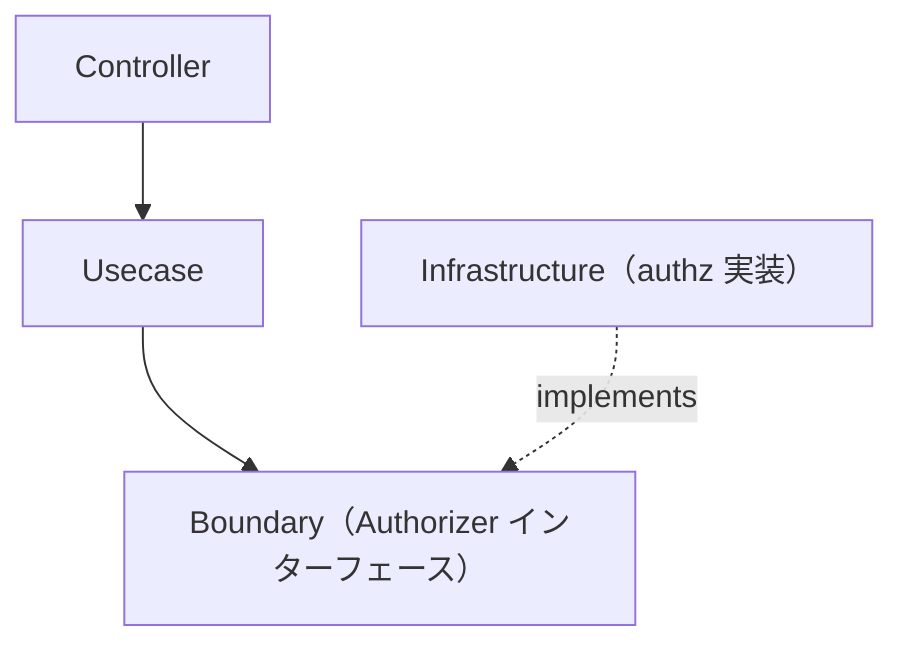

# authz ディレクトリ

[English](README.md) | 日本語

`internal/infrastructure/authz` は **認可（authz）インフラストラクチャ** を提供します。`internal/infrastructure/auth`（認証）と対になる存在です。

`Authorizer` の **実装** を格納します。その抽象は Usecase 層の Boundary として定義されます。

```txt
internal/usecase/boundary/authz
```

## 役割

- `Authorizer` インターフェース（Policy Decision Point）の実装を提供する。
- 認証済みの主体がリソースに対して操作を実行してよいかを判定する。

認証と異なり、認可は **アプリケーション状態に対するポリシー判断** です。この Boundary は **Usecase 層**（Policy Enforcement Point）から利用され、Usecase が `Authorize(...)` を呼び出し、拒否時に `apperror.ErrPermissionDenied`（403）を返します。

## アーキテクチャ上の位置づけ



## 現在の実装

|ディレクトリ|用途|
|---|---|
|`allowall`|local / CI / test 用の全許可スタブ（すべて許可）|
|`userrole`|`user_roles` ベースの RBAC Authorizer サンプル。本番相当の環境向け（admin ⇒ 許可、それ以外はリソース所有者のみ許可）。`user` サンプルの一部であり、サンプル削除とともに削除される。|

実運用ではこれらを RBAC / 外部ポリシーエンジン実装へ差し替えます。

## local / staging / production の実装

`allowall` は **開発用スタブ**であり、配線されるのは `local` / `ci` / `test` のみです。`development` / `staging` / `production` では実実装を追加し、環境ごとに配線する必要があります（[setup-repository.md](../../../docs/get-started/setup-repository.md) Phase 9.2 参照）。`provideAuthorizer` は **fail-closed** であり、実装が配線されていない環境は `default` 分岐に落ちて設計上起動エラーになります。`user` サンプルが存在する間は、`user_roles` を裏付けとするサンプル実装 `userrole` が `development` / `staging` / `production` を担います。サンプルを削除すると、自前の実装を配線するまでこれらの環境は fail-closed エラーに戻ります。

推奨レイアウト（`internal/infrastructure/auth/` と対になる構成）:

```txt
internal/infrastructure/authz
├── allowall   # local / ci / test 用スタブ（すべて許可）
├── stg        # staging 用 Authorizer
└── prd        # production 用 Authorizer
```

実運用の `Authorizer` は通常、次のいずれかで判定します。

- 所有権（subject == `Resource.OwnerID()`）— オブジェクトレベル認可
- RBAC（`auth.Authn` の claims / scopes から導いたロール）
- 外部ポリシーエンジン（OPA / Cedar）

各環境は `provideAuthorizer`（`internal/di/module/authz.go`）に `case config.EnvDevelopment / EnvStaging / EnvProduction` を追加し、実実装を返すことで配線します。どの `case` にも該当しない環境は `default` 分岐に落ち、fail-closed エラーを返します。（`user` サンプルが存在する間、その `case` はサンプル `userrole` が占めており、サンプルとともに削除されます。）

## DI への登録

`Authorizer` は次の `authzModule()` で登録されます。

```txt
internal/di/module/authz.go
```

Usecase 層が依存するため `InfrastructureModule()` に含めており、**環境ゲート付き**であるため全許可スタブが本番相当の環境に配線されることはありません。

## 設計方針

### 1 Boundary を実装する

Infrastructure は `usecase/boundary/authz` で定義された `Authorizer` を実装します。

### 2 認可は Usecase が強制するポリシー

本パッケージは判断実装（PDP）のみを提供します。強制点（PEP）— `Authorize(...)` を呼び拒否を 403 に対応づける処理 — は Usecase 層に置きます。
