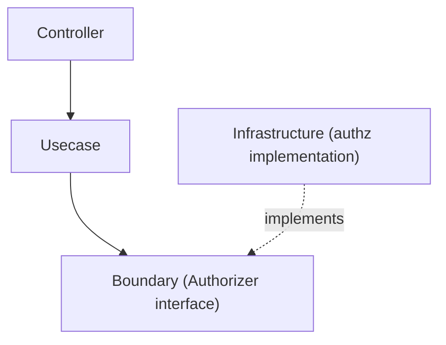

# authz Directory

`internal/infrastructure/authz` provides **Authorization (authz) Infrastructure** — the counterpart to `internal/infrastructure/auth` (authentication).

It contains **implementations of `Authorizer`**, whose abstraction is defined as a Boundary in the Usecase layer:

```txt
internal/usecase/boundary/authz
```

## Role

- Provide implementations of the `Authorizer` interface (the Policy Decision Point).
- Decide whether an authenticated subject may perform an action on a resource.

Unlike authentication, authorization is a **policy decision over application state**. The Boundary is consumed by the **Usecase layer** (the Policy Enforcement Point), which calls `Authorize(...)` and returns `apperror.ErrPermissionDenied` (403) on deny.

## Position in Architecture



## Current Implementation

|Directory|Purpose|
|---|---|
|`allowall`|Allow-all stub for local / CI / test (grants everything)|
|`userrole`|Sample `user_roles`-based RBAC Authorizer for production-like environments (admin ⇒ allow; otherwise resource-owner only). Part of the `user` sample and removed with it.|

A real deployment replaces these with its own RBAC / external policy-engine implementation.

## Local / Staging / Production Implementation

`allowall` is a **development-only stub**; it grants everything, so it is wired only for `local` / `ci` / `test`. This restriction is enforced by the stub itself — `allowall.New` refuses to construct outside those environments (**fail-closed by construction**), so a wiring mistake cannot accidentally enable allow-all in `development` / `staging` / `production`. `provideAuthorizer` is **also fail-closed**: any environment without a wired implementation falls through to the `default` branch and returns a startup error by design. While the `user` sample is present, the sample `userrole` implementation (backed by `user_roles`) serves `local` / `development` / `staging` / `production` — only `ci` / `test` take `allowall`, so a local run exercises the real decision path. Removing the sample folds `local` into the `allowall` case and reverts the production-like environments to the fail-closed error until you wire your own (see [setup-repository.md](../../../docs/get-started/setup-repository.md) Phase 11, Authorization).

Suggested layout (mirrors `internal/infrastructure/auth/`):

A real `Authorizer` typically decides via:

- ownership (subject == `Resource.OwnerID()`) — object-level authorization
- RBAC (roles derived from `auth.Authn` claims / scopes)
- an external policy engine (OPA / Cedar)

Wire each environment in `provideAuthorizer` (`internal/di/module/authz.go`) by adding a `case config.EnvDevelopment / EnvStaging / EnvProduction` branch that returns your real implementation, while keeping the self-guarded `allowall.New(appCfg)` for the non-production `local` / `ci` / `test` case. Anything left unhandled falls through to the `default` branch, which returns the fail-closed error. Because `allowall.New` is itself fail-closed, allow-all can never be reached in a production-like environment even if that wiring is wrong. (While the `user` sample is present, the production-like `case` is occupied by the sample `userrole`, and it is removed together with the sample.)

## Registration to DI

`Authorizer` is registered via `authzModule()` in:

```txt
internal/di/module/authz.go
```

It is included in `InfrastructureModule()` (the Usecase layer depends on it). The allow-all stub is never wired in production-like environments — this is **enforced by `allowall.New` itself** (fail-closed), not only by the provider.

## Test Strategy

An `Authorizer` here is a **pure in-memory decision point with no real I/O** — it reaches a database only through an injected repository, if at all. The infrastructure layer's real-DB strategy therefore does not apply; these are plain unit tests, with whatever repository the implementation needs supplied as a generated mock.

Viewpoints that hold for any implementation in this directory:

- **The decision is pinned from both sides.** Every allow path and every deny path gets its own case, and a deny asserts the specific sentinel via `errors.Is` (`ErrForbidden`), never a message string.
- **A guard that must run before a lookup is verified to actually do so**, by expecting *no* call on the mock rather than only checking the returned error. The ordering is the safeguard, so asserting the return value alone would miss a regression that leaks a lookup.
- **A constructor that refuses environments refuses them explicitly.** `allowall.New` must fail outside `local` / `ci` / `test`; the refusal is the fail-closed guarantee, so the environments it rejects matter more than the ones it accepts.

While the `user` sample is present, `userrole` adds the viewpoints its own policy needs: admin allows without ownership, a non-admin owner allows, a non-admin non-owner denies; a `nil` `Authn`, an unresolved UserID and a zero-value UserID each deny before any role lookup; an ownerless resource — a `nil` resource, or one whose `OwnerID()` is `nil` — stays admin-only; and a repository error propagates unchanged instead of being flattened into a deny. The zero-value-subject case cannot be reproduced through the running app, because the sole production `WithUserID` call site (`internal/infrastructure/auth/useridentity`) resolves IDs that already passed the domain's `IsNil` guard, so that unit test is the only place the branch is pinned.

Which environment receives which implementation is DI-layer scope and is verified there (see [`internal/di/README.md`](../../di/README.md), *Environment-gated wiring*), not here.

## Design Policy

### 1 Implement the Boundary

Infrastructure implements the `Authorizer` defined in `usecase/boundary/authz`.

### 2 Authorization is a Usecase-enforced policy

This package only provides the decision implementation (PDP). The enforcement point (PEP) — calling `Authorize(...)` and mapping a deny to 403 — lives in the Usecase layer.
