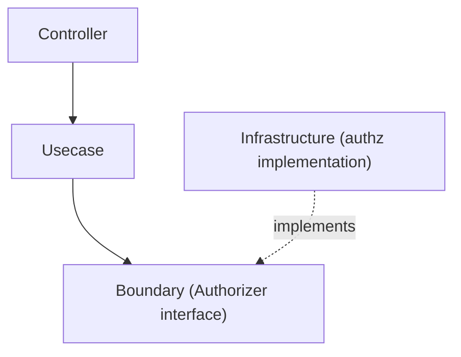

# authz Directory

`internal/infrastructure/authz` provides **Authorization (authz) Infrastructure** — the counterpart to `internal/infrastructure/auth` (authentication).

It contains **implementations of `Authorizer`**, whose abstraction is defined as a Boundary in the Usecase layer:

```txt
internal/usecase/boundary/authz
```

## Role

- Provide implementations of the `Authorizer` interface (the Policy Decision Point).
- Decide whether an authenticated subject may perform an action on a resource.

Unlike authentication, authorization is a **policy decision over application state**. The Boundary is consumed by the **Usecase layer** (the Policy Enforcement Point), which calls `Authorize(...)` and returns `apperror.ErrPermissionDenied` (403) on deny.

## Position in Architecture



## Current Implementation

|Directory|Purpose|
|---|---|
|`allowall`|Allow-all stub for local / CI / test (grants everything)|

A real deployment replaces this with an RBAC / external policy-engine implementation.

## Registration to DI

`Authorizer` is registered via `authzModule()` in:

```txt
internal/di/module/authz.go
```

It is included in `InfrastructureModule()` (the Usecase layer depends on it), and is **environment-gated** so the allow-all stub is never wired in production-like environments.

## Design Policy

### 1 Implement the Boundary

Infrastructure implements the `Authorizer` defined in `usecase/boundary/authz`.

### 2 Authorization is a Usecase-enforced policy

This package only provides the decision implementation (PDP). The enforcement point (PEP) — calling `Authorize(...)` and mapping a deny to 403 — lives in the Usecase layer.
