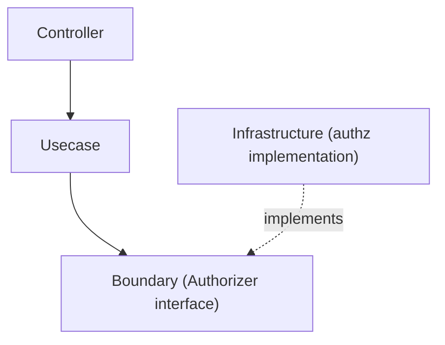

# authz Directory

`internal/infrastructure/authz` provides **Authorization (authz) Infrastructure** — the counterpart to `internal/infrastructure/auth` (authentication).

It contains **implementations of `Authorizer`**, whose abstraction is defined as a Boundary in the Usecase layer:

```txt
internal/usecase/boundary/authz
```

## Role

- Provide implementations of the `Authorizer` interface (the Policy Decision Point).
- Decide whether an authenticated subject may perform an action on a resource.

Unlike authentication, authorization is a **policy decision over application state**. The Boundary is consumed by the **Usecase layer** (the Policy Enforcement Point), which calls `Authorize(...)` and returns `apperror.ErrPermissionDenied` (403) on deny.

## Position in Architecture



## Current Implementation

|Directory|Purpose|
|---|---|
|`allowall`|Allow-all stub for local / CI / test (grants everything)|
|`userrole`|Sample `user_roles`-based RBAC Authorizer for production-like environments (admin ⇒ allow; otherwise resource-owner only). Part of the `user` sample and removed with it.|

A real deployment replaces these with its own RBAC / external policy-engine implementation.

## Local / Staging / Production Implementation

`allowall` is a **development-only stub**; it is wired only for `local` / `ci` / `test`. For `development` / `staging` / `production` you must add real implementations and wire them per environment (see [setup-repository.md](../../../docs/get-started/setup-repository.md) Phase 9.2). The DI provider is **fail-closed**: when no `Authorizer` dependency is provided those environments refuse to start by design. While the `user` sample is present, the sample `userrole` implementation (backed by `user_roles`) is provided and serves those environments; removing the sample reverts them to the fail-closed error until you wire your own.

Suggested layout (mirrors `internal/infrastructure/auth/`):

```txt
internal/infrastructure/authz
├── allowall   # local / ci / test stub (grants everything)
├── stg        # staging Authorizer
└── prd        # production Authorizer
```

A real `Authorizer` typically decides via:

- ownership (subject == `Resource.OwnerID()`) — object-level authorization
- RBAC (roles derived from `auth.Authn` claims / scopes)
- an external policy engine (OPA / Cedar)

Wire each environment in `provideAuthorizer` (`internal/di/module/authz.go`) by adding `case config.EnvDevelopment / EnvStaging / EnvProduction` branches that return your real implementation. The current `default` branch wires the sample `userrole` when its `RoleRepository` is provided and otherwise returns the fail-closed error.

## Registration to DI

`Authorizer` is registered via `authzModule()` in:

```txt
internal/di/module/authz.go
```

It is included in `InfrastructureModule()` (the Usecase layer depends on it), and is **environment-gated** so the allow-all stub is never wired in production-like environments.

## Design Policy

### 1 Implement the Boundary

Infrastructure implements the `Authorizer` defined in `usecase/boundary/authz`.

### 2 Authorization is a Usecase-enforced policy

This package only provides the decision implementation (PDP). The enforcement point (PEP) — calling `Authorize(...)` and mapping a deny to 403 — lives in the Usecase layer.
