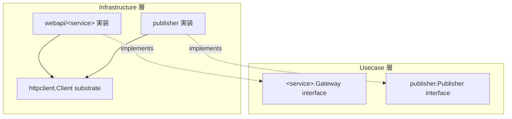

# httpclient

[English](README.md) | 日本語

`internal/infrastructure/httpclient` は、外部 HTTP 通信の **resilient な substrate**（retry / circuit breaker / budget / tracing）を提供し、gateway や publisher などの意味的 IF 実装から利用されるパッケージです。

## アーキテクチャ上の位置づけ



このパッケージは domain / usecase の境界インターフェースを実装しません。driver 相当の substrate（`rdb/driver` の HTTP 版）であり、`webapi/` と `publisher/` から利用されます。呼び出し側は意図（`Request`）と結果（`Response`）だけを扱い、ステータス解釈・`apperror` への写像・timeout / retry / budget / breaker / o11y はすべて substrate 内部で完結します。

## 設計方針

- net/http を露出しない: 自前型（`Method` / `Header` / `Request` / `Response` / `Downstream`）を公開し、ステータス解釈と `apperror` への写像は substrate 内部に閉じる（`pgerror.NormalizeError` の HTTP 版）。
- `Method` は**閉じた型**（struct ベース・非公開フィールド）: `Method("garbage")` のような任意のメソッド文字列は実行時ではなくコンパイル時に弾かれる——定義済みファクトリ関数（`MethodGet()` … `MethodDelete()`）を使う。ゼロ値 `Method{}` は構築可能なため、`Do` が `ErrInvalidArgument` で弾く。リクエストは `NewRequest(method, downstream, url, opts...)` で生成する——`method` / `downstream` / `url` はシグネチャで必須化され、任意項目は `WithHeader` / `WithBody` / `WithIdempotencyKey` / `WithRetry` で設定する（`WithRetry` は `AllowRetry` と `IdempotencyKey` を同時に設定するが、`WithRetry("")` の空 key は `Do` で弾かれる）。
- `Request` は**イミュータブルな値オブジェクト**: 全フィールドが非公開で、構築は `NewRequest` + `With*` オプション経由のみ、参照は getter 経由のみ（`Header()` / `Body()` は防御的コピーを返すため内部状態を変更できない）。型は任意メソッド文字列をコンパイル時に排除するが、型で表現を防ぎきれない残りの不正状態——ゼロ値 `Method{}`、`WithRetry("")` による空 `IdempotencyKey` での `AllowRetry`——は `Do` 実行時に `ErrInvalidArgument` で弾く。
- `Downstream` ごとの resilient 設定は `Registry` が解決する: 各 gateway が `DownstreamProfile` を `httpclient_profiles` fx グループへ寄与し、未登録キーは `DefaultProfile` へ fallback する。
- retry の安全性はメソッド依存: 冪等メソッド（GET / PUT / DELETE）は常に retry 安全、非冪等メソッド（POST / PATCH）は `AllowRetry` 明示時のみ安全で、その場合 `IdempotencyKey` が必須。
- retry 対象は 5xx / 429 / transport 失敗。4xx / 成功 / ctx cancel は対象外。backoff は指数 + full jitter で、`Retry-After` ヘッダがあればそれを優先する。
- Downstream ごとの retry budget（トークンバケット）が retry の増幅を抑え、Downstream ごとの circuit breaker（closed / half-open / open）が継続的な downstream 障害時に fail-fast する。
- 2 段のタイムアウトを強制: 1 試行ごとの per-attempt timeout と、呼び出し全体の overall timeout。backoff 待機が overall deadline を超える場合は retry を打ち切る。
- セキュリティ既定: リダイレクトは追従せず（`http.ErrUseLastResponse`、SSRF 面の縮小）、応答ボディは `MaxResponseBytes` までしか読まず、エラーメッセージは query / userinfo / fragment を redact し、trace 伝搬 / private-network 接続は Downstream ごとに opt-out できる。名前解決後の dial guard（`internal/observability`）は link-local（クラウドメタデータ `169.254.169.254`）/ unspecified / bogon 予約帯（TEST-NET、将来予約、IETF 割当、ベンチマーク用、IPv6 ドキュメント用）を常時拒否し、loopback / private(RFC1918, ULA) / CGNAT(RFC 6598 `100.64.0.0/10`) は `AllowPrivateNetwork` 未設定時に拒否する。
- transport / status 事象は `apperror` sentinel（`ErrUnavailable` / `ErrCanceled` / `ErrInvalidArgument` 等）へ正規化する。呼び出し側は raw status ではなく sentinel で分岐する。

## DI 登録

`internal/di/module/httpclient.go` の `httpclient` モジュールに登録します。各 Downstream が `httpclient_profiles` グループへ `Profile` を寄与し、`Registry` がそれらをまとめて解決します。

```go
fx.Module("httpclient",
    fx.Provide(
        provideHTTPClientRegistry,
        httpclient.New,
    ),
)
```

## Test Strategy

DB を持たない substrate であるため、infrastructure 層の実 DB 戦略は適用されない。すべてがプロセス内で閉じる —— downstream は `httptest` サーバ、時刻は注入したクロック。

- **downstream はプロセス内の `httptest` サーバ**で、status / ヘッダ / body / トランスポート失敗を台本どおりに返す。実ネットワークにも外部サービスにも触れない。
- **時刻は注入し、実時間を待たない。** `clock` testkit のダブル（`NewStepClock` / `NewNoopSleeper`）が backoff・`Retry-After`・試行ごとのタイムアウト・全体タイムアウトを決定的にする。実時間を sleep するテストは構造的に flaky であり、本パッケージが避けるべきアンチパターンそのもの。打ち切りのケースは実時間ではなく StepClock の進みと `OverallTimeout` の関係で固定する。
- **リトライ方針を両側から固定する。** リトライする: 5xx / 429 / トランスポート失敗（冪等メソッド、または `WithRetry` を持つ場合）。リトライしない: 4xx・成功・context キャンセル・冪等キーを持たない非冪等メソッド。assert は raw な status code ではなく、`errors.Is` でマップ後の `apperror` sentinel に対して行う —— それが呼び出し側に与えている契約だから。
- **breaker と budget は状態遷移ごとに固定する**（タイミングではなく）。継続的な失敗による closed → open、open → half-open、half-open → closed / open、およびトークンバケットの消費 / 補充の算術。各遷移がそれぞれ独立した subject として独立したテストを持つ。
- **`Client` 経由では到達できない非公開ヘルパー**（リクエスト構築のガード、プロファイル解決）は、同一パッケージの `*_internal_test.go` で担保する。

## テストカバレッジ例外

以下の未被覆分岐は**構造上到達不能**として、ほぼ 100% の被覆期待の対象外とする。これを塗る
ための contrived テストや追加実装は行わない:

- `client.go` `doWithRetry` — retry ループ後の末尾 `return resp, err`。各反復はループ内で
  return し（最終試行は `attempt == maxAttempts` に到達）、末尾 return はコンパイラ充足のため
  だけに存在し実行されない。

**ガバナンス:** カバレッジ例外は**任意に追加しない**。新規エントリはアーキテクト等の適切な
承認者の承認を要する。
