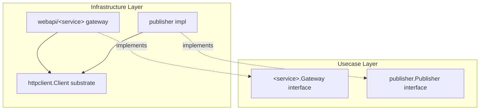

# httpclient

English | [日本語](README.ja.md)

`internal/infrastructure/httpclient` provides a **resilient substrate for outbound HTTP** (retry / circuit breaker / budget / tracing), consumed by semantic interface implementations such as gateways and publishers.

## Architectural Position



This package does **not** implement a domain / usecase boundary interface. It is a driver-level substrate (the HTTP counterpart of `rdb/driver`), consumed by `webapi/` and `publisher/`. Callers express only intent (`Request`) and result (`Response`); status interpretation, `apperror` mapping, timeout / retry / budget / breaker / observability all stay inside the substrate.

## Design Policy

- net/http is never exposed: own types (`Method` / `Header` / `Request` / `Response` / `Downstream`) are public, and status interpretation + `apperror` mapping are closed inside the substrate (the HTTP version of `pgerror.NormalizeError`).
- `Method` is a **closed type** (struct-backed, unexported field): an arbitrary method string such as `Method("garbage")` is rejected at compile time rather than at runtime — use the defined factory functions (`MethodGet()` … `MethodDelete()`). The zero value `Method{}` is still constructible, so it is rejected at `Do` with `ErrInvalidArgument`. Build requests with `NewRequest(method, downstream, url, opts...)` — `method` / `downstream` / `url` are required by the signature, and optional fields use `WithHeader` / `WithBody` / `WithIdempotencyKey` / `WithRetry` (the last sets `AllowRetry` + `IdempotencyKey` together; an empty key via `WithRetry("")` is rejected at `Do`).
- `Request` is an **immutable value object**: all fields are unexported, so it is constructible only through `NewRequest` + `With*` options and readable only through getters (`Header()` / `Body()` return defensive copies so the internal state can't be mutated). The type prevents arbitrary method strings at compile time; the remaining invalid states the type can't express away — the zero-value `Method{}`, or `AllowRetry` with an empty `IdempotencyKey` via `WithRetry("")` — are rejected at runtime inside `Do` with `ErrInvalidArgument`.
- Per-`Downstream` resilience is resolved by `Registry`: each gateway contributes a `DownstreamProfile` to the `httpclient_profiles` fx group, and unregistered keys fall back to `DefaultProfile`.
- Retry safety is method-aware: idempotent methods (GET / PUT / DELETE) are always retry-safe; non-idempotent methods (POST / PATCH) are retried only when `AllowRetry` is set, which then requires `IdempotencyKey`.
- Retryable outcomes are 5xx / 429 / transport failures; 4xx / success / context cancellation are not retried. Backoff is exponential with full jitter, honoring a `Retry-After` header when present.
- A per-downstream retry budget (token bucket) caps retry amplification, and a per-downstream circuit breaker (closed / half-open / open) fails fast under sustained downstream faults.
- Two timeout layers are enforced: a per-attempt timeout and an overall timeout; a backoff wait that would overrun the overall deadline aborts the retry.
- Security defaults: redirects are not followed (`http.ErrUseLastResponse`, SSRF surface reduction), response bodies are read only up to `MaxResponseBytes`, error messages are redacted of query / userinfo / fragment, and trace propagation / private-network access are opt-out per downstream. The post-DNS dial guard (in `internal/observability`) always blocks link-local (cloud metadata `169.254.169.254`) / unspecified / bogon-reserved ranges (TEST-NETs, Future Use, IETF Assignments, Benchmarking, IPv6 Documentation), and blocks loopback / private (RFC1918, ULA) / CGNAT (RFC 6598 `100.64.0.0/10`) unless `AllowPrivateNetwork` is set.
- Transport / status events are normalized into `apperror` sentinels (`ErrUnavailable` / `ErrCanceled` / `ErrInvalidArgument` etc.); callers branch on sentinels, never on raw status.

## DI Registration

Registered by the `httpclient` module in `internal/di/module/httpclient.go`. Each downstream contributes a `Profile` to the `httpclient_profiles` group, which the `Registry` aggregates.

```go
fx.Module("httpclient",
    fx.Provide(
        provideHTTPClientRegistry,
        httpclient.New,
    ),
)
```

## Test Strategy

This is a substrate with no database, so the infrastructure layer's real-DB strategy does not apply.
Everything closes in-process: an `httptest` server for the downstream, an injected clock for time.

- **The downstream is an in-process `httptest` server** scripting status / headers / body / transport
  failure. No real network, no external service.
- **Time is injected, never waited on.** The `clock` testkit doubles (`NewStepClock` / `NewNoopSleeper`)
  make backoff, `Retry-After`, the per-attempt timeout and the overall timeout deterministic. A test that
  sleeps real time is flaky by construction and is the anti-pattern this package guards against — a
  deadline case pins the abort using the step clock's advance against `OverallTimeout`, not wall time.
- **Retry policy is pinned from both sides.** Retried: 5xx / 429 / transport failure, for an idempotent
  method or one carrying `WithRetry`. Not retried: 4xx, success, context cancellation, and a
  non-idempotent method without an idempotency key. Assertions go through the mapped `apperror` sentinel
  with `errors.Is`, never a raw status code — that is the contract callers are given.
- **Breaker and budget are pinned per state transition**, not by timing: closed → open on sustained
  faults, open → half-open, half-open → closed / open, and the token bucket's consume / refill
  arithmetic. Each transition is its own subject with its own test.
- **Unexported helpers unreachable through `Client`** (request construction guard, profile resolution)
  are covered by `*_internal_test.go` in the same package.

## Test coverage exception

The following uncovered branch is exempt from the near-100% expectation as **structurally
unreachable**; no contrived test or extra implementation is added to reach it:

- `client.go` `doWithRetry` — the trailing `return resp, err` after the retry loop. Every
  iteration returns inside the loop (the final attempt hits `attempt == maxAttempts`), so
  the trailing return exists only to satisfy the compiler and is never executed.

**Governance:** coverage exceptions are **not added at will** — a new entry requires an
appropriate approver's (e.g. architect) sign-off.
