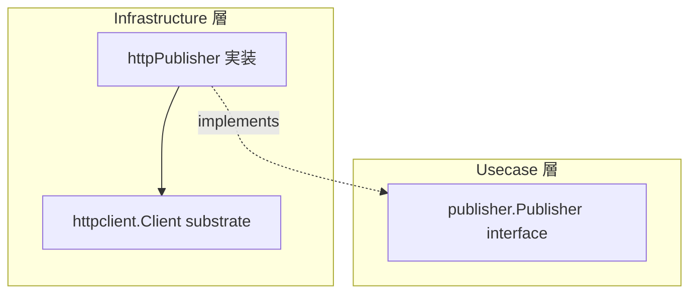

# publisher

[English](README.md) | 日本語

`internal/infrastructure/publisher` は、**transactional outbox の publish 境界（`publisher.Publisher`）の実装を選ぶ唯一の場所**です。relay engine が claim した outbox メッセージを受信エンドポイントへ POST する HTTP 実装を同梱し、判別子 `OUTBOX_PUBLISHER` によって実装を選択します。

## アーキテクチャ上の位置づけ



Usecase 層の `publisher.Publisher` インターフェース（`internal/usecase/boundary/publisher`）を Infrastructure 層で実装し、実際の transport は `httpclient` substrate に委譲します。relay engine と usecase は HTTP の詳細ではなく境界のみに依存します。

## 実装の選択

`New(cfg, client, tf)` が `OUTBOX_PUBLISHER` で分岐し、対応する adapter を返します。未知の値は既定へ流さず起動エラーにするため、綴り間違いが意図しない publish 先へ流れることはありません。publish 先は環境ティアの関数ではなくデプロイ先ごとの判断であるため、`APP_ENV` 分岐ではなく明示の判別子にしています。

各分岐が自分の設定だけを解決するので、キューへ publish するデプロイが `OUTBOX_ENDPOINT` を要求されることはなく、逆も同様です。どちらの解決も最初の publish 時ではなく relay 起動時に落とします。未設定のまま起動すると全メッセージが黙って dead 化するためです。

<!-- sample-api:begin -->
`http` 以外の唯一の分岐である `sqs` 分岐は、削除可能なサンプル群からの配線です（[ADR-0106](../../../docs/adr/0106-broker-sdk-isolation-verified-after-sample-removal.ja.md) を参照）。`make setup-remove-sample-api` の後は HTTP 分岐だけが残り、SQS adapter 自体は未配線の参照実装として残ります。
<!-- sample-api:end -->

## 設計方針

- transport retry を無効化する（`MaxAttempts = 1`）: relay の poll ループ自体が at-least-once の retry 本体であるため、substrate 層 retry は二重になる（D10）。再送は relay の次 poll が担う。
- 非冪等な POST だが、受信側 dedup のため `MessageID` を `Idempotency-Key` として載せ、`AllowRetry` は明示的に `false` とする。
- trace 伝搬を無効化する（`PropagateTrace = false`）: emit 時に capture した `traceparent` をメッセージヘッダで明示伝搬するため、substrate の自動 inject は抑止する。
- エンドポイント URL は config から一度解決して構築時に注入し、`Content-Type: application/json` とメッセージ自身のヘッダ（`traceparent` 等）を送る。
- 非 2xx / transport 失敗は substrate が `apperror` sentinel へ写像してそのまま返し、relay の次 poll での再送を促す。

## DI 登録

`internal/di/module/outboxpublisher.go` の `outbox_publisher` モジュールに登録します。downstream profile は `httpclient_profiles` グループへ寄与します。

```go
fx.Module("outbox_publisher",
    fx.Provide(
        outboxpublisher.New,
    ),
    provideHTTPClientProfiles(
        outboxpublisher.NewDownstreamProfile,
    ),
)
```
