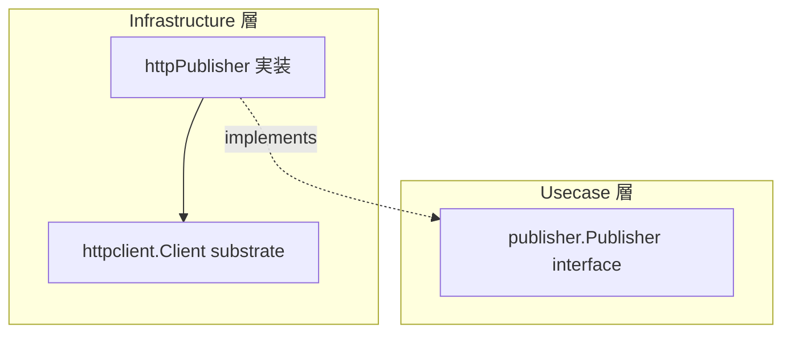

# publisher

[English](README.md) | 日本語

`internal/infrastructure/publisher` は、**transactional outbox の publish 境界（`publisher.Publisher`）の実装を選ぶ唯一の場所**です。relay engine が claim した outbox メッセージを受信エンドポイントへ POST する HTTP 実装を同梱し、判別子 `OUTBOX_PUBLISHER` によって実装を選択します。

## アーキテクチャ上の位置づけ



Usecase 層の `publisher.Publisher` インターフェース（`internal/usecase/boundary/publisher`）を Infrastructure 層で実装し、実際の transport は `httpclient` substrate に委譲します。relay engine と usecase は HTTP の詳細ではなく境界のみに依存します。

## 実装の選択

`New(cfg, client, tf)` が `OUTBOX_PUBLISHER` で分岐し、対応する adapter を返します。未知の値は既定へ流さず起動エラーにするため、綴り間違いが意図しない publish 先へ流れることはありません。publish 先は環境ティアの関数ではなくデプロイ先ごとの判断であるため、`APP_ENV` 分岐ではなく明示の判別子にしています。

各分岐が自分の設定だけを解決するので、キューへ publish するデプロイが `OUTBOX_ENDPOINT` を要求されることはなく、逆も同様です。どちらの解決も最初の publish 時ではなく relay 起動時に落とします。未設定のまま起動すると全メッセージが黙って dead 化するためです。

<!-- sample-api:begin -->
`http` 以外の唯一の分岐である `sqs` 分岐は、削除可能なサンプル群からの配線です（[ADR-0049](../../../docs/ja/adr/0049-broker-sdk-isolation-verified-after-sample-removal.ja.md) を参照）。`make setup-remove-sample-api` の後は HTTP 分岐だけが残り、SQS adapter 自体は未配線の参照実装として残ります。
<!-- sample-api:end -->

## 設計方針

- transport retry を無効化する（`MaxAttempts = 1`）: relay の poll ループ自体が at-least-once の retry 本体であるため、substrate 層 retry は二重になる（D10）。再送は relay の次 poll が担う。
- 非冪等な POST だが、受信側 dedup のため `MessageID` を `Idempotency-Key` として載せ、`AllowRetry` は明示的に `false` とする。
- trace 伝搬を無効化する（`PropagateTrace = false`）: emit 時に capture した `traceparent` をメッセージヘッダで明示伝搬するため、substrate の自動 inject は抑止する。
- エンドポイント URL は config から一度解決して構築時に注入し、`Content-Type: application/json` とメッセージ自身のヘッダ（`traceparent` 等）を送る。
- 非 2xx / transport 失敗は substrate が `apperror` sentinel へ写像してそのまま返し、relay の次 poll での再送を促す。

## Test Strategy

ここでの基盤は DB ではなく `httpclient.Client` Boundary であるため、infrastructure 層の実 DB 戦略は適用されません。すべて in-process で閉じます。downstream は `httpclient` の生成モックで、ネットワークへは何も送出しません。

- **結果だけでなくリクエストを assert する。** このアダプタの仕事は outbox メッセージを 1 回の HTTP 呼び出しへ変えることそのものなので、テストは substrate へ渡された `Request` を検査します。メソッド・エンドポイント・`Content-Type`・メッセージ自身のヘッダ（`traceparent`）、そして `Idempotency-Key` として載る `MessageID` です。返り値のエラーだけを見ると、この写像が自由にドリフトします。
- **無効化した設定は「意図的に off である」ことを固定する。** これらは既定値ではなく安全装置だからです。`AllowRetry = false`（再送は relay の poll ループが所有する）と `PropagateTrace = false`（emit 時の `traceparent` はメッセージヘッダとして運ぶ）。どちらも反転しても無言で通るため、それぞれが独立したケースを持ちます。
- **機微ヘッダは正規化の抜けに対して固定する。** ヘッダの照合が大文字小文字や前後の空白で破られてはならないため、それらの形を仮定せず明示的にテストします。
- **substrate のエラーは加工せず伝播する。** 非 2xx / transport 失敗は到達時点で既に `apperror` sentinel です。assert はその sentinel に対する `errors.Is` で行い、アダプタが再ラップも平坦化もしていないことを確かめます。relay の再送判断は、これが無傷で届くことに依存しています。
- **実装の選択それ自体が subject である。** `OUTBOX_PUBLISHER` で分岐する `New` は、既知の各値に加えて未知の値でもテストします。誤記で起動を失敗させることが契約だからです。各分岐が自分の設定だけを解決すること（queue 構成のデプロイが `OUTBOX_ENDPOINT` を要求されないこと）も同様です。

## DI 登録

`internal/di/module/outboxpublisher.go` の `outbox_publisher` モジュールに登録します。downstream profile は `httpclient_profiles` グループへ寄与します。

```go
fx.Module("outbox_publisher",
    fx.Provide(
        outboxpublisher.New,
    ),
    provideHTTPClientProfiles(
        outboxpublisher.NewDownstreamProfile,
    ),
)
```
