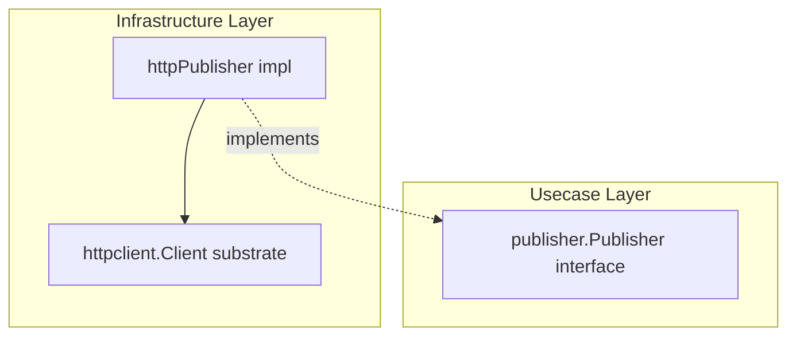

# publisher

English | [日本語](README.ja.md)

`internal/infrastructure/publisher` provides the **HTTP implementation of the transactional outbox publish boundary** (`publisher.Publisher`), POSTing outbox messages claimed by the relay engine to a receiving endpoint.

## Architectural Position



Implements the `publisher.Publisher` interface (`internal/usecase/boundary/publisher`) in the Infrastructure layer, delegating actual transport to the `httpclient` substrate. The relay engine and usecase depend only on the boundary, not on HTTP details.

## Design Policy

- Transport retry is disabled (`MaxAttempts = 1`): the relay poll loop is itself the at-least-once retry body, so substrate-level retry would double up (D10). Redelivery is owned by the next relay poll.
- The non-idempotent POST carries `MessageID` as `Idempotency-Key` for receiver-side dedup, but `AllowRetry` is explicitly `false`.
- Trace propagation is disabled (`PropagateTrace = false`): the `traceparent` captured at emit time is propagated explicitly via message headers, so the substrate's automatic injection is suppressed.
- The endpoint URL is resolved once from config and injected at construction; `Content-Type: application/json` plus the message's own headers (e.g. `traceparent`) are sent.
- Non-2xx / transport failures are mapped to `apperror` sentinels by the substrate and returned as-is, signaling the relay to retry on the next poll.

## DI Registration

Registered by the `outbox_publisher` module in `internal/di/module/outboxpublisher.go`. The downstream profile is contributed to the `httpclient_profiles` group.

```go
fx.Module("outbox_publisher",
    fx.Provide(
        outboxpublisher.NewEndpoint,
        outboxpublisher.New,
    ),
    provideHTTPClientProfiles(
        outboxpublisher.NewDownstreamProfile,
    ),
)
```
