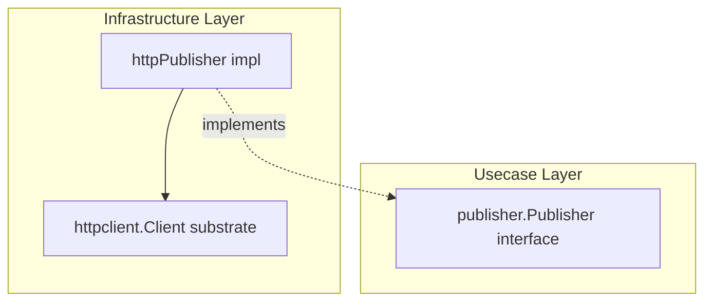

# publisher

English | [日本語](README.ja.md)

`internal/infrastructure/publisher` is **the only place that chooses the implementation of the transactional outbox publish boundary** (`publisher.Publisher`). It ships the HTTP implementation, which POSTs outbox messages claimed by the relay engine to a receiving endpoint, and selects between implementations by the `OUTBOX_PUBLISHER` discriminator.

## Architectural Position



Implements the `publisher.Publisher` interface (`internal/usecase/boundary/publisher`) in the Infrastructure layer, delegating actual transport to the `httpclient` substrate. The relay engine and usecase depend only on the boundary, not on HTTP details.

## Choosing an implementation

`New(cfg, client, tf)` switches on `OUTBOX_PUBLISHER` and returns the matching adapter; an unknown value fails startup rather than falling through to a default, so a typo never publishes to an unintended target. The publish target is a per-deployment decision rather than a function of the environment tier, which is why it is an explicit discriminator instead of an `APP_ENV` branch.

Each branch resolves its own settings, so a deployment that publishes to a queue is never asked for `OUTBOX_ENDPOINT`, and vice versa. Both resolutions fail at relay startup rather than at the first publish — an unset target would otherwise dead-letter every message silently.

<!-- sample-api:begin -->
The `sqs` branch — the only branch besides `http` — is wiring from the removable sample set (see [ADR-0106](../../../docs/adr/0106-broker-sdk-isolation-verified-after-sample-removal.md)); after `make setup-remove-sample-api` only the HTTP branch remains, while the SQS adapter itself stays as an unwired reference implementation.
<!-- sample-api:end -->

## Design Policy

- Transport retry is disabled (`MaxAttempts = 1`): the relay poll loop is itself the at-least-once retry body, so substrate-level retry would double up (D10). Redelivery is owned by the next relay poll.
- The non-idempotent POST carries `MessageID` as `Idempotency-Key` for receiver-side dedup, but `AllowRetry` is explicitly `false`.
- Trace propagation is disabled (`PropagateTrace = false`): the `traceparent` captured at emit time is propagated explicitly via message headers, so the substrate's automatic injection is suppressed.
- The endpoint URL is resolved once from config and injected at construction; `Content-Type: application/json` plus the message's own headers (e.g. `traceparent`) are sent.
- Non-2xx / transport failures are mapped to `apperror` sentinels by the substrate and returned as-is, signaling the relay to retry on the next poll.

## DI Registration

Registered by the `outbox_publisher` module in `internal/di/module/outboxpublisher.go`. The downstream profile is contributed to the `httpclient_profiles` group.

```go
fx.Module("outbox_publisher",
    fx.Provide(
        outboxpublisher.New,
    ),
    provideHTTPClientProfiles(
        outboxpublisher.NewDownstreamProfile,
    ),
)
```
