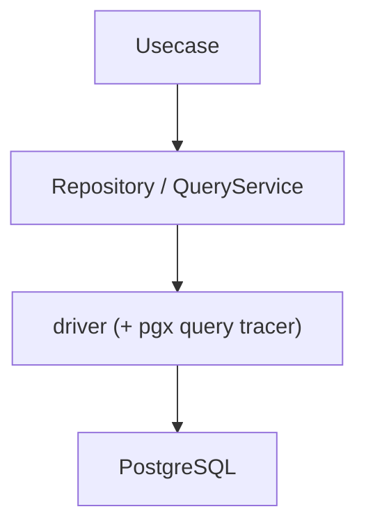
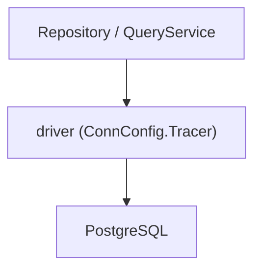
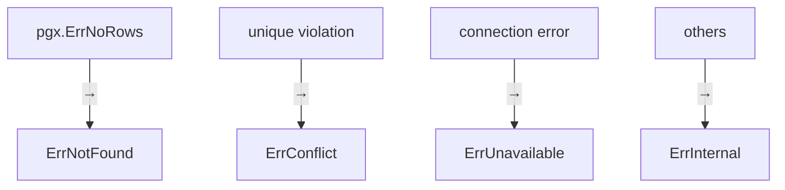

# インフラ層のRDB（`internal/infrastructure/rdb`）ガイド

[English](README.md) | 日本語

## 役割

`internal/infrastructure/rdb` は **RDB（PostgreSQL）を利用するための Infrastructure サブシステム**です。

このディレクトリは次の責務を持ちます。

- PostgreSQL への接続管理
- SQL 実行（sqlc）
- Repository / QueryService 実装
- SQL 実行ログとトレース（Observability）
- PostgreSQL エラーの正規化
- DB nullable 型と Go 型の変換

Domain / Usecase は **RDB の実装詳細を意識せずにデータ永続化・検索を利用できます。**

## RDB アーキテクチャ

このディレクトリは次のレイヤー構造で構成されています。



各レイヤーの責務は次の通りです。

|Layer|役割|
|---|---|
|Repository|Aggregate 永続化（Domain Repository Interface の実装）|
|QueryService|検索専用クエリーの提供（Usecase Interface の実装）|
|driver|DB 接続 / トランザクション管理、および pgx クエリトレーサーによる SQL ログ / トレース|
|PostgreSQL|実際の DB|

補助コンポーネントとして以下が存在します。

|Component|役割|
|---|---|
|sqlc|SQL から生成された型安全なクエリ実行コード|
|pgerror|PostgreSQL エラー → アプリケーションエラー変換|
|metrics|コネクションプール統計の Prometheus メトリクス|
|system_cqrs|システム運用クエリ（ヘルスチェック等）|
|testkit|RDB テストユーティリティ（実DB + rollback）|

## ディレクトリ構成

```txt
internal/infrastructure/rdb
 ├ repository/        Repository 実装
 ├ query_service/     QueryService 実装
 ├ system_cqrs/      システム運用クエリ（ヘルスチェック等）
 ├ driver/            DB 接続 / トランザクション + pgx クエリトレーサー（ログ / トレース）
 ├ sqlc/              sqlc 生成コード + SQL helper
 ├ pgerror/           PostgreSQL エラー正規化
 ├ metrics/           コネクションプール Prometheus メトリクス
 └ testkit/           RDB テストユーティリティ
```

## Repository

Repository は **Domain の Repository Interface を実装する層**です。

主な責務

- sqlc クエリ実行
- Row → Domain エンティティ変換
- DB エラー正規化

重要: **Repository はビジネスロジックを持たない**

詳細は以下を参照してください。

[repository ディレクトリの README](repository/README.ja.md)

## QueryService

QueryService は **検索・一覧取得などの読み取り専用クエリーを提供する層**です。

Repository が Aggregate 永続化を扱うのに対し、
QueryService は検索用途に特化します。

主な責務

- 検索クエリ実行
- Row → Domain / DTO 変換
- DB エラー正規化

重要: **検索は Repository ではなく QueryService に実装する**

詳細は以下を参照してください。

[query_service ディレクトリの README](query_service/README.ja.md)

## sqlc

`sqlc` は SQL から Go コードを生成するツールです。

このディレクトリでは

- sqlc 生成コード
- LIKE 検索 helper

などを提供します。

`internal/infrastructure/rdb/sqlc/gen` に生成コードが配置されます。

詳細は以下を参照してください。

[sqlc ディレクトリの README](sqlc/README.ja.md)

## driver

`driver` は **DB 接続とトランザクション管理を提供する最下位レイヤー**です。

主な機能

- DatabaseDriver 抽象
- DB 接続プール管理
- トランザクション管理（tx.Manager）
- sqlc 用 DBTX インターフェース
- pgx クエリトレーサーによる SQL ログ / トレース（後述）

重要: **トランザクション境界は Usecase 層が管理する**

詳細は以下を参照してください。

[driver ディレクトリの README](driver/README.ja.md)

## SQL ログ / トレース（pgx クエリトレーサー）

SQL のログとトレースは、専用のラッパー層ではなく **pgx の接続レベル**（`ConnConfig.Tracer`）で
`driver.NewQueryTracer` により結線します。Repository / QueryService は `driver.New(ctx, db)` で
driver を直接利用し、計装は透過的で、トランザクション内のクエリも対象になります。



クエリトレーサーは OpenTelemetry span（semconv の DB 属性付き）のために `otelpgx` を埋め込み、
クエリログを出力します：**正常終了は Info（latency 付き）、スローは Warn、失敗は Error**。

主な機能

- クエリごとの OpenTelemetry span（`otelpgx` 経由、batch / copy も対象）
- 正常終了時の Info ログ（latency 付き）
- クエリ失敗時のエラーログ（`span.RecordError` に加えて）
- スロークエリ警告ログ（しきい値: `DB_SLOW_QUERY_WARN_THRESHOLD`）
- クエリ引数のマスク（`OBS_MASKED_DB_QUERY_ARGS`）

## PostgreSQL エラー正規化

`pgerror` は **PostgreSQL 固有エラーをアプリケーションエラーへ変換するレイヤー**です。

Repository / QueryService は

```go
pgerror.NormalizeError(err)
```

を利用して DB エラーを正規化します。

主な変換



詳細は以下を参照してください。

[pgerror ディレクトリの README](pgerror/README.ja.md)

## metrics

`metrics` は **pgxpool コネクションプールの統計情報を Prometheus メトリクスとして公開する**パッケージです。

Gauge（接続数）と Counter（取得回数・破棄回数等）を提供します。

詳細は以下を参照してください。

[metrics ディレクトリの README](metrics/README.ja.md)

## system_cqrs

`system_cqrs` は **システム運用向けの DB クエリ**（ヘルスチェック等）を提供する層です。

Repository / QueryService とは異なり、ビジネスドメインに属さない運用・監視目的のクエリを担当します。

詳細は以下を参照してください。

[system_cqrs ディレクトリの README](system_cqrs/README.ja.md)

## command_service

`command_service` は **CommandService** を実装します。QueryService の書き込み側の対称物で、
インターフェースは QueryService と並んで Usecase 層に、実装はここに置きます。単一トランザクションでの
原子性を要する複数集約への書き込みのために予約されています
（[ADR-0028](../../../docs/adr/0028-lightweight-cqrs.md) /
[ADR-0030](../../../docs/adr/0030-commandservice-atomicity-criterion.md)）。最初の実装は
`command_service/purchase`（在庫減算 + 購入 / 明細 INSERT。
[ADR-0032](../../../docs/adr/0032-ordered-pessimistic-row-locks.md) 参照）です。

CommandService は `ctx` で渡されたトランザクション上で書き込みを実行し（自前では開かない。境界は
Usecase が所有し、`idempotency.Run` の内側に入る）、outbox イベントは発行しません（Usecase の責務で
`system_cqrs` カテゴリ）。メソッドは決定済みの Domain 集約を受け取り、sqlc のエラーは
`pgerror.NormalizeError` で正規化します。

**ここに置いてよいもの。** 集約を読み込んで保存する形では表現できない書き込みだけです。相対更新、
集合演算、ロックを取らずに原子性を得る操作。読んで変更して保存できるものは Repository に属します。
この線引きが無いと、このパッケージは「SQL を直接書きたいときの置き場」になります。

**条件は導出であって独立の著作ではない。** ここで SQL に書くガードは、既に存在するドメインの不変条件を
言い換えたものでなければなりません。在庫減算のガードはドメインの売り越し判定を言い換えたもので、返す
sentinel も同じものです。つまり下流であり、ドメインの規則が変わればこちらも変わりますが、逆はありません。
1 つの規則を独立に 2 度書くと、片方だけが動いた瞬間に黙って乖離します。
[ADR-0028](../../../docs/adr/0028-lightweight-cqrs.md) § Derivation を参照。

## testkit

`testkit` は **RDB を利用するテストのためのユーティリティ**です。

主な機能

- テスト用 DB 初期化
- 共有テスト DB ドライバの提供
- トランザクション内テスト（自動 rollback）

テスト特性

- 実DB
- トランザクション rollback
- 並列実行（Tx は直列）

詳細は以下を参照してください。

[testkit ディレクトリの README](testkit/README.ja.md)

## 設計方針

この RDB サブシステムは次の設計原則に基づいています。

### 1. DB 実装の隠蔽

Domain / Usecase は

- sql
- pgx
- sql.DB

などの DB 実装に依存しません。

### 2. 責務分離（Repository / QueryService）

- 書き込み / 永続化 → Repository
- 検索 / 読み取り   → QueryService

### 3. トランザクション境界の集中管理

Usecase が Tx を管理し、Infra は Tx を開始しません。

### 4. DB エラーの正規化

PostgreSQL 固有エラーは`pgerror`でアプリケーション共通エラーへ変換します。

### 5. SQL 型安全

SQL 実行はすべて`sqlc`を通して行います。

例外: `sqlc` で表現できない PostgreSQL のセッション設定コマンド（例: 行ロッククエリ前に発行する `SET LOCAL lock_timeout`）は直接 `Exec` で実行してよい。これらは `system_cqrs` に限定し、エラーは引き続き `pgerror.NormalizeError` を経由させます。

### 6. 可観測性

SQL 実行トレースは driver の接続層に結線した pgx クエリトレーサー（`otelpgx` の span）が提供し、
ログは正常終了（Info・latency 付き）・スロー（Warn）・失敗（Error）で出力します。

### 7. テスト戦略（Integration 前提）

Repository / QueryService テストは

実DB + rollback

で実行します。

`testkit`を利用して安全に実現します。

各 Repository / QueryService テストが検証する観点:

- SQL 実行経路 — メソッドが dispatch する各クエリ / 分岐
- 全 sqlc 戻り値への `pgerror.NormalizeError` 適用（生 `pg` / 接続エラー → `apperror`）
- row → entity 変換（カラム → フィールド対応、NULL 処理）

並行 / ロック競合は既定の `testkit` ヘルパでは再現できません: `WithinTx` はトランザクションを直列化します（最後に rollback する単一 tx）。真に並行なコネクションでしか発火しない分岐 — 例: `Claim` の `lock_timeout` `55P03`（lock_not_available）— は、独立した `TransactionManager.Do` を 2 本（2 コネクション / トランザクション）走らせ、片方が行ロックを保持しもう片方をタイムアウトさせる専用の統合テストが要ります。

#### カバレッジ例外（到達不能な防御分岐）

ドメインの値は `pkg/safecast` を通して sqlc のカラム幅へ絞り込むため、各書き込み箇所には
`if err != nil` が付きます。ドメインが範囲を保証している以上、呼び出し側からこの分岐へは到達
できません。範囲チェック本体は `pkg/safecast` にあり全分岐がテスト済みで、呼び出し側に残るのは
エラープラミングだけなので、[`testing-conventions.md` §9](../../../docs/testing-conventions.md)
に従い作為的なテストで色を付けるのではなくここに記録します。

|ファイル|関数|未被覆の分岐|到達不能な理由|
|---|---|---|---|
|`repository/product/product_repository.go`|`Create`|`safecast.IntToInt32(p.Quantity())` のエラー|`product` が `quantity` を `[0, math.MaxInt32]` に検証済み|
|`repository/product/product_repository.go`|`Create`|`safecast.IntPtrToInt32Ptr(p.StockWarningThreshold())` のエラー|`product` が閾値を `[0, math.MaxInt32]` に検証済み|
|`repository/product/product_repository.go`|`Update`|`safecast.IntToInt32(p.Quantity())` のエラー|同上|
|`repository/product/product_repository.go`|`Update`|`safecast.IntPtrToInt32Ptr(p.StockWarningThreshold())` のエラー|同上|
|`repository/product/product_repository.go`|`UpdateStock`|`safecast.IntToInt32(p.Quantity())` のエラー|同上|

同じメソッド内の `version` 変換は例外ではありません。ドメインが課すのは `version >= 1` だけで
範囲外の version は到達可能なため、テストで被覆しています。purchase の `statusCode` / 明細数量の
変換も同様です。
