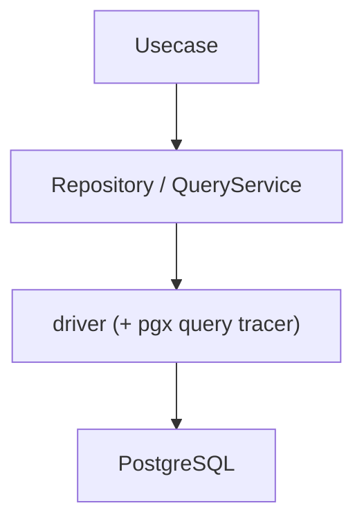
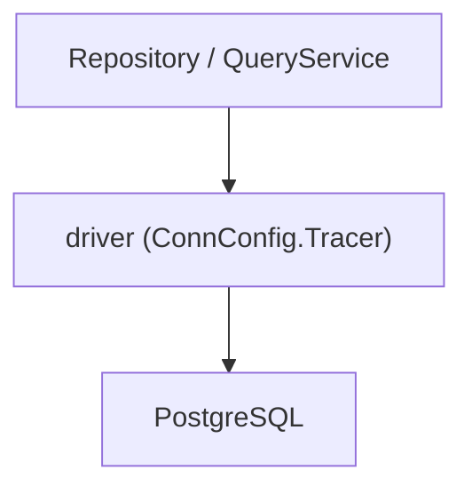
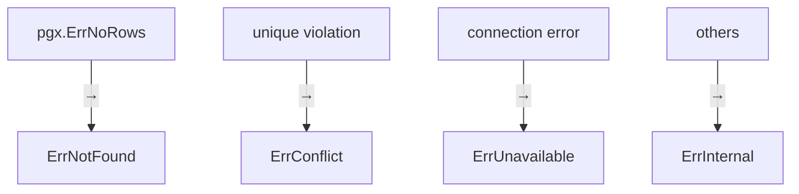

# インフラ層のRDB（`internal/infrastructure/rdb`）ガイド

[English](README.md) | 日本語

## 役割

`internal/infrastructure/rdb` は **RDB（PostgreSQL）を利用するための Infrastructure サブシステム**です。

このディレクトリは次の責務を持ちます。

- PostgreSQL への接続管理
- SQL 実行（sqlc）
- Repository / QueryService 実装
- SQL 実行ログとトレース（Observability）
- PostgreSQL エラーの正規化
- DB nullable 型と Go 型の変換

Domain / Usecase は **RDB の実装詳細を意識せずにデータ永続化・検索を利用できます。**

## RDB アーキテクチャ

このディレクトリは次のレイヤー構造で構成されています。



各レイヤーの責務は次の通りです。

|Layer|役割|
|---|---|
|Repository|Aggregate 永続化（Domain Repository Interface の実装）|
|QueryService|検索専用クエリーの提供（Usecase Interface の実装）|
|driver|DB 接続 / トランザクション管理、および pgx クエリトレーサーによる SQL ログ / トレース|
|PostgreSQL|実際の DB|

補助コンポーネントとして以下が存在します。

|Component|役割|
|---|---|
|sqlc|SQL から生成された型安全なクエリ実行コード|
|pgerror|PostgreSQL エラー → アプリケーションエラー変換|
|metrics|コネクションプール統計の Prometheus メトリクス|
|system_query|システム運用クエリ（ヘルスチェック等）|
|testkit|RDB テストユーティリティ（実DB + rollback）|

## ディレクトリ構成

```txt
internal/infrastructure/rdb
 ├ repository/        Repository 実装
 ├ query_service/     QueryService 実装
 ├ system_query/      システム運用クエリ（ヘルスチェック等）
 ├ driver/            DB 接続 / トランザクション + pgx クエリトレーサー（ログ / トレース）
 ├ sqlc/              sqlc 生成コード + SQL helper
 ├ pgerror/           PostgreSQL エラー正規化
 ├ metrics/           コネクションプール Prometheus メトリクス
 └ testkit/           RDB テストユーティリティ
```

## Repository

Repository は **Domain の Repository Interface を実装する層**です。

主な責務

- sqlc クエリ実行
- Row → Domain エンティティ変換
- DB エラー正規化

重要: **Repository はビジネスロジックを持たない**

詳細は以下を参照してください。

[repository ディレクトリの README](repository/README.ja.md)

## QueryService

QueryService は **検索・一覧取得などの読み取り専用クエリーを提供する層**です。

Repository が Aggregate 永続化を扱うのに対し、
QueryService は検索用途に特化します。

主な責務

- 検索クエリ実行
- Row → Domain / DTO 変換
- DB エラー正規化

重要: **検索は Repository ではなく QueryService に実装する**

詳細は以下を参照してください。

[query_service ディレクトリの README](query_service/README.ja.md)

## sqlc

`sqlc` は SQL から Go コードを生成するツールです。

このディレクトリでは

- sqlc 生成コード
- LIKE 検索 helper

などを提供します。

`internal/infrastructure/rdb/sqlc/gen` に生成コードが配置されます。

詳細は以下を参照してください。

[sqlc ディレクトリの README](sqlc/README.ja.md)

## driver

`driver` は **DB 接続とトランザクション管理を提供する最下位レイヤー**です。

主な機能

- DatabaseDriver 抽象
- DB 接続プール管理
- トランザクション管理（tx.Manager）
- sqlc 用 DBTX インターフェース
- pgx クエリトレーサーによる SQL ログ / トレース（後述）

重要: **トランザクション境界は Usecase 層が管理する**

詳細は以下を参照してください。

[driver ディレクトリの README](driver/README.md)

## SQL ログ / トレース（pgx クエリトレーサー）

SQL のログとトレースは、専用のラッパー層ではなく **pgx の接続レベル**（`ConnConfig.Tracer`）で
`driver.NewQueryTracer` により結線します。Repository / QueryService は `driver.New(ctx, db)` で
driver を直接利用し、計装は透過的で、トランザクション内のクエリも対象になります。



クエリトレーサーは OpenTelemetry span（semconv の DB 属性付き）のために `otelpgx` を埋め込み、
**失敗時とスロークエリ時のみログを出力**します。正常クエリは span のみ記録します。これにより
span のライフサイクル / レイテンシはトレースバックエンド（APM）を正とし、クエリごとのログノイズを避けます。

主な機能

- クエリごとの OpenTelemetry span（`otelpgx` 経由、batch / copy も対象）
- クエリ失敗時のエラーログ（`span.RecordError` に加えて）
- スロークエリ警告ログ（しきい値: `DB_SLOW_QUERY_WARN_THRESHOLD`）
- クエリ引数のマスク（`OBS_MASKED_DB_QUERY_ARGS`）

## PostgreSQL エラー正規化

`pgerror` は **PostgreSQL 固有エラーをアプリケーションエラーへ変換するレイヤー**です。

Repository / QueryService は

```go
pgerror.NormalizeError(err)
```

を利用して DB エラーを正規化します。

主な変換



詳細は以下を参照してください。

[pgerror ディレクトリの README](pgerror/README.ja.md)

## metrics

`metrics` は **pgxpool コネクションプールの統計情報を Prometheus メトリクスとして公開する**パッケージです。

Gauge（接続数）と Counter（取得回数・破棄回数等）を提供します。

詳細は以下を参照してください。

[metrics ディレクトリの README](metrics/README.ja.md)

## system_query

`system_query` は **システム運用向けの DB クエリ**（ヘルスチェック等）を提供する層です。

Repository / QueryService とは異なり、ビジネスドメインに属さない運用・監視目的のクエリを担当します。

詳細は以下を参照してください。

[system_query ディレクトリの README](system_query/README.ja.md)

## testkit

`testkit` は **RDB を利用するテストのためのユーティリティ**です。

主な機能

- テスト用 DB 初期化
- 共有テスト DB ドライバの提供
- トランザクション内テスト（自動 rollback）

テスト特性

- 実DB
- トランザクション rollback
- 並列実行（Tx は直列）

詳細は以下を参照してください。

[testkit ディレクトリの README](testkit/README.md)

## 設計方針

この RDB サブシステムは次の設計原則に基づいています。

### 1. DB 実装の隠蔽

Domain / Usecase は

- sql
- pgx
- sql.DB

などの DB 実装に依存しません。

### 2. 責務分離（Repository / QueryService）

- 書き込み / 永続化 → Repository
- 検索 / 読み取り   → QueryService

### 3. トランザクション境界の集中管理

Usecase が Tx を管理し、Infra は Tx を開始しません。

### 4. DB エラーの正規化

PostgreSQL 固有エラーは`pgerror`でアプリケーション共通エラーへ変換します。

### 5. SQL 型安全

SQL 実行はすべて`sqlc`を通して行います。

### 6. 可観測性

SQL 実行トレースは driver の接続層に結線した pgx クエリトレーサー（`otelpgx` の span）が提供し、
ログ出力はクエリ失敗とスロークエリのみに限定します。

### 7. テスト戦略（Integration 前提）

Repository / QueryService テストは

実DB + rollback

で実行します。

`testkit`を利用して安全に実現します。
