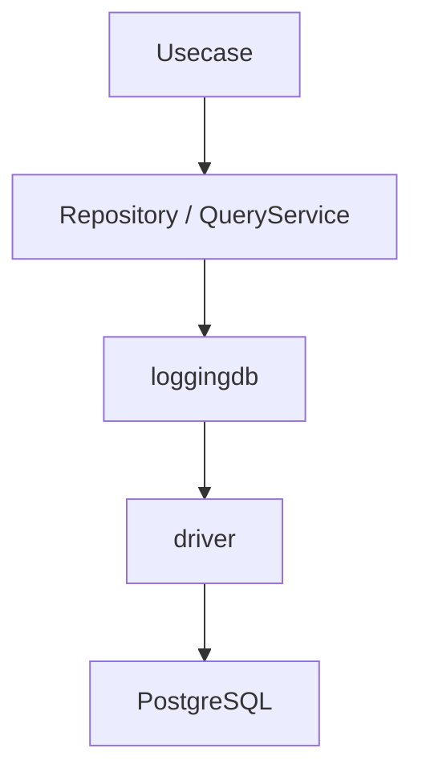
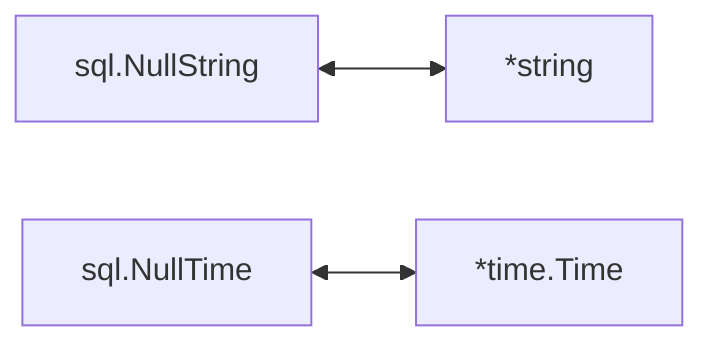
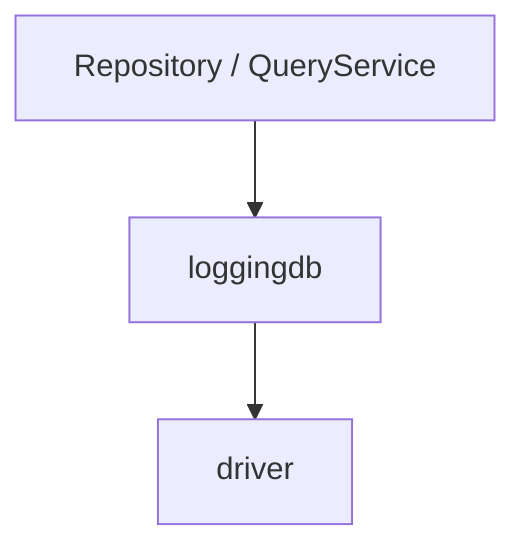
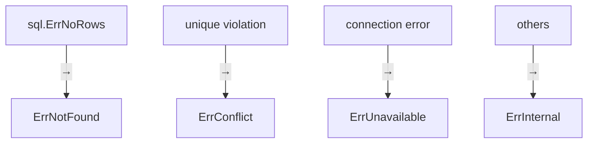

# RDB Infrastructure Guide (`internal/infrastructure/rdb`)

[English](README.md) | Japanese

## Role

`internal/infrastructure/rdb` is an **Infrastructure subsystem for using RDB (PostgreSQL)**.

This directory has the following responsibilities.

- Connection management to PostgreSQL
- SQL execution (sqlc)
- Repository / QueryService implementation
- SQL execution logging and tracing (Observability)
- PostgreSQL error normalization
- Conversion between DB nullable types and Go types

Domain / Usecase can use **data persistence and querying without being aware of RDB implementation details**.

## RDB Architecture

This directory is composed of the following layered structure.



The responsibilities of each layer are as follows.

|Layer|Role|
|---|---|
|Repository|Aggregate persistence (implementation of Domain Repository Interface)|
|QueryService|Provides search-specific queries (implementation of Usecase Interface)|
|loggingdb|Adds SQL logging / tracing (Observability wrapper)|
|driver|DB connection management / transaction management|
|PostgreSQL|Actual DB|

The following exist as supporting components.

|Component|Role|
|---|---|
|sqlc|Type-safe query execution code generated from SQL|
|conv|Conversion between nullable types and Go types|
|pgerror|PostgreSQL error → application error conversion|
|testkit|RDB test utilities (real DB + rollback)|

## Directory Structure

```txt
internal/infrastructure/rdb

 ├ repository/        Repository implementation
 ├ query_service/     QueryService implementation
 ├ driver/            DB connection / transaction
 │   └ loggingdb/     SQL logging / tracing wrapper
 ├ sqlc/              sqlc generated code + SQL helper
 ├ conv/              nullable type conversion
 ├ postgres/
 │   └ pgerror/       PostgreSQL error normalization
 └ testkit/           RDB test utilities
```

## Repository

Repository is the layer that **implements the Domain Repository Interface**.

Main responsibilities

- sqlc query execution
- Row → Domain entity conversion
- DB error normalization

Important: **Repository does not contain business logic**

See details below.

[repository directory README](repository/README.ja.md)

## QueryService

QueryService is the layer that **provides read-only queries such as search and listing**.

While Repository handles Aggregate persistence,  
QueryService is specialized for search use cases.

Main responsibilities

- Execute search queries
- Convert Row → Domain / DTO
- Normalize DB errors

Important: **Search must be implemented in QueryService, not Repository**

See details below.

[query_service directory README](query_service/README.ja.md)

## sqlc

`sqlc` is a tool that generates Go code from SQL.

In this directory:

- sqlc generated code
- LIKE search helper
- Enum / state conversion helper

are provided.

Generated code is placed at:

`internal/infrastructure/rdb/sqlc/gen`

See details below.

[sqlc directory README](sqlc/README.md)

## conv

`conv` is a **utility for converting between nullable types and Go pointer types**.



Used in Repository / QueryService implementations.

See details below.

[conv directory README](conv/README.md)

## driver

`driver` is the **lowest layer that provides DB connection and transaction management**.

Main functions

- DatabaseDriver abstraction
- DB connection pool management
- Transaction management (tx.Manager)
- DBTX interface for sqlc

Important: **Transaction boundaries are managed by the Usecase layer**

See details below.

[driver directory README](driver/README.md)

## loggingdb

`loggingdb` is an **Observability wrapper that adds SQL execution logs and tracing**.



Main functions

- SQL log output
- OpenTelemetry span
- Query execution time measurement
- slow query detection

Important:  
**loggingdb does not execute DB operations (pure wrapper)**

See details below.

[loggingdb directory README](driver/loggingdb/README.md)

## PostgreSQL Error Normalization

`postgres/pgerror` is a **layer that converts PostgreSQL-specific errors into application errors**.

Repository / QueryService use:

```go
pgerror.NormalizeError(err)
```

to normalize DB errors.

Main conversions



See details below.

[pgerror directory README](postgres/pgerror/README.md)

## testkit

`testkit` is a **utility for testing using RDB**.

Main functions

- Test DB initialization
- LoggingDBProvider generation
- Transaction-based testing (automatic rollback)

Test characteristics

- real DB
- transaction rollback
- parallel execution (Tx is serialized)

See details below.

[testkit directory README](testkit/README.md)

## Design Principles

This RDB subsystem is based on the following design principles.

### 1. Hiding DB Implementation

Domain / Usecase do not depend on:

- sql
- pgx
- sql.DB

### 2. Separation of Responsibility (Repository / QueryService)

- Write / persistence → Repository
- Search / read       → QueryService

### 3. Centralized Transaction Boundary Management

Usecase manages Tx, and Infrastructure does not start Tx.

### 4. DB Error Normalization

PostgreSQL-specific errors are converted into application-wide errors by `pgerror`.

### 5. SQL Type Safety

All SQL execution is performed through `sqlc`.

### 6. Observability

SQL execution logging and tracing are provided by `loggingdb`.

### 7. Test Strategy (Integration-based)

Repository / QueryService tests are executed with:

real DB + rollback

This is safely implemented using `testkit`.
