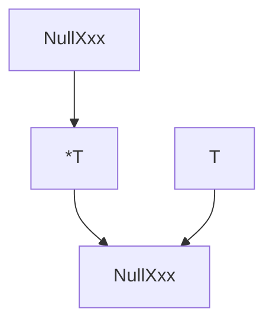
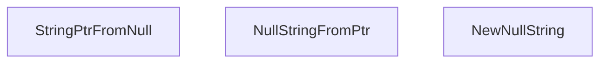
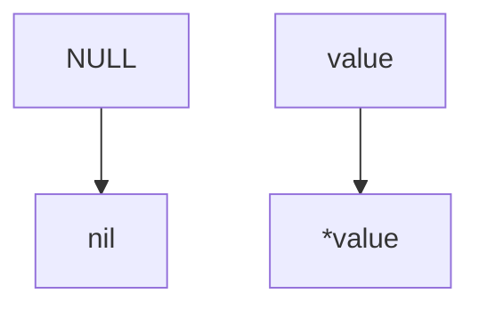
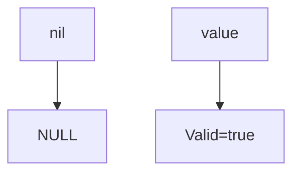
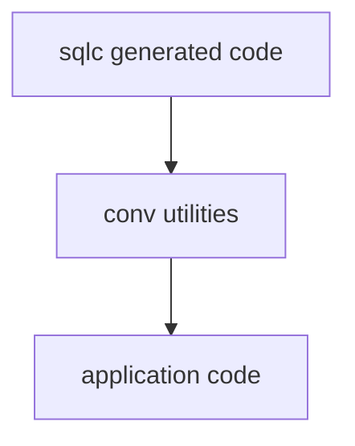

# `conv` Package

[English](README.md) | Japanese

Overview: Provides utility functions to convert between `database/sql` nullable types (`sql.NullString`, `sql.NullInt16`, `sql.NullInt64`, `sql.NullBool`, `sql.NullFloat64`, `sql.NullTime`) and Go pointer types (`*string`, `*int64`, etc.), as well as `googleUUID.NullUUID`.

This package is primarily an **Infrastructure-layer utility used in combination with sqlc-generated code**.

## Responsibility

This package bridges nullable values in the database and pointer values in application code.

Primary responsibilities:

- Convert nullable values retrieved from the database into pointer types that are easy to use in application code
- Convert pointer values created in the application into `sql.NullXxx` types for database writes
- Encapsulate NULL handling into functions to prevent duplicated logic
- Clearly separate database-specific types from application types

This allows **NULL handling to be centralized in a single place**.

## Supported Types

This package handles the following nullable types.

### database/sql

- `sql.NullString`
- `sql.NullInt16`
- `sql.NullInt64`
- `sql.NullBool`
- `sql.NullFloat64`
- `sql.NullTime`

### UUID

- `github.com/google/uuid.NullUUID`

UUID is converted to and from the application's `pkg/uuid.UUID`.

## Provided Conversion Patterns

For each type, **symmetric conversion APIs** are provided.



Example (string)



This symmetric design allows the same rules to be used for both reading and writing.

## Usage (Behavior-Based)

### Read Side

Convert nullable values retrieved from the database into pointers.

```go
name := conv.StringPtrFromNull(row.Name)
```

Conversion rules



In application code, `nil` can be used to determine NULL.

### Write Side

Convert pointers into nullable types.

```go
row.Name = conv.NullStringFromPtr(namePtr)
```

Conversion rules



### Create nullable from value

Convert non-NULL values into nullable types.

```go
row.Name = conv.NewNullString("alice")
```

## UUID Conversion

UUID conversion converts between `googleUUID.NullUUID` and the application's `uuid.UUID`.

```go
UUIDPtrFromNull
NullUUIDFromPtr
NewNullUUID
```

Note:

- `UUIDPtrFromNull` involves UUID parsing and therefore **returns an error**.

Example

```go
u, err := conv.UUIDPtrFromNull(row.UserID)
if err != nil {
    return err
}
```

## Pointer Safety

Pointers generated from nullable types reference a copy of the internal value.

In other words

```txt
&ns.String
```

This means they do not directly reference the internal memory of the DB driver.

Therefore, they can be safely handled as normal pointer values.

## Relationship with sqlc

This package is primarily used as a **support utility for sqlc-generated code**.

Role



This enables separation of responsibilities between:

- DB types
- Application types

## Testing

Unit tests are provided for each function (`nullable_test.go`).

Tests use `testify/require` and verify the following:

- `Valid` flag is correctly set
- NULL → nil
- nil → NULL

## Necessity

### Production

Not required, but **strongly recommended**.

Reason

- Centralized NULL handling
- Prevent duplicated code
- Reduce bug risk

### Development / Testing

Recommended

Reason

- Easily express NULL / non-NULL cases
- Improve readability of test code

## Impact if Disabled

Direct runtime failures are unlikely, but:

- NULL handling becomes scattered across the codebase
- Duplicate logic increases
- Becomes a source of bugs

These risks may arise.

## Notes

This package provides **conversion utilities only**.

Responsibilities not handled:

- DB query execution
- Transaction management
- Domain logic

These should be implemented in:

- Repository
- Usecase

and other layers.

## Extension Rules

When adding new nullable types, follow the naming convention below.

```go
func XxxPtrFromNull (...) {
  // Implementation
}
func NullXxxFromPtr (...) {
  // Implementation
}
func NewNullXxx (...) {
  // Implementation
}
```

Example

```go
func DecimalPtrFromNull (...) {
  // Implementation
}
func NullDecimalFromPtr (...) {
  // Implementation
}
func NewNullDecimal (...) {
  // Implementation
}
```

This rule maintains API consistency.
