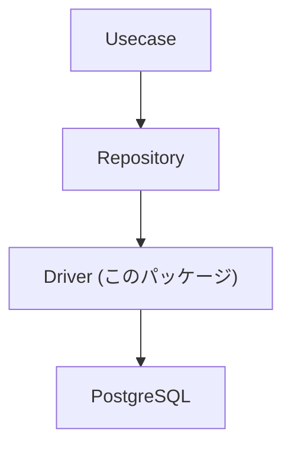
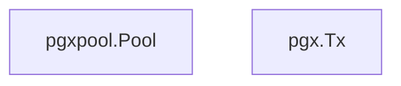
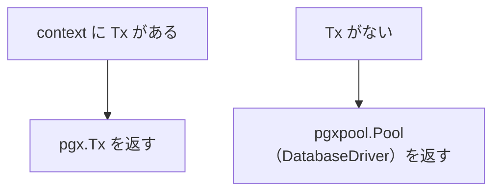

# driver

[English](README.md) | 日本語

概要: **RDB（PostgreSQL / pgx）接続のための基盤ドライバレイヤー。接続管理・トランザクション境界・sqlc 実行アダプタを提供します。**

このパッケージは **Infrastructure 層の最下位に位置する DB アクセス基盤**です。

Repository 層はこの driver を通して DB にアクセスします。

## アーキテクチャ上の位置



Driver は **RDB 接続の最下層アダプタ**です。

## 役割

このディレクトリは次の機能を提供します。

- `pgxpool.Pool` をラップした **DatabaseDriver 抽象化**
- **トランザクション管理 (`tx.Manager`)**
- **pgx ベースの DBTX インターフェース提供（sqlc 互換）**
- **接続プール設定**
- **DB 起動時の疎通確認 (fail fast)**

これにより Repository 層は



のどちらでも同じクエリコードを実行できます。

## DB 初期化

DB 接続を初期化するコンストラクタは 2 つあります。

```go
func NewDB(...) (DatabaseDriver, error)                         // クエリトレーサーなし
func NewTracedDB(..., tracer pgx.QueryTracer) (DatabaseDriver, error) // クエリトレーサーあり
```

`NewTracedDB` はアプリ本体（DI）が利用し、pgx クエリトレーサーを `poolCfg.ConnConfig.Tracer`
に結線します。`NewDB`（トレーサーなし）は、クエリ計装が不要なツール経路（マイグレーション /
シード等）のために残しています。

処理内容:

1. `pgxpool.NewWithConfig()` による接続初期化
2. 接続プール設定
    - MaxConns
    - MinConns
    - ConnMaxLifetime
    - ConnMaxIdleTime
3. クエリトレーサーを `ConnConfig.Tracer` に結線（指定時のみ）
4. `Ping` による DB 疎通確認

Ping に失敗した場合は **起動時にエラーを返す (fail fast)** 設計です。

## DatabaseDriver

`DatabaseDriver` は `pgxpool.Pool` を抽象化したインターフェースです。

```go
 type DatabaseDriver interface {
     DBTX

     Begin(ctx context.Context) (pgx.Tx, error)
     Ping(ctx context.Context) error
     Close() error
     Stats() *pgxpool.Stat
 }
```

目的:

- `pgxpool.Pool` への直接依存を避ける
- テスト時に mock 化を可能にする
- トランザクション開始を抽象化する

実装は `dbDriver` が提供します。

## DBTX

`DBTX` は **sqlc が要求する最小インターフェース**です。

```go
 type DBTX interface {
     Exec(ctx context.Context, query string, args ...any) (pgconn.CommandTag, error)
     Query(ctx context.Context, query string, args ...any) (pgx.Rows, error)
     QueryRow(ctx context.Context, query string, args ...any) pgx.Row
 }
```

このインターフェースにより sqlc は


のどちらでも同じクエリコードを実行できます。

## トランザクション透過レイヤ

`connection.go` の `New()` は **トランザクション透過アダプタ**です。

```go
func New(ctx context.Context, db DatabaseDriver) DBTX
```

挙動:



これにより Repository 層は`DB`と`Tx`の違いを意識せずクエリを実行できます。

## トランザクション管理

`tx.Manager` は Usecase 層のトランザクション境界を提供します。

```go
err := tx.Do(ctx, func(ctx context.Context) error {
    ...
})
```

内部では次の処理を行います。

1. context に Tx が存在するか確認
2. 存在すれば **既存 Tx を再利用**
3. 存在しなければ **新規 Tx を開始**
4. fn 実行
5. 成功 → commit
6. error → rollback

※ pgx.Tx を利用したトランザクション管理です。

これにより **ネストトランザクションを安全に扱うことができます。**

## 注意点

### トランザクション cleanup タイムアウト

rollback / commit 実行時は、リクエストの `context` がキャンセルされていても cleanup を必ず試行する必要があります。

そのため、以下のパターンを採用しています。

```go
context.WithTimeout(
    context.WithoutCancel(ctx),
    cleanupTimeout,
)
```

#### なぜ `context.WithoutCancel(ctx)` を使うのか

cleanup は **リクエストライフサイクルに依存してはいけません**。

もし元の `ctx` をそのまま使うと:

- request timeout / client cancel により
- rollback / commit がキャンセルされ
- トランザクションが開いたまま残り
- connection pool が枯渇する可能性があります

`context.WithoutCancel(ctx)` を使うことで:

- cleanup は必ず実行される
- trace / logger / correlation ID は維持される

> cleanup は「成功させること」ではなく「安全に試みること」が重要です。

#### cleanupTimeout について

- rollback / commit に許可する最大時間
- 現在は `5秒` に固定

この値は **ビジネス設定ではなくインフラ保護のためのセーフティ値** です。

- 長すぎると:
  - goroutine 詰まり
  - connection pool 枯渇
- 短すぎると:
  - cleanup 未完了

そのため、環境変数ではなく driver 内の定数として管理しています。

ポイント:

- `context.WithoutCancel(ctx)`
  - リクエストキャンセルの影響を受けずに cleanup を実行
  - trace / logger / correlation ID は維持される

- `cleanupTimeout`
  - cleanup（rollback / commit）に対する最大待機時間
  - 現在は `5秒` に固定

この値は**ビジネス設定ではなくインフラ保護のためのセーフティ値**です。

- 長くしすぎると:
  - goroutine 詰まり
  - connection pool 枯渇
- 短すぎると:
  - cleanup 未完了

そのため、通常は driver 内の定数として管理し、環境変数などで外部化しない方針としています。

### Context を必ず伝搬する

トランザクションは`context.Context`に格納されます。そのため`ctx`を必ず下位レイヤに伝搬してください。

### Repository は driver.New() を使用する

Repository 層では

```go
driver.New(ctx, db)
```

を利用して `DBTX` を取得します。

これにより`Tx`と`DB`を透過的に切り替えることができます。

## DSN ヘルパー（config.go）

DB 接続用の DSN を組み立てるユーティリティです。

|関数|説明|
|---|---|
|`DSN(dbCfg)`|基本の接続 URL を生成|
|`DSNWithTimeZone(dbCfg, osCfg)`|タイムゾーン付き接続 URL を生成|
|`DSNString(dbCfg)`|`DSN` の文字列版|
|`DSNWithTimeZoneString(dbCfg, osCfg)`|`DSNWithTimeZone` の文字列版|

## NewTransactionManager

```go
func NewTransactionManager(db DatabaseDriver, logger logging.Logger, sleeper clock.Sleeper) tx.Manager
```

Usecase 層の `tx.Manager`（`internal/usecase/boundary/tx`）を実装するコンストラクタです。
`Do` は `serialization_failure`(40001) / `deadlock_detected`(40P01) を検出するとトランザクション全体を
有限回まで再試行します（`sleeper` で指数 backoff + full jitter, `pkg/retry`）。`fn` の冪等性契約は
`tx` 境界 README を参照してください。

## クエリトレーサー（query_tracer.go）

`NewQueryTracer` は `ConnConfig.Tracer` に結線する `pgx.QueryTracer` を生成します。OpenTelemetry
span のために `otelpgx` を埋め込み、クエリログ（正常終了 Info / スロー Warn / 失敗 Error）を上乗せします。

|型 / 関数|説明|
|---|---|
|`NewQueryTracer`|`pgx.QueryTracer` を生成（DB / Observability 設定、Logger、LogFieldBuilder を受け取る）|
|`queryTracer`|`*otelpgx.Tracer` を埋め込み、`TraceQueryStart` / `TraceQueryEnd` を上書きしてログを付加|

特徴：

- `otelpgx` によるクエリごとの OpenTelemetry span（semconv の DB 属性付き、batch / copy も対象）
- 正常終了時の**Info ログ**（latency 付き）
- クエリ失敗時の**エラーログ**（`span.RecordError` に加えて）
- `DB_SLOW_QUERY_WARN_THRESHOLD` 超過時の**スロークエリ Warn ログ**
- `OBS_MASKED_DB_QUERY_ARGS` によるクエリ引数のマスキング
