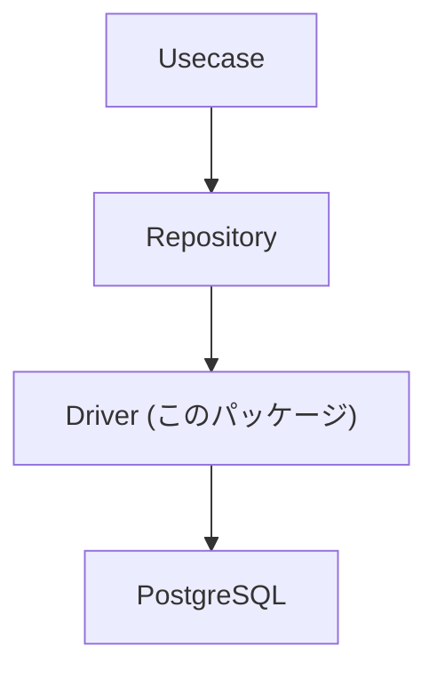
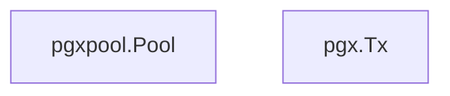
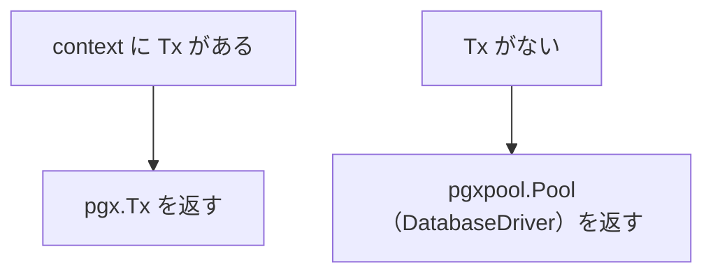

# driver

[English](README.md) | 日本語

概要: **RDB（PostgreSQL / pgx）接続のための基盤ドライバレイヤー。接続管理・トランザクション境界・sqlc 実行アダプタを提供します。**

このパッケージは **Infrastructure 層の最下位に位置する DB アクセス基盤**です。

Repository 層はこの driver を通して DB にアクセスします。

## アーキテクチャ上の位置



Driver は **RDB 接続の最下層アダプタ**です。

## 役割

このディレクトリは次の機能を提供します。

- `pgxpool.Pool` をラップした **DatabaseDriver 抽象化**
- **トランザクション管理 (`tx.Manager`)**
- **pgx ベースの DBTX インターフェース提供（sqlc 互換）**
- **接続プール設定**
- **DB 起動時の疎通確認 (fail fast)**

これにより Repository 層は



のどちらでも同じクエリコードを実行できます。

## DB 初期化

`NewDB()` は DB 接続を初期化します。

```go
func NewDB(...) (DatabaseDriver, error)
```

処理内容:

1. `pgxpool.NewWithConfig()` による接続初期化
2. 接続プール設定
    - MaxConns
    - MinConns
    - ConnMaxLifetime
    - ConnMaxIdleTime
3. `Ping` による DB 疎通確認

Ping に失敗した場合は **起動時にエラーを返す (fail fast)** 設計です。

## DatabaseDriver

`DatabaseDriver` は `pgxpool.Pool` を抽象化したインターフェースです。

```go
 type DatabaseDriver interface {
     DBTX

     Begin(ctx context.Context) (pgx.Tx, error)
     Ping(ctx context.Context) error
     Close() error
     Stats() *pgxpool.Stat
 }
```

目的:

- `pgxpool.Pool` への直接依存を避ける
- テスト時に mock 化を可能にする
- トランザクション開始を抽象化する

実装は `dbDriver` が提供します。

## DBTX

`DBTX` は **sqlc が要求する最小インターフェース**です。

```go
 type DBTX interface {
     Exec(ctx context.Context, query string, args ...any) (pgconn.CommandTag, error)
     Query(ctx context.Context, query string, args ...any) (pgx.Rows, error)
     QueryRow(ctx context.Context, query string, args ...any) pgx.Row
 }
```

このインターフェースにより sqlc は


のどちらでも同じクエリコードを実行できます。

## トランザクション透過レイヤ

`connection.go` の `New()` は **トランザクション透過アダプタ**です。

```go
func New(ctx context.Context, db DatabaseDriver) DBTX
```

挙動:



これにより Repository 層は`DB`と`Tx`の違いを意識せずクエリを実行できます。

## トランザクション管理

`tx.Manager` は Usecase 層のトランザクション境界を提供します。

```go
err := tx.Do(ctx, func(ctx context.Context) error {
    ...
})
```

内部では次の処理を行います。

1. context に Tx が存在するか確認
2. 存在すれば **既存 Tx を再利用**
3. 存在しなければ **新規 Tx を開始**
4. fn 実行
5. 成功 → commit
6. error → rollback

※ pgx.Tx を利用したトランザクション管理です。

これにより **ネストトランザクションを安全に扱うことができます。**

## 注意点

### Context を必ず伝搬する

トランザクションは`context.Context`に格納されます。そのため`ctx`を必ず下位レイヤに伝搬してください。

### Repository は driver.New() を使用する

Repository 層では

```go
driver.New(ctx, db)
```

を利用して `DBTX` を取得します。

これにより`Tx`と`DB`を透過的に切り替えることができます。

## 必要度

### 本番運用

必須

理由

- DB 接続管理
- トランザクション境界
- sqlc クエリ実行

のすべてがこのレイヤに依存しているためです。

### 開発 / テスト

推奨

理由

- `DatabaseDriver` が interface のため
- mock を使ったテストが可能
