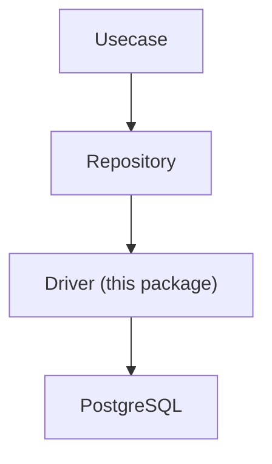
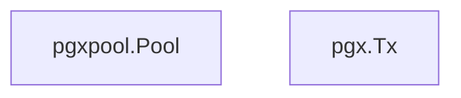
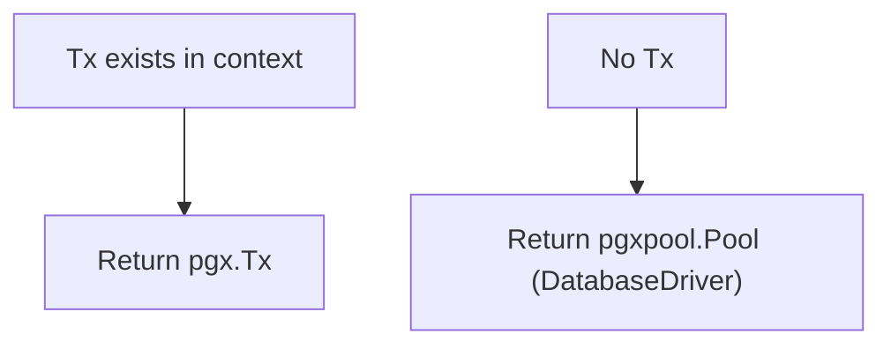

# driver

English | [日本語](README.ja.md)

Overview: **Base driver layer for RDB (PostgreSQL / pgx) connections. Provides connection management, transaction boundaries, and sqlc execution adapters.**

This package is the **lowest-level DB access foundation in the Infrastructure layer**.

The Repository layer accesses the DB through this driver.

## Architectural Position



Driver is the **lowest-level adapter for RDB connections**.

## Responsibilities

This directory provides the following functionalities:

- **DatabaseDriver abstraction** wrapping `pgxpool.Pool`
- **Transaction management (`tx.Manager`)**
- **Provision of pgx-based DBTX interface (sqlc compatible)**
- **Connection pool configuration**
- **Connectivity check at DB startup (fail fast)**

With this, the Repository layer can execute the same query code with either:



## DB Initialization

`NewDB()` initializes the DB connection.

```go
func NewDB(...) (DatabaseDriver, error)
```

Processing details:

1. Initialize connection via `pgxpool.NewWithConfig()`
2. Configure connection pool
    - MaxConns
    - MinConns
    - ConnMaxLifetime
    - ConnMaxIdleTime
3. Verify DB connectivity using `Ping`

If Ping fails, it returns an error at startup (**fail fast** design).

## DatabaseDriver

`DatabaseDriver` is an interface that abstracts `pgxpool.Pool`.

```go
 type DatabaseDriver interface {
     DBTX

     Begin(ctx context.Context) (pgx.Tx, error)
     Ping(ctx context.Context) error
     Close() error
     Stats() *pgxpool.Stat
 }
```

Purpose:

- Avoid direct dependency on `pgxpool.Pool`
- Enable mocking during tests
- Abstract transaction start

Implementation is provided by `dbDriver`.

## DBTX

`DBTX` is the **minimal interface required by sqlc**.

```go
 type DBTX interface {
     Exec(ctx context.Context, query string, args ...any) (pgconn.CommandTag, error)
     Query(ctx context.Context, query string, args ...any) (pgx.Rows, error)
     QueryRow(ctx context.Context, query string, args ...any) pgx.Row
 }
```

With this interface, sqlc can execute the same query code with either:


## Transaction Transparent Layer

`New()` in `connection.go` is a **transaction-transparent adapter**.

```go
func New(ctx context.Context, db DatabaseDriver) DBTX
```

Behavior:



With this, the Repository layer can execute queries without being aware of the difference between `DB` and `Tx`.

## Transaction Management

`tx.Manager` provides transaction boundaries in the Usecase layer.

```go
err := tx.Do(ctx, func(ctx context.Context) error {
    ...
})
```

Internally, it performs the following:

1. Check if Tx exists in context
2. If exists → **reuse existing Tx**
3. If not → **start new Tx**
4. Execute fn
5. Success → commit
6. error → rollback

- Uses pgx.Tx for transaction management.

This enables **safe handling of nested transactions**.

## Notes

### Always propagate Context

Transactions are stored in `context.Context`. Therefore, always propagate `ctx` to lower layers.

### Repository must use driver.New()

In the Repository layer:

```go
driver.New(ctx, db)
```

Use this to obtain `DBTX`.

This allows transparent switching between `Tx` and `DB`.

## Necessity

### Production

Required

Reason:

- DB connection management
- Transaction boundaries
- sqlc query execution

All depend on this layer.

### Development / Testing

Recommended

Reason:

- `DatabaseDriver` is an interface
- Enables testing with mocks
