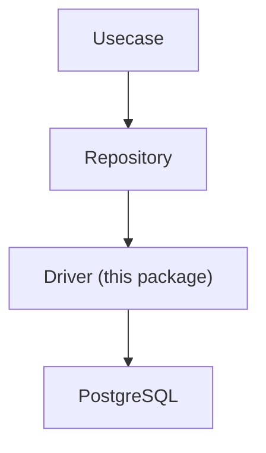
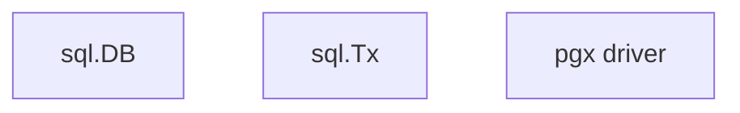
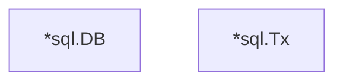
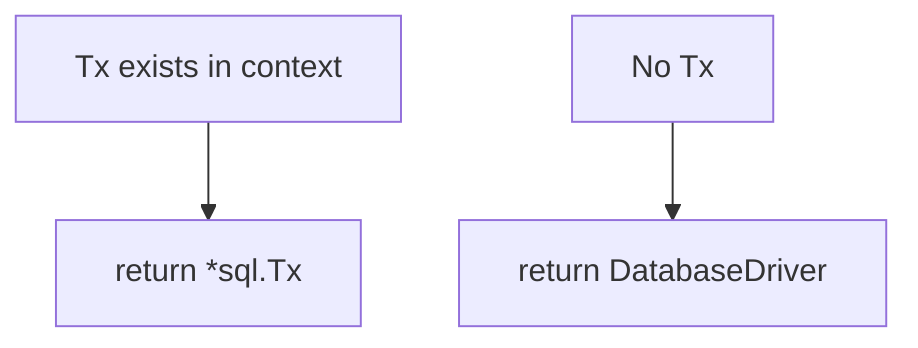

# driver

[English](README.md) | 日本語

Overview: **A foundational driver layer for RDB (PostgreSQL) connectivity. Provides connection management, transaction boundaries, and sqlc execution adapters.**

This package is the **lowest-level DB access infrastructure in the Infrastructure layer**.

The Repository layer accesses the DB through this driver.

## Architectural Position



Driver is the **lowest-level adapter for RDB connections**.

## Responsibilities

This directory provides the following functions.

- **DatabaseDriver abstraction** wrapping `sql.DB`
- **Transaction management (`tx.Manager`)**
- **DBTX interface provision for sqlc**
- **Connection pool configuration**
- **DB connectivity check at startup (fail fast)**

As a result, the Repository layer:



is designed to **not directly depend on concrete DB implementations** such as these.

## DB Initialization

`NewDB()` initializes the DB connection.

```go
func NewDB(...) (DatabaseDriver, error)
```

Processing contents:

1. Initialize connection with `sql.Open()`
2. Connection pool configuration
    - MaxOpenConns
    - MaxIdleConns
    - ConnMaxLifetime
    - ConnMaxIdleTime
3. DB connectivity check using `PingContext`

If Ping fails, it is designed to **return an error at startup (fail fast)**.

## DatabaseDriver

`DatabaseDriver` is an interface that abstracts `sql.DB`.

```go
 type DatabaseDriver interface {
     DBTX

     BeginTx(ctx context.Context, opts *sql.TxOptions) (*sql.Tx, error)
     PingContext(ctx context.Context) error
     Close() error
 }
```

Purpose:

- Avoid direct dependency on `sql.DB`
- Enable mocking in tests
- Abstract transaction start

The implementation is provided by `dbDriver`.

## DBTX

`DBTX` is the **minimal interface required by sqlc**.

```go
 type DBTX interface {
     ExecContext(ctx context.Context, query string, args ...any) (sql.Result, error)
     PrepareContext(ctx context.Context, query string) (*sql.Stmt, error)
     QueryContext(ctx context.Context, query string, args ...any) (*sql.Rows, error)
     QueryRowContext(ctx context.Context, query string, args ...any) *sql.Row
 }
```

With this interface, sqlc can:



execute the same query code with either.

## Transaction Transparent Layer

`New()` in `connection.go` is a **transaction-transparent adapter**.

```go
func New(ctx context.Context, db DatabaseDriver) DBTX
```

Behavior:



This allows the Repository layer to execute queries without being aware of the difference between `DB` and `Tx`.

## Transaction Management

`tx.Manager` provides transaction boundaries for the Usecase layer.

```go
err := tx.Do(ctx, func(ctx context.Context) error {
    ...
})
```

Internally, it performs the following processing.

1. Check if a Tx exists in context
2. If it exists → **reuse existing Tx**
3. If it does not exist → **start new Tx**
4. Execute fn
5. Success → commit
6. error → rollback

This enables **safe handling of nested transactions**.

## Notes

### Always propagate Context

Transactions are stored in `context.Context`. Therefore, always propagate `ctx` to lower layers.

### Repository must use driver.New()

In the Repository layer:

```go
driver.New(ctx, db)
```

is used to obtain `DBTX`.

This allows transparent switching between `Tx` and `DB`.

## Necessity

### Production

Required

Reason:

- DB connection management
- Transaction boundaries
- sqlc query execution

all depend on this layer.

### Development / Testing

Recommended

Reason:

- `DatabaseDriver` is an interface
- Enables testing using mocks
