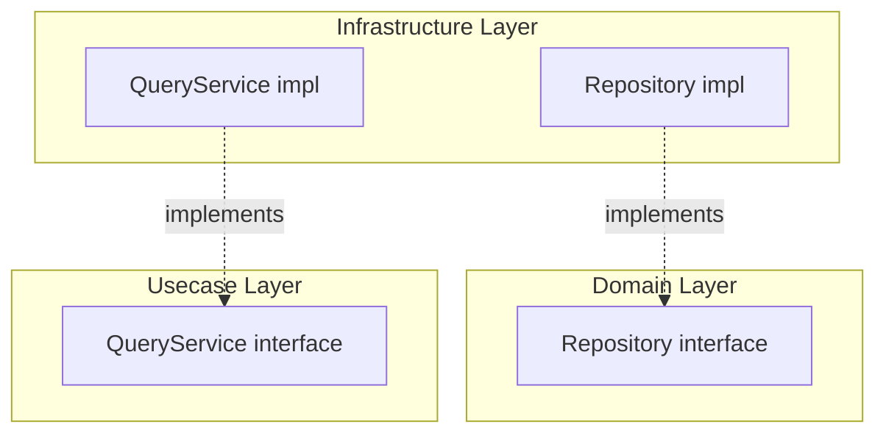
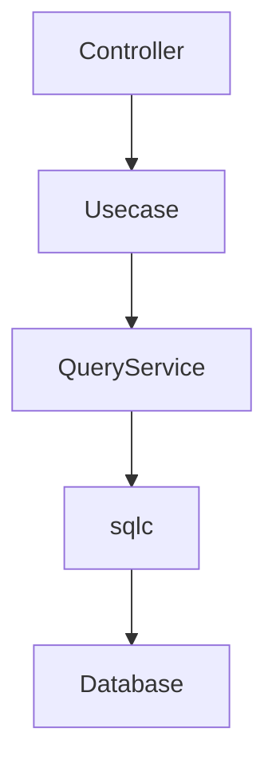
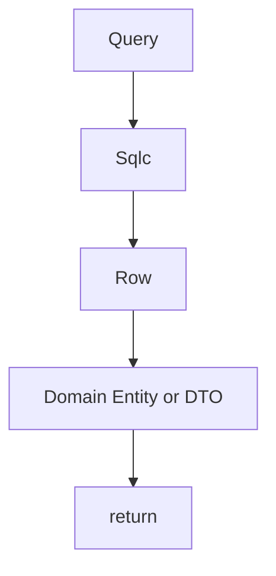
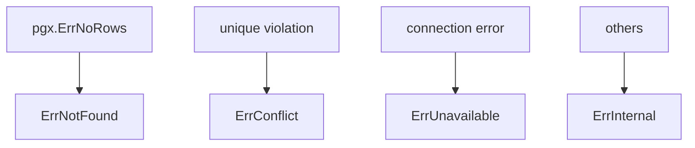
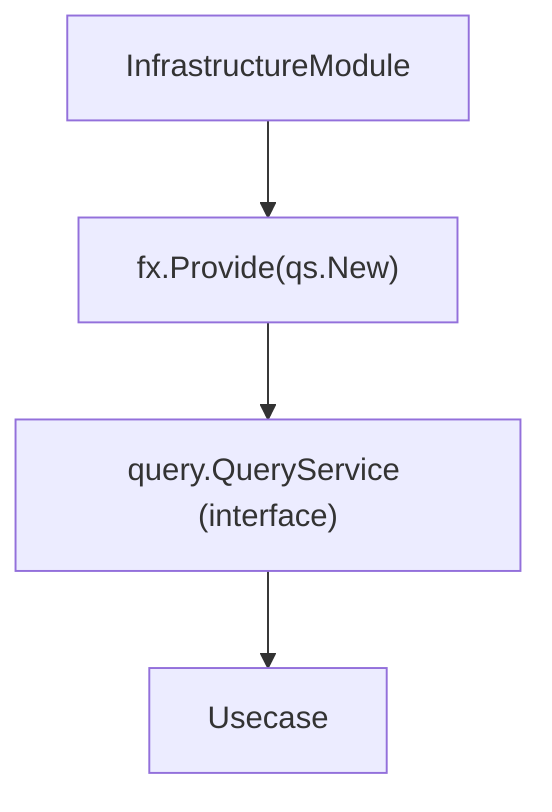
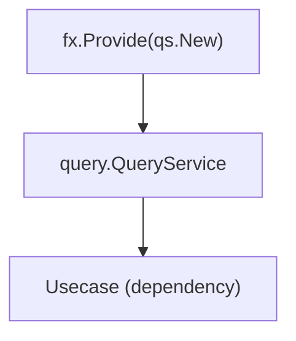

# Query Service Implementation Guide

English | [日本語](README.ja.md)

## Position of Query Service in Onion Architecture

In Onion Architecture, persistence abstractions are defined as **Repository interfaces** in the Domain layer. Repository handles per-Aggregate CRUD and guards Domain invariants.

Query Service (QS), on the other hand, is an **intentional exception to this principle**.



### Why QS Interface Lives in Usecase, Not Domain

|Aspect|Repository|Query Service|
|---|---|---|
|Concern|Aggregate persistence|Usecase-specific search|
|Granularity|Per Aggregate|Per screen / API response|
|Return type|Domain Entity|DTO (display projection)|
|Invariants|Guaranteed by Domain|Not involved|
|Interface placement|Domain layer|Usecase layer|

QS returns **projections that a usecase needs, not complete Aggregate reconstructions**. This is a Usecase concern, not a Domain concern, so the interface is placed in the Usecase layer (`internal/usecase/<aggregate>/query`).

> **Note (Repository may also return a small read model).** The "Return type = DTO" row above is the
> *typical* split, not an absolute — a Repository read that JOINs a *fixed reference master* (e.g.
> `purchases` → `purchase_statuses`) may return a small read model with the resolved display value and
> still be a single-Aggregate Repository read (not a QS). What moves a read to QS is crossing
> *independent* Aggregates / a derived projection, not merely returning a non-Entity. See
> `docs/rules.md` § "Repository / QueryService Rules".

### Relationship to CQRS

Introducing QS is a **lightweight CQRS (Command Query Responsibility Segregation)** approach.

- **Command (write)**: Goes through Repository, guarding Domain Entity invariants
- **Query (read)**: Goes through QS, executing performance-optimized search queries directly

This is not full CQRS (separate DB / event sourcing), but a **practical design that separates read/write responsibilities on the same DB**.

### When to Use QS Over Repository

Consider QS instead of Repository when:

- Searches requiring multi-table JOINs
- Paginated list retrieval
- Full-text or keyword search
- Queries requiring aggregation or grouping
- Reads whose natural shape is a projection wasteful to reconstruct as a full Aggregate
  (a few columns from a heavy Aggregate, or a joined view)

Conversely, **simple single-Aggregate reads stay in Repository** — fetch by ID, and simple
filter / list / count by the Aggregate's own attributes (including an unfiltered full list such
as `SELECT * FROM <table> ORDER BY ...`). Returning many rows, or mapping the result to a
response DTO, does **not** by itself move a read to QS — only crossing Aggregates or the
query-complexity cases above do. See
[`docs/rules.md`](../../../../docs/rules.md) § "Repository / QueryService Rules".

## Role

Query Service is a layer that provides **read-only queries such as search and list retrieval**.



The responsibilities of Query Service are as follows:

1. Execute SQL search
2. Convert Row → Domain Entity / DTO
3. Normalize DB errors

Query Service **does not contain business logic.**

## Architecture Position

QueryService implementations are placed in the following location.

`internal/infrastructure/rdb/query_service/<aggregate>/`

Example

```txt
query_service/
 └ <aggregate>/
     └ <aggregate>_query_service.go
```

QueryService interfaces are placed in the **Usecase layer**.

`internal/usecase/<aggregate>/query`

Example

```txt
internal/usecase/<aggregate>/query/<aggregate>_query_service.go
```

Infrastructure **only implements this interface**.

## QueryService Responsibilities

QueryService is responsible for **search-specific data retrieval**.



QueryService does not perform the following:

- Business rules
- Usecase logic
- Controller processing
- Transaction management

## sqlc Usage

QueryService uses **sqlc generated queries**.

```go
rows, err := db.Search<Entities>(ctx, &gen.Search<Entities>Params{...})
```

## SQL Splitting Design

Search conditions (active / deleted / all) are not branched within SQL, but implemented as separate queries.

Example:

- Search<Entities>
- SearchActive<Entities>
- SearchDeleted<Entities>

Reasons:

- Improve SQL readability
- Improve index efficiency
- Simplify sqlc generated code

## LIKE Search Helper

For keyword search, use helpers from `internal/infrastructure/rdb/sqlc`.

Example

```go
escaped := sqlc.EscapeForLike(keyword, sqlc.DefaultLikeEscapeChar)
pattern := sqlc.WrapContainsLikePattern(escaped)
```

Purpose:

- Prevent LIKE injection
- Standardize search patterns

Keyword search is executed with OR conditions (ILIKE ANY).

## Deleted State Control

Filtering by deleted state is handled by branching in Go and calling dedicated queries.

```go
switch {
case filter.Active == nil:
    // all
case *filter.Active:
    // active
case !*filter.Active:
    // deleted
}
```

With this design:

- Prevent SQL complexity
- Maintain index efficiency
- Improve readability

## Row → Return Type Conversion

Row structs returned by sqlc are **Infrastructure-specific types**.

However, in this project, type conversions are applied at generation time using sqlc override:

- nullable → pointer type
- UUID → `pkg/uuid` type

Therefore, QueryService can pass generated types directly to Domain constructors or DTOs with minimal additional conversion.

```go
u, err := <aggregate>.New(
    row.ID,
    row.Field1,
    row.Field2,
    ...
)
```

Important rules:

- Do not return sqlc Row directly to upper layers
- Convert to Domain Entity or DTO

## About UUID

In this project, sqlc override aligns UUID in DB and `pkg/uuid` used in Domain.

Therefore, explicit UUID conversion in QueryService is generally unnecessary.

```go
row.<Entity>.ID // usable as-is
```

Use the `pkg/uuid` wrapper for UUID generation, comparison, and helper operations.

## About Nullable

Nullable values are handled as pointer types via sqlc override.

Therefore, additional conversion in QueryService is unnecessary.

```go
row.<Entity>.OptionalText  // *string
row.<Entity>.DeletedAt     // *time.Time
```

## DB Access (driver)

QueryService accesses the DB through `driver.DatabaseDriver`.

```go
db := gen.New(driver.New(ctx, s.db))
```

`driver.New(ctx, db)` provides:

- Transparent switching between DB / Tx (picks the tx in context if present)
- Context-based connection retrieval

SQL logging / tracing is applied transparently by the pgx query tracer wired at the driver
connection level (see `driver/README.md`), so QueryService is designed to **not be aware of DB
connection state**.

## Error Normalization

PostgreSQL errors are normalized in `internal/infrastructure/rdb/pgerror`.

```go
return pgerror.NormalizeError(err)
```

Main mappings:



## Observability (Tracing)

QueryService uses:

`observability.LayerTracer`

```go
ctx, endSpan := s.tracer.Start(ctx)
defer endSpan()
```

QueryService is responsible only for:

- span start
- span end

### About span name

Span names are uniformly assigned by LayerTracer, so QueryService does not need to explicitly specify them.

### Design Intent

- Ensure tracing consistency
- Separate responsibilities across layers
- Eliminate direct dependency on OpenTelemetry

## DI (Dependency Injection) Mechanism (Query Service)

Query Service is created using **DI with Uber Fx**.  
Like Repository, it is implemented in the Infrastructure layer and injected into the Usecase layer interface.

### Overall Structure

Query Service is registered via `fx.Provide` and injected into Usecase.



### Role of internal/di/module/persistence.go

Persistence providers (repository / query_service / system_cqrs) are registered in
`persistenceModule`, which `InfrastructureModule()` composes.

```go
func persistenceModule() fx.Option {
    return fx.Module("persistence",
        fx.Module("query_service",
            fx.Provide(
                <aggregate>qs.New,
            ),
        ),
    )
}
```

- `fx.Provide`
  - Registers the Query Service constructor
- Return value is the **interface defined in the Usecase layer**
  - Example: `query.<Aggregate>QueryService`

### Query Service Constructor Design

```go
func New(
    db driver.DatabaseDriver,
    tf observability.TracerFactory,
) query.<Aggregate>QueryService {
    return &service{
        db:     db,
        tracer: tf.Infra(),
    }
}
```

Key points:

- Return value must be an **interface (Usecase definition)**
- All dependencies must be received as arguments (new is prohibited)
- External dependencies such as DB / Tracer are confined to Infrastructure

### DI Flow



On the Usecase side:

```go
type service struct {
    qs query.<Aggregate>QueryService
}
```

is used to receive via interface.

### Difference from Repository (DI perspective)

||Repository|Query Service|
|---|---|---|
|interface definition location|domain|usecase|
|return type|domain.Repository|query.QueryService|
|purpose|persistence|search|

### Why return Usecase interface

- Query is a Usecase concern (per usecase)
- Not placed in Domain because it is not aggregate-based
- Allows flexible handling of search specification changes

### Rules for AI / Developers

- Query Service constructor must always be defined as `New`
- Return value must be the Usecase interface
- Do not new dependencies inside Query Service
- Register DI in `internal/di/module/persistence.go` (`persistenceModule`)

## QueryService Structure

QueryService has the following dependencies.

```go
type service struct {
    db     driver.DatabaseDriver
    tracer observability.LayerTracer
}
```

constructor

```go
func New(
    db driver.DatabaseDriver,
    tf observability.TracerFactory,
) query.<Aggregate>QueryService {
    return &service{
        db:     db,
        tracer: tf.Infra(),
    }
}
```

## Difference from Repository

Repository and QueryService have different roles.

||Repository|QueryService|
|---|---|---|
|purpose|Aggregate persistence|search|
|operation|CRUD|search|
|responsibility|Aggregate unit|search-specific|
|placement|domain interface|usecase interface|

## Anti-Patterns

### 1. Writing search in Repository

Search processing should be implemented in QueryService, not Repository.

However, the following simple filters are allowed in Repository:

- Retrieval by ID / foreign key
- Simple condition filtering
- Count retrieval (COUNT)

More complex searches (multiple conditions, full-text search, etc.) should be implemented in QueryService.

### 2. Writing business logic

QueryService is **data retrieval only**.

NG

```go
if entity.IsPremium() {
}
```

### 3. Returning sqlc Row

NG

```go
return rows
```

Always convert to Domain.

## Implementation Example

```go
// service is the implementation of QueryService.
// It is responsible for DB access and tracing.
type service struct {
    db     driver.DatabaseDriver
    tracer observability.LayerTracer
}

// New is the constructor for QueryService.
// All dependencies are injected externally; no new is performed internally.
func New(
    db driver.DatabaseDriver,
    tf observability.TracerFactory,
) query.<Aggregate>QueryService {
    return &service{
        db:     db,
        tracer: tf.Infra(),
    }
}

// buildLikeTokens converts keywords into LIKE patterns. Returns ["%"] (match-all) when empty.
func buildLikeTokens(keywords []string) []string {
    if len(keywords) == 0 {
        return []string{"%"}
    }
    tokens := make([]string, len(keywords))
    for i, kw := range keywords {
        escaped := sqlc.EscapeForLike(kw, sqlc.DefaultLikeEscapeChar)
        tokens[i] = sqlc.WrapContainsLikePattern(escaped)
    }
    return tokens
}

// FindByFilter searches based on keywords and deleted state.
// - Keywords are converted to LIKE patterns
// - Deleted state is branched in Go
// - SQL uses dedicated queries
func (s *service) FindByFilter(ctx context.Context, filter *query.<Aggregate>SearchFilter, limit, offset int32) (query.<Aggregate>SearchResults, error) {
    ctx, endSpan := s.tracer.Start(ctx)
    defer endSpan()

    tokens := buildLikeTokens(filter.Keywords)
    db := gen.New(driver.New(ctx, s.db))

    // Switch queries based on deleted state
    switch {
    case filter.Active == nil:
        return fetchSearchAll(ctx, db, &gen.Search<Entities>Params{
            PatternsParam: tokens,
            LimitParam:    limit,
            OffsetParam:   offset,
        })
    case *filter.Active:
        return fetchSearchActive(ctx, db, &gen.SearchActive<Entities>Params{
            PatternsParam: tokens,
            LimitParam:    limit,
            OffsetParam:   offset,
        })
    default:
        return fetchSearchDeleted(ctx, db, &gen.SearchDeleted<Entities>Params{
            PatternsParam: tokens,
            LimitParam:    limit,
            OffsetParam:   offset,
        })
    }
}

// fetchSearchAll is a helper function to search all rows.
// It separates logic from the service method and clarifies responsibilities.
func fetchSearchAll(
    ctx context.Context,
    db *gen.Queries,
    params *gen.Search<Entities>Params,
) (query.<Aggregate>SearchResults, error) {
    rows, err := db.Search<Entities>(ctx, params)
    if err != nil {
        return nil, pgerror.NormalizeError(err)
    }

    // Row → DTO conversion
    // sqlc override already maps nullable → pointer and UUID → pkg/uuid,
    // so each column is copied into the DTO with minimal additional conversion.
    results := make(query.<Aggregate>SearchResults, len(rows))
    for i, row := range rows {
        results[i] = &query.<Aggregate>SearchResult{
            // Field: row.Field,
            // ...
        }
    }

    return results, nil
}
```
