# Repository Implementation Guide

[English](README.md) | Japanese

## Responsibility

Repository is the layer that **implements the Domain persistence abstraction (Repository Interface) in Infrastructure**.

The responsibilities of this layer are strictly limited to the following three:

1. Executing queries using sqlc
2. Converting DB Rows → Domain entities
3. Normalizing DB errors

Repository **must not contain business logic**.

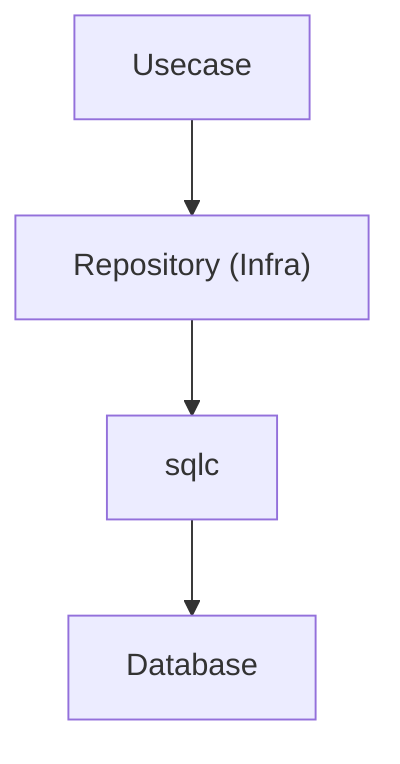

Repository simply **implements the Repository Interface defined by the Domain**.

## Architectural Position

Repository implementations should be placed in:

```txt
internal/infrastructure/rdb/repository/<aggregate>/
```

Example

```txt
repository/
 ├ user/
 │   └ user_repository.go
 └ prefecture/
     └ prefecture_repository.go
```

The Repository Interface must be placed in the **Domain layer**.

Location: `internal/domain/<aggregate>/repository.go`

Infrastructure **only implements** this interface.

## Repository Method Responsibility

Repository methods perform only the following processing.

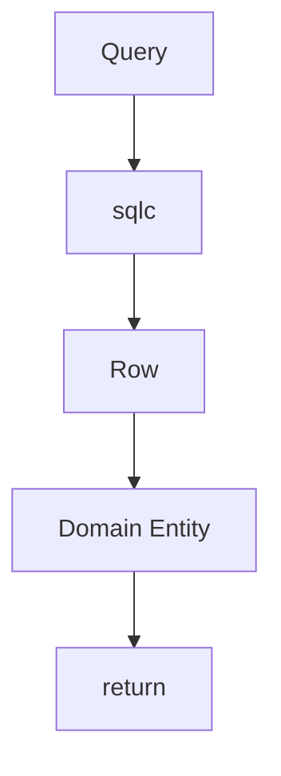

Repository must not perform:

- Business rules
- Aggregation processing
- DTO generation
- Usecase logic

These are the **responsibility of Usecase / Domain**.

## Using sqlc

Repository uses **sqlc generated query code**.

```go
rows, err := db.ListUsers(ctx, &gen.ListUsersParams{...})
```

With sqlc:

- Type-safe SQL execution
- Compile-time validation

becomes possible.

Generated code is located at:

`internal/infrastructure/rdb/sqlc/gen`

## Row → Domain Conversion

Row structures returned by sqlc are **Infrastructure-only types**.

Therefore Repository must always **convert them into Domain entities**.

```go
user, err := user.New(
    uuid.FromPrimitive(row.Users.ID),
    row.Users.FirstName,
    row.Users.LastName,
    ...
)
```

Important rules:

- Do not return sqlc Rows to upper layers
- Use Domain constructors

## Domain Constructor Errors

If Domain entity creation fails,  
the error must be **returned as-is**.

```go
user, err := user.New(...)
if err != nil {
    return nil, err
}
```

Reason:

- Domain invariant violation
- DB data inconsistency
- Migration mistakes

These are treated as **Domain-layer responsibility**.

## UUID Conversion

DB uses primitive UUID.

Domain uses `pkg/uuid.UUID`.

Therefore conversion is required.

```go
uuid.FromPrimitive(row.ID)
uuid.ToPrimitiveUniqueList(ids)
```

UUID operations use:

`pkg/uuid`

wrapper utilities.

## Nullable Conversion

Nullable DB values are represented using `sql.Null*`.

Repository converts them using:

`internal/infrastructure/rdb/conv`

Example

```go
conv.StringPtrFromNull(row.Users.Building)
conv.NullStringFromPtr(user.Building())
```

This centralizes conversion:

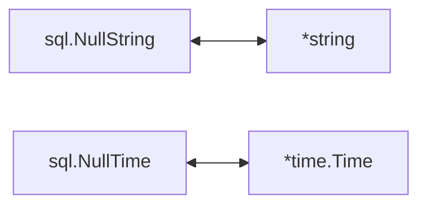

## sqlc Helper

Helper processing such as LIKE search uses:

`internal/infrastructure/rdb/sqlc`

Example

```go
escaped := sqlc.EscapeForLike(keyword, sqlc.DefaultLikeEscapeChar)
pattern := sqlc.WrapContainsLikePattern(escaped)
```

Deleted state:

```go
DeletedState: sqlc.BoolPtrToDeletedState(active)
```

Purpose:

- Prevent LIKE injection
- Standardize search patterns
- Centralize state conversion

## LoggingDBProvider

Repository does not directly use `driver.DatabaseDriver`.

```go
db := gen.New(r.db.NewLoggingDB(ctx))
```

`loggingdb.DBProvider` provides:

- SQL log output
- Transparent DB / Tx switching
- Context-based connection acquisition

Repository becomes a design that **does not need to be aware of DB connection state**.

## Error Normalization

PostgreSQL errors are converted into `apperror` by:

`internal/infrastructure/rdb/postgres/pgerror`

```go
return pgerror.NormalizeError(err)
```

Main mappings:

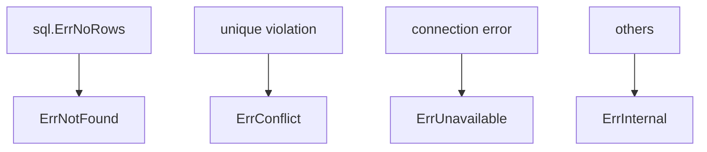

## Transactions

Transaction boundaries are the responsibility of **Usecase**.

Transaction management is the responsibility of **Usecase**.

Query execution is performed using:

```go
gen.New(r.db.NewLoggingDB(ctx))
```

With this:

Repository uses

```go
gen.New(r.db.NewLoggingDB(ctx))
```

to transparently use `Tx / DB`.

## Observability（Tracing）

In the Infrastructure layer:

`observability.LayerTracer` is used.

```go
ctx, endSpan := r.tracer.Start(ctx)
defer endSpan()
```

Repository only handles:

- span start
- span end

It does not directly depend on OpenTelemetry SDK.

## DI（Dependency Injection）の仕組み（Repository）

Repository is created using **DI with Uber Fx**.  
In the Infrastructure layer, it implements the **Domain Repository Interface and provides it to the DI container**.

### Overall Structure

Repository is registered with `fx.Provide` and injected into Usecase.

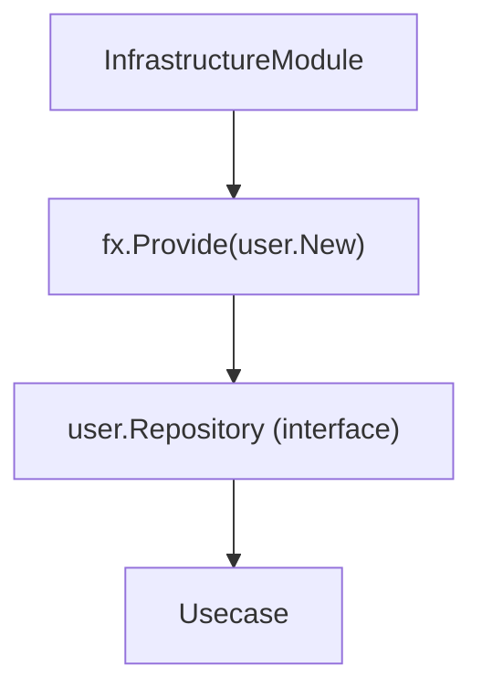

### Role of internal/di/module/infrastructure.go

```go
func InfrastructureModule() fx.Option {
    return fx.Module("infrastructure",
        fx.Module("repository",
            fx.Provide(
                user.New,
                prefecture.New,
            ),
        ),
    )
}
```

- `fx.Provide`
  - Registers the Repository constructor
- Return value is **Domain interface type**
  - Example: `user.Repository`

### Repository Constructor Design

```go
func New(
    db loggingdb.DBProvider,
    tf observability.TracerFactory,
) user.Repository {
    return &repository{
        db:       db,
        tracer:   tf.Infra(),
    }
}
```

Key points:

- Return type must be **interface (Domain definition)**
- All dependencies must be received as arguments (no new)
- External dependencies (DB / Tracer) are confined to Infrastructure

### DI Flow

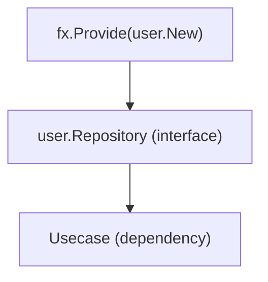

On the Usecase side:

```go
type service struct {
    repo user.Repository
}
```

is used to receive via interface.

### Why return interface

- Domain depends only on interface
- Infrastructure can be replaced (mock / alternative DB)
- Maintains dependency inversion of Onion Architecture

### Rules for AI / Developers

- Repository constructor must be defined as `New`
- Return type must be interface (Domain definition)
- Do not new dependencies inside Repository
- Register DI in `internal/di/module/infrastructure.go`

## Repository Structure

Repository implementation has the following dependencies.

- loggingdb.DBProvider is the only DB access entry point used by Repository
  - SQL logging
  - Trace integration
  - Transparent DB / Tx switching

- driver.DatabaseDriver is a pure DB connection driver without logging
  - If logging is unnecessary, it can be obtained via `r.db.NewDB(ctx)`

- observability.TracerFactory is a factory for generating LayerTracer
  - Repository uses Infra layer tracer

```go
type repository struct {
    db     loggingdb.DBProvider
    tracer observability.LayerTracer
}
```

constructor

```go
func New(
    db loggingdb.DBProvider,
    tf observability.TracerFactory,
) user.Repository {
    return &repository{
        db:       db,
        tracer:   tf.Infra(),
    }
}
```

## Test Strategy

Repository tests are implemented as **Infrastructure Integration Tests**.

Because Repository includes correctness of SQL execution as responsibility,  
it must be verified using a real DB without mocks.

The structure under test is:

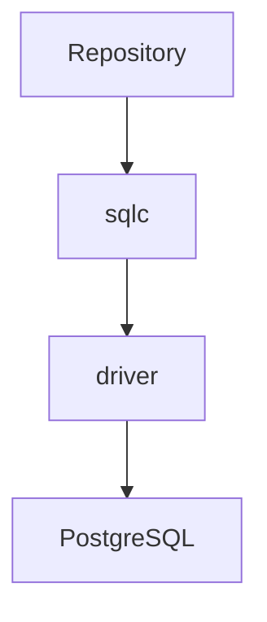

This entire layer is tested with a real DB.

### Test Purpose

Repository tests verify:

- SQL queries execute correctly
- Row → Domain conversion is correct
- Domain constructor errors propagate correctly
- PostgreSQL errors are normalized via `pgerror.NormalizeError`
- Pagination (limit / offset) works correctly

Repository tests **do not aim to validate Domain logic**.

### Test Execution Environment

Repository tests initialize DB using `testkit`.

```go
db, provider := testkit.NewTestDBWithLoggingProvider(t)
```

This provides:

- test DB connection
- loggingdb.DBProvider

### Transaction Test

Each test runs within a transaction.

```go
txm := testkit.NewTestTransactionManager(t)

txm.WithinTx(func(ctx context.Context) {
    // test logic
})
```

Internal behavior:

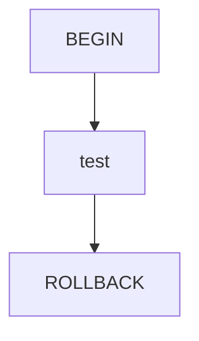

This ensures:

- DB state remains clean
- test independence is maintained

### Parallel Execution

Repository tests can use `t.Parallel()` for parallel execution.

However, `testkit.NewTestTransactionManager(t)` serializes transaction execution internally.

Execution model:

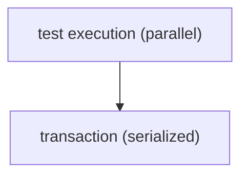

Each test executes inside `WithinTx`:


By serializing transactions, even when multiple tests run simultaneously:

- DB state conflicts
- cross-test interference

are prevented.

### Domain Error Verification

Repository uses Domain constructor for Row → Domain conversion.

Therefore, if invalid data exists in DB, Domain errors occur.

Tests verify this.

```go
require.ErrorIs(t, err, user.ErrInvalidLastName)
```

This validates:

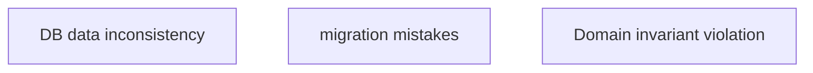

### Test Error Normalization

DB errors are converted to `apperror` via `pgerror.NormalizeError`.

Example:


Repository tests verify normalized results such as:

- `ErrConflict`
- `ErrNotFound`

## Repository Anti-Patterns

Repository layer has common incorrect implementation patterns.  
These break architectural boundaries and must not be implemented.

### 1. Writing Business Logic

Repository is a persistence layer.  
Business rules must not be written.

NG example

```go
func (r *repository) Create(ctx context.Context, user*user.User) error {
    if user.IsPremium() {
        // ❌ business rule
    }
}
```

Correct responsibility

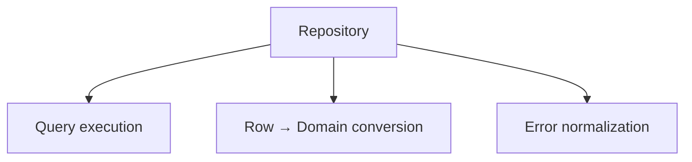

Business rules belong to Domain / Usecase.

### 2. Creating DTO

Repository does not create DTO.

NG example

```go
return UserDTO{
    Name: row.Users.Name,
}
```

Repository returns only Domain entities.

```go
return user.New(...)
```

DTO conversion belongs to Usecase / Presenter.

### 3. Returning sqlc Row directly

sqlc Row is Infrastructure-specific type.

NG example

```go
return rows
```

Always convert to Domain.

```go
u, err := user.New(...)
```

Reason: do not leak sqlc type to upper layers.

### 4. Writing QueryService

Repository is aggregate-level persistence abstraction.

Therefore:

- `FindByKeyword`
- `SearchUser`
- `AggregateSearch`

must not be implemented.

Search is separated into QueryService.

### 5. Starting transaction

Repository does not manage transaction boundaries.

NG example

```go
tx, _ := db.Begin()
```

Transaction management belongs to Usecase.

Repository uses:

```go
gen.New(r.db.NewLoggingDB(ctx))
```

to transparently use Tx / DB.

### 6. Referencing Controller type

Repository must not depend on HTTP layer.

NG example

```go
func (r *repository) Create(ctx echo.Context)
```

Correct

```go
func (r *repository) Create(ctx context.Context, user*user.User)
```

### 7. Defining Domain interface in Infra

Repository Interface is defined in Domain.

NG example

`internal/infrastructure/repository/user_repository_interface.go`

Correct

`internal/domain/user/repository.go`

Infra only implements Domain interface.

## Do / Don't

### Do

- Use sqlc generated code
- Convert Row → Domain
- Use conv for nullable conversion
- Use pgerror.NormalizeError
- Use LIKE helper

### Don't

- Define Domain interface in Infra
- Return sqlc types to upper layers
- Write business logic
- Reference Controller type
- Write QueryService

## Implementation Example

```go
package user

// repository name fixed
type repository struct {
    db     loggingdb.DBProvider
    tracer observability.LayerTracer
}

// constructor name fixed
func New(
    db loggingdb.DBProvider,
    tf observability.TracerFactory,
) user.Repository {
    return &repository{
        db:       db,
        tracer:   tf.Infra(),
    }
}

func (r *repository) FindAll(ctx context.Context, limit, offset int32) (user.Users, error) {
    // Start / end span
    ctx, endSpan := r.tracer.Start(ctx)
    defer endSpan()

    // Use driver.ResolveDriverWithLog for automatic logging
    // If unnecessary, use driver.ResolveDriver(ctx, r.db)
    db := gen.New(r.db.NewLoggingDB(ctx))

    // Call sqlc generated DML
    rows, err := db.ListUsers(ctx, &gen.ListUsersParams{
        OffsetParam: offset,
        LimitParam:  limit,
    })

    if err != nil {
        // Normalize error
        // Classification handled in pgerror package
        return nil, pgerror.NormalizeError(err)
    }

    // Map to Domain entity
    users := make(user.Users, len(rows))
    for i, row := range rows {
        u, err := user.New(
            uuid.FromPrimitive(row.Users.ID),
            row.Users.FirstName,
            row.Users.LastName,
            row.Users.PasswordHash,
            row.Users.Email,
            row.Users.Phone,
            uuid.FromPrimitive(row.Users.PrefectureID),
            row.Users.City,
            row.Users.Street,
            conv.StringPtrFromNull(row.Users.Building),
            row.Users.PostalCode,
            row.Users.CreatedAt,
            row.Users.UpdatedAt,
            conv.TimePtrFromNull(row.Users.DeletedAt),
        )
        if err != nil {
            return nil, err
        }
        users[i] = u
    }
    return users, nil
}
```
