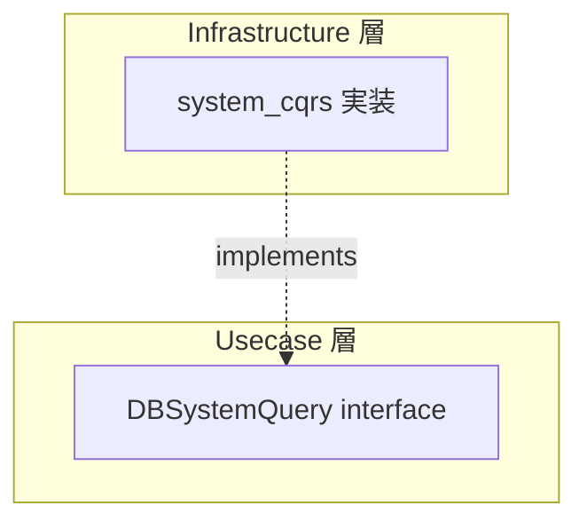

# system_cqrs

[English](README.md) | 日本語

`internal/infrastructure/rdb/system_cqrs` は、**システム運用向けの DB クエリ**を提供する Infrastructure 層のパッケージです。

## オニオンアーキテクチャにおける位置づけ

system_cqrs は Repository や QueryService とは異なる **DB アクセスカテゴリ**です。



|カテゴリ|目的|interface 配置|返却型|
|---|---|---|---|
|Repository|Aggregate の永続化|Domain 層|Domain Entity|
|QueryService|ユースケース固有の検索|Usecase 層|DTO|
|**SystemQuery**|**システム運用クエリ**|**Usecase 層**|**運用情報 DTO**|

SystemQuery は **ビジネスドメインに属さない運用・監視目的のクエリ**を担当します。ヘルスチェック、DB 疎通確認、メトリクス収集など、ビジネスロジックとは独立した運用基盤のクエリがここに配置されます。

## 現在の実装

### healthcheck

DB の疎通確認を行い、応答時間を計測します。

```go
func New(provider driver.DatabaseDriver, tf observability.TracerFactory) query.DBSystemQuery
```

|メソッド|説明|
|---|---|
|`CheckDBHealth(ctx)`|DB に `SELECT 1` を実行し、`DBHealth`（Ready / RespondedAt / Latency）を返す|

返却型：

```go
type DBHealth struct {
    Ready       bool
    RespondedAt time.Time
    Latency     time.Duration
}
```

interface は Usecase 層に定義されています。

```text
internal/usecase/healthcheck/query/health_check_system_cqrs.go
```

### idempotency

冪等性キーを永続化し、リクエストの at-most-once 処理を支えます。`internal/usecase/boundary/idempotency/` の `Store` 境界を実装します。

```go
func New(provider driver.DatabaseDriver, tf observability.TracerFactory) idempotencybndry.Store
```

|メソッド|説明|
|---|---|
|`Claim(ctx, p)`|業務 tx 内で claimed 行を作成（`SET LOCAL lock_timeout` が効く）|
|`Get(ctx, scope, key)`|scope + key に対応する `Record` を取得|
|`Complete(ctx, p)`|claim 済みキーに対し完了レスポンスを記録|
|`DeleteExpired(ctx, cutoff, limit)`|`cutoff` より古い期限切れ行を `limit` 件まで削除（GC）|

境界 interface の詳細は [`internal/usecase/boundary/idempotency/README.ja.md`](../../../usecase/boundary/idempotency/README.ja.md) を参照。

### outbox

トランザクショナル outbox テーブルを永続化します。`internal/usecase/boundary/outbox/` の `Store` 境界を実装します。

```go
func New(provider driver.DatabaseDriver, tf observability.TracerFactory) outboxbndry.Store
```

主なメソッド：`Insert` / `ClaimPending`（`FOR UPDATE SKIP LOCKED`）/ `MarkPublished` / `MarkFailed` / `MarkDead` / `ReplayDead` / `DeletePublished`（GC）/ `OldestPendingCreatedAt`（outbox-lag SLI）。

境界 interface の全詳細は [`internal/usecase/boundary/outbox/README.ja.md`](../../../usecase/boundary/outbox/README.ja.md) を参照。

## 構成

運用上の関心事ごとに 1 つのディレクトリを置き、`database/dml/system_cqrs/` の同じ関心事と同じ名前を付ける。

## 設計方針

- interface は Usecase 層（`internal/usecase/<concern>/query`、または idempotency / outbox のような運用永続化では `internal/usecase/boundary/<concern>` の Store）に定義
- 実装は Infrastructure 層に配置
- ビジネスロジックを含まない
- `driver.DatabaseDriver` + `observability.LayerTracer` を DI で受け取る
- DB エラーは `pgerror.NormalizeError` で正規化

## 拡張する場合

新しいシステムクエリを追加する場合：

1. `internal/usecase/<concern>/query/` に interface を定義
2. `internal/infrastructure/rdb/system_cqrs/<concern>/` に実装を配置
3. `internal/di/module/persistence.go`（`persistenceModule` の `system_cqrs` サブモジュール）に DI 登録を追加
