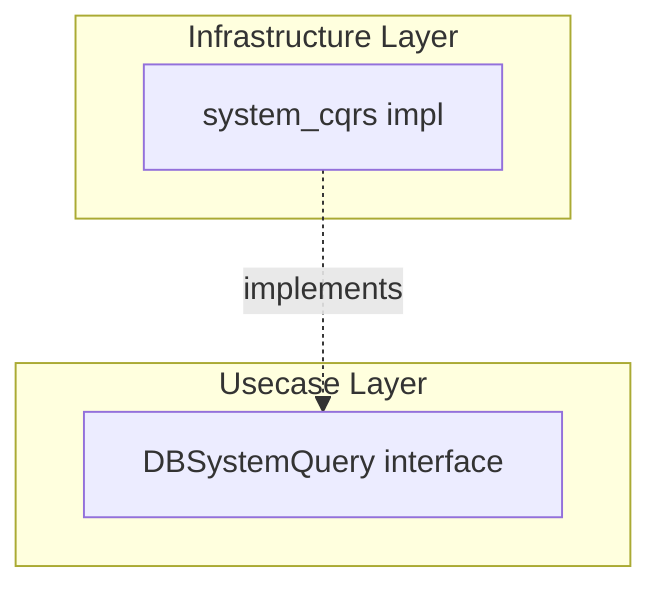

# system_cqrs

English | [日本語](README.ja.md)

`internal/infrastructure/rdb/system_cqrs` is an Infrastructure layer package that provides **system-operational DB queries**.

## Position in Onion Architecture

system_cqrs is a **DB access category**, distinct from Repository and QueryService.



|Category|Purpose|Interface Placement|Return Type|
|---|---|---|---|
|Repository|Aggregate persistence|Domain layer|Domain Entity|
|QueryService|Usecase-specific search|Usecase layer|DTO|
|**SystemQuery**|**System operational queries**|**Usecase layer**|**Operational info DTO**|

SystemQuery handles **queries for operational and monitoring purposes that do not belong to the business domain**. Health checks, DB connectivity verification, metrics collection, and other queries independent of business logic are placed here.

## Current Implementation

### healthcheck

Verifies DB connectivity and measures response time.

```go
func New(provider driver.DatabaseDriver, tf observability.TracerFactory) query.DBSystemQuery
```

|Method|Description|
|---|---|
|`CheckDBHealth(ctx)`|Execute `SELECT 1` against DB, return `DBHealth` (Ready / RespondedAt / Latency)|

Return type:

```go
type DBHealth struct {
    Ready       bool
    RespondedAt time.Time
    Latency     time.Duration
}
```

The interface is defined in the Usecase layer:

```text
internal/usecase/healthcheck/query/health_check_system_cqrs.go
```

### idempotency

Persists idempotency keys for at-most-once request handling. Implements the `Store` boundary in `internal/usecase/boundary/idempotency/`.

```go
func New(provider driver.DatabaseDriver, tf observability.TracerFactory) idempotencybndry.Store
```

|Method|Description|
|---|---|
|`Claim(ctx, p)`|Create a claimed row within the business tx (`SET LOCAL lock_timeout` applies)|
|`Get(ctx, scope, key)`|Fetch the stored `Record` for a scope + key|
|`Complete(ctx, p)`|Record the completed response against the claimed key|
|`DeleteExpired(ctx, cutoff, limit)`|Delete expired rows older than `cutoff` up to `limit` (GC)|

See [`internal/usecase/boundary/idempotency/README.md`](../../../usecase/boundary/idempotency/README.md) for the boundary interface details.

### outbox

Persists the transactional outbox table. Implements the `Store` boundary in `internal/usecase/boundary/outbox/`.

```go
func New(provider driver.DatabaseDriver, tf observability.TracerFactory) outboxbndry.Store
```

Key methods: `Insert` / `ClaimPending` (`FOR UPDATE SKIP LOCKED`) / `MarkPublished` / `MarkFailed` / `MarkDead` / `ReplayDead` / `DeletePublished` (GC) / `OldestPendingCreatedAt` (outbox-lag SLI).

See [`internal/usecase/boundary/outbox/README.md`](../../../usecase/boundary/outbox/README.md) for the full boundary interface details.

## Structure

One directory per operational concern, named after the same concern in `database/dml/system_cqrs/`.

## Design Policy

- Interface defined in Usecase layer (`internal/usecase/<concern>/query`, or a `internal/usecase/boundary/<concern>` Store for operational persistence such as idempotency / outbox)
- Implementation placed in Infrastructure layer
- Does not contain business logic
- Receives `driver.DatabaseDriver` + `observability.LayerTracer` via DI
- DB errors normalized with `pgerror.NormalizeError`

## Extending

To add a new system query:

1. Define the interface in `internal/usecase/<concern>/query/`
2. Place the implementation in `internal/infrastructure/rdb/system_cqrs/<concern>/`
3. Add DI registration in `internal/di/module/persistence.go` (`persistenceModule`'s `system_cqrs` submodule)
