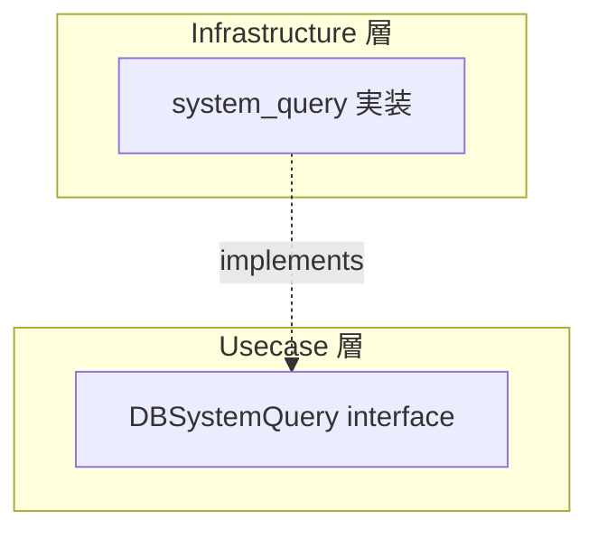

# system_query

[English](README.md) | 日本語

`internal/infrastructure/rdb/system_query` は、**システム運用向けの DB クエリ**を提供する Infrastructure 層のパッケージです。

## オニオンアーキテクチャにおける位置づけ

system_query は Repository や QueryService とは異なる **DB アクセスカテゴリ**です。



|カテゴリ|目的|interface 配置|返却型|
|---|---|---|---|
|Repository|Aggregate の永続化|Domain 層|Domain Entity|
|QueryService|ユースケース固有の検索|Usecase 層|DTO|
|**SystemQuery**|**システム運用クエリ**|**Usecase 層**|**運用情報 DTO**|

SystemQuery は **ビジネスドメインに属さない運用・監視目的のクエリ**を担当します。ヘルスチェック、DB 疎通確認、メトリクス収集など、ビジネスロジックとは独立した運用基盤のクエリがここに配置されます。

## 現在の実装

### healthcheck

DB の疎通確認を行い、応答時間を計測します。

```go
func New(provider loggingdb.DBProvider, tf observability.TracerFactory) query.DBSystemQuery
```

|メソッド|説明|
|---|---|
|`CheckDBHealth(ctx)`|DB に `SELECT 1` を実行し、`DBHealth`（Ready / RespondedAt / Latency）を返す|

返却型：

```go
type DBHealth struct {
    Ready       bool
    RespondedAt time.Time
    Latency     time.Duration
}
```

interface は Usecase 層に定義されています。

```text
internal/usecase/healthcheck/query/health_check_system_query.go
```

## 構成

```text
internal/infrastructure/rdb/system_query/
└── healthcheck/
    └── health_check_system_query.go
```

## 設計方針

- interface は Usecase 層（`internal/usecase/<concern>/query`）に定義
- 実装は Infrastructure 層に配置
- ビジネスロジックを含まない
- `loggingdb.DBProvider` + `observability.LayerTracer` を DI で受け取る
- DB エラーは `pgerror.NormalizeError` で正規化

## 拡張する場合

新しいシステムクエリを追加する場合：

1. `internal/usecase/<concern>/query/` に interface を定義
2. `internal/infrastructure/rdb/system_query/<concern>/` に実装を配置
3. `internal/di/module/infrastructure.go` に DI 登録を追加
