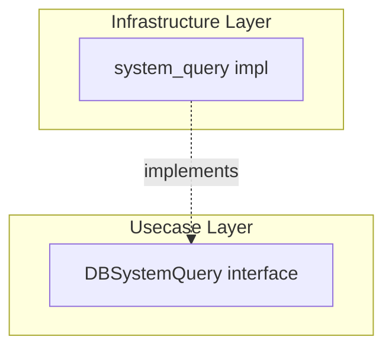

# system_query

English | [日本語](README.ja.md)

`internal/infrastructure/rdb/system_query` is an Infrastructure layer package that provides **system-operational DB queries**.

## Position in Onion Architecture

system_query is a **DB access category**, distinct from Repository and QueryService.



|Category|Purpose|Interface Placement|Return Type|
|---|---|---|---|
|Repository|Aggregate persistence|Domain layer|Domain Entity|
|QueryService|Usecase-specific search|Usecase layer|DTO|
|**SystemQuery**|**System operational queries**|**Usecase layer**|**Operational info DTO**|

SystemQuery handles **queries for operational and monitoring purposes that do not belong to the business domain**. Health checks, DB connectivity verification, metrics collection, and other queries independent of business logic are placed here.

## Current Implementation

### healthcheck

Verifies DB connectivity and measures response time.

```go
func New(provider loggingdb.DBProvider, tf observability.TracerFactory) query.DBSystemQuery
```

|Method|Description|
|---|---|
|`CheckDBHealth(ctx)`|Execute `SELECT 1` against DB, return `DBHealth` (Ready / RespondedAt / Latency)|

Return type:

```go
type DBHealth struct {
    Ready       bool
    RespondedAt time.Time
    Latency     time.Duration
}
```

The interface is defined in the Usecase layer:

```text
internal/usecase/healthcheck/query/health_check_system_query.go
```

## Structure

```text
internal/infrastructure/rdb/system_query/
└── healthcheck/
    └── health_check_system_query.go
```

## Design Policy

- Interface defined in Usecase layer (`internal/usecase/<concern>/query`)
- Implementation placed in Infrastructure layer
- Does not contain business logic
- Receives `loggingdb.DBProvider` + `observability.LayerTracer` via DI
- DB errors normalized with `pgerror.NormalizeError`

## Extending

To add a new system query:

1. Define the interface in `internal/usecase/<concern>/query/`
2. Place the implementation in `internal/infrastructure/rdb/system_query/<concern>/`
3. Add DI registration in `internal/di/module/infrastructure.go`
