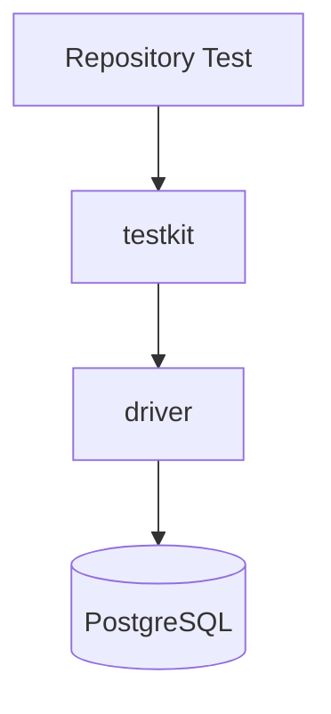
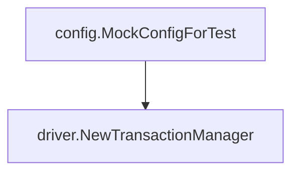
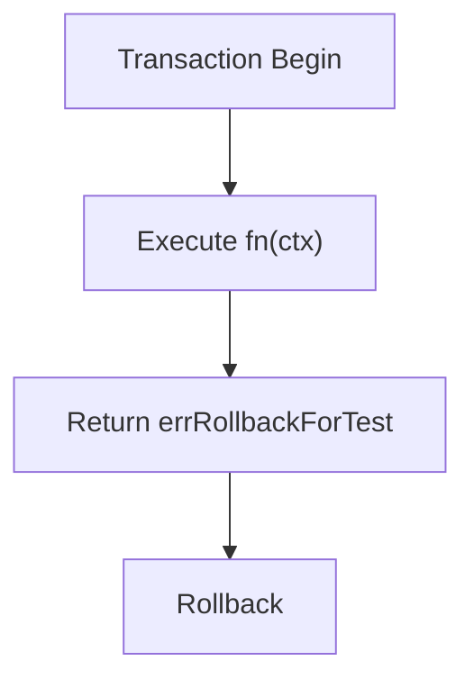
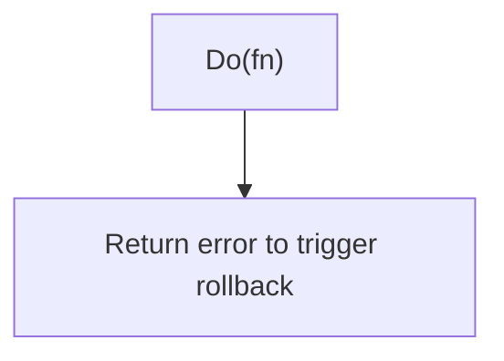
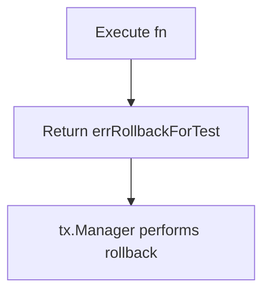
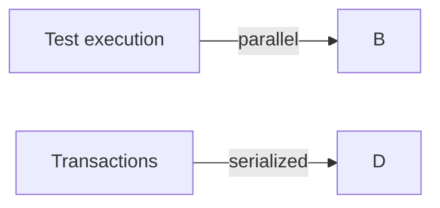
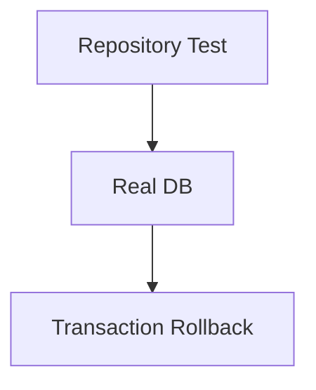
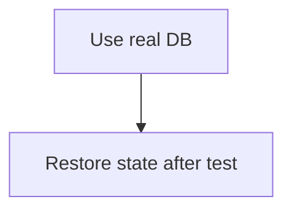

## `testkit` Package

English | [日本語](README.ja.md)

Overview: **A package that provides utilities for tests using RDB.**

It is mainly used for the following purposes.

- Easily create a test `DatabaseDriver`
- Execute tests within a transaction and always roll back

This package is a **support tool to make writing Repository and Infrastructure tests easier**.

## Purpose

The following problems occur in tests that use RDB.

- DB initialization code becomes lengthy each time
- Transaction management becomes complicated
- Data cleanup after tests is required

`testkit` provides the following features to solve these.

- Test DB initialization
- Automatic rollback transactions

## Architectural Position



`testkit` is a **test-only Infrastructure helper layer**.

## Provided API

### NewTestDB

```go
func NewTestDB(t *testing.T) driver.DatabaseDriver
```

Creates a test `DatabaseDriver` (shared singleton). Pass it directly to Repository / QueryService
constructors; SQL logging / tracing is applied at the driver connection level.

### NewTestTransactionRunner

```go
func NewTestTransactionRunner(t *testing.T) TransactionRunner
```

Creates a transaction manager for testing.

Internally, it uses:



### HoldSuiteSerialization

```go
func HoldSuiteSerialization(t *testing.T, db driver.DatabaseDriver)
```

Holds the suite-wide serialization for the calling test's whole duration, so the `CASCADE TRUNCATE`
another package's tests (a separate process) issue cannot run while it is held. It is released in
`t.Cleanup`.

The hold lives in a dedicated transaction, and the test's own transactions do **not** join the
serialization — joining would make them wait on the hold and they would never proceed.

Ordinary tests never need this: `WithinTx` performs the same serialization internally. Reach for it
only in a test that keeps **two transactions alive at once** — a lock-contention reproduction, for
example — which `WithinTx` (one transaction, always rolled back) cannot express. Hold it across the
whole test, including the rows it seeds: protecting only part of it leaves a window where a seeded
row is truncated away before the contention under test begins.

## Transaction Execution

### TransactionRunner

```go
type TransactionRunner interface {
    WithinTx(fn func(ctx context.Context))
    WithinTxE(fn func(ctx context.Context) error)
}
```

### WithinTx

```go
func (t *testTxRunner) WithinTx(fn func(ctx context.Context))
```

Executes the specified function **inside a transaction**.

Processing flow:



Internally, it uses `tx.Manager.Do`.



### WithinTxE

```go
func (t *testTxRunner) WithinTxE(fn func(ctx context.Context) error)
```

The same as `WithinTx`, except that `fn` can return an error. What that buys is **retry**: the
transaction manager retries the whole transaction on a deadlock (`40P01`) or a serialization failure
(`40001`), as `pgerror.IsRetryableTxError` declares.

`WithinTx` cannot reach that retry. A failing `require` inside `fn` calls `FailNow`, which unwinds
with `runtime.Goexit`, so the transaction manager never receives a return value and never evaluates
whether the error was retryable. A transient error the repository has already declared recoverable
therefore surfaces as a permanent test failure.

Use it for a statement whose failure is infrastructure noise rather than a broken contract — a
`CASCADE TRUNCATE`, which takes `ACCESS EXCLUSIVE` on every dependent table and can deadlock against
a transaction running outside the suite serialization:

```go
txm.WithinTxE(func(ctx context.Context) error {
    if _, err := driver.New(ctx, testDB).Exec(ctx, "TRUNCATE product_statuses CASCADE"); err != nil {
        return err // 40P01 here is retried, not a red test
    }

    actual, err := repo.FindAll(ctx)
    require.NoError(t, err)
    assert.Empty(t, actual)

    return nil
})
```

Returning `nil` still rolls the transaction back — the return value carries failure, not commit
intent. Keep ordinary assertions on `require` / `assert`; only route the statements you want retried
through the return value.

## Rollback Mechanism

`WithinTx` achieves rollback with the following mechanism.



This special error is defined as:

```go
var errRollbackForTest = xerrors.New("rollback for test")
```

This error is treated as **success in tests**.

## Parallel Execution

Repository tests can be executed in parallel using `t.Parallel()`.

However, transactions are serialized internally.



This is guaranteed by the following implementation.

```go
txLock sync.Mutex
```

```go
txLock.Lock()
defer txLock.Unlock()
```

This ensures:

- Preventing DB state conflicts
- Preventing interference between tests

## DB Instance

The test DB is managed as a singleton.

```go
var (
    testDB driver.DatabaseDriver
    dbOnce sync.Once
)
```

By **sharing a single DB instance within the process**:

- Reduced connection cost
- Faster test execution

are achieved.

## Usage Examples

### Transaction-Based Test

```go
txm := testkit.NewTestTransactionRunner(t)

txm.WithinTx(func(ctx context.Context) {
    repo.Create(ctx, ...)
})
```

### Repository Test

```go
db := testkit.NewTestDB(t)

repo := repository.NewRepository(db)
```

## Test Design Policy

By using `testkit`, the following design becomes possible.



In other words:



This enables **safe Integration Test**.

## Notes

### Connects to a Real DB

This package connects to an **actual PostgreSQL**.

Therefore, you must configure:

- Test DB
- CI DB

### Design of WithinTx

`WithinTx` does not accept a return value from fn.

```go
fn(ctx)
return errRollbackForTest
```

Therefore, assertions in tests should use:

```go
require / assert
```

That choice costs the retry: `require` unwinds with `runtime.Goexit`, so a retryable DB error never
reaches the transaction manager. When a statement should be retried rather than fail the test, use
`WithinTxE` and return the error instead.

### Transactions Are Always Rolled Back

When using `WithinTx`, transactions are **always rolled back**.

Therefore, it cannot be used for tests that:

```txt
persist data
```
