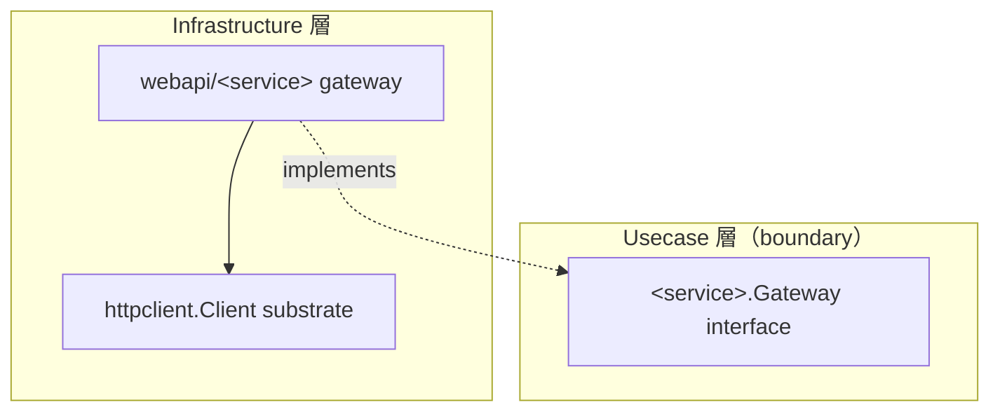

# webapi

[English](README.md) | 日本語

`internal/infrastructure/webapi` は、**外部 Web API gateway の親サブシステム**です。各 leaf は `httpclient` の resilient な substrate 上で usecase の `boundary.Gateway` インターフェースを実装します。

## アーキテクチャ上の位置づけ



`webapi/` 配下の各 leaf は `internal/usecase/boundary/<service>` で定義された意味的 gateway インターフェースを実装し、transport は `httpclient` substrate へ委譲します。Usecase / Domain は HTTP の詳細ではなく境界のみに依存します。leaf 実装は独自の README を持ちません（リポジトリの規約）。このサブシステム README が唯一の入り口です。

## 設計方針

- 外部サービスごとに 1 つの leaf パッケージを置き、各 leaf は usecase が定義した `boundary.Gateway` を実装し、境界の出力 DTO（生の HTTP / JSON 形ではない）を返す。
- 各 leaf は `httpclient` substrate をラップし、`DownstreamProfile` を登録する（論理 `Downstream` キーが profile / breaker / metrics / budget を駆動する）。
- 外部サービス向け profile は trace 伝搬を無効化し（`PropagateTrace = false`）、private/loopback 宛て接続を拒否する（`AllowPrivateNetwork = false`）。内部相関 ID の外部漏洩と内部ホストへの SSRF を防ぐ。
- エラーは substrate が写像済みの `apperror` sentinel として返す。JSON デコード / ドメイン形の検証失敗は `apperror.ErrUnavailable` でラップする。
- エンドポイントのベース URL は構築時に解決して DI で注入する（各 leaf の `NewEndpoint`）。各 leaf は `observability.LayerTracer`（`tf.Infra()`）で span を開始する。

> **Evans からの逸脱。** 構造としてはこれは Anticorruption Layer である。自層の語彙で述べた port、
> 境界での変換、ベンダーのものが内側へ届かないこと。ただし掲げている動機は Evans のものではない。
> 上記は一貫して依存性逆転・置換可能性・transport の隠蔽から論じているが、Evans は意味論から、
> 上流の*モデル*を入れないことから論じる。実務上の違いは、この層が確実に守るものが何かに出る。
> 技術型とベンダー語彙は構造上守られる。概念は、ここでは決めていない。外部サービスのある概念が
> 我々のものと本当に食い違ったとき、どちらが勝つかを上記のどこも述べていない。述べられるまでは、
> その衝突はこのモデルの語彙へ寄せて解決し、その判断を leaf の変換箇所に記録すること。

## DI 登録

`internal/di/module/webapi.go` の `webapi` モジュールに登録します。各 leaf がコンストラクタ / エンドポイントを provide し、`DownstreamProfile` を `httpclient_profiles` グループへ寄与します。

```go
fx.Module("webapi",
    fx.Provide(
        <service>.NewEndpoint,
        <service>.New,
    ),
    provideHTTPClientProfiles(
        <service>.NewDownstreamProfile,
    ),
)
```
