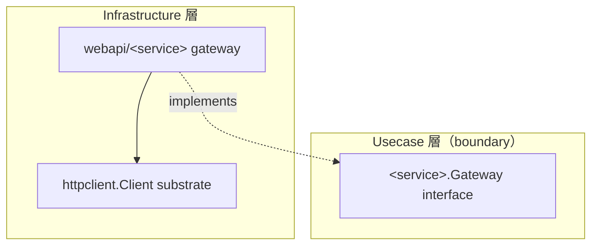

# webapi

[English](README.md) | 日本語

`internal/infrastructure/webapi` は、**外部 Web API gateway の親サブシステム**です。各 leaf は `httpclient` の resilient な substrate 上で usecase の `boundary.Gateway` インターフェースを実装します。

## アーキテクチャ上の位置づけ



`webapi/` 配下の各 leaf は `internal/usecase/boundary/<service>` で定義された意味的 gateway インターフェースを実装し、transport は `httpclient` substrate へ委譲します。Usecase / Domain は HTTP の詳細ではなく境界のみに依存します。leaf 実装は独自の README を持ちません（リポジトリの規約）。このサブシステム README が唯一の入り口です。

## 設計方針

- 外部サービスごとに 1 つの leaf パッケージを置き、各 leaf は usecase が定義した `boundary.Gateway` を実装し、境界の出力 DTO（生の HTTP / JSON 形ではない）を返す。
- 各 leaf は `httpclient` substrate をラップし、`DownstreamProfile` を登録する（論理 `Downstream` キーが profile / breaker / metrics / budget を駆動する）。
- 外部サービス向け profile は trace 伝搬を無効化し（`PropagateTrace = false`）、private/loopback 宛て接続を拒否する（`AllowPrivateNetwork = false`）。内部相関 ID の外部漏洩と内部ホストへの SSRF を防ぐ。
- エラーは substrate が写像済みの `apperror` sentinel として返す。JSON デコード / ドメイン形の検証失敗は `apperror.ErrUnavailable` でラップする。
- エンドポイントのベース URL は構築時に解決して DI で注入する（各 leaf の `NewEndpoint`）。各 leaf は `observability.LayerTracer`（`tf.Infra()`）で span を開始する。

## Test Strategy

ここの gateway は DB ではなく `httpclient` substrate の上に構築されるため、infrastructure 層の実 DB 戦略は適用されません。すべて `httpclient` の生成モックの背後で in-process に閉じます。leaf は自前の README を持たない規約であるため、以下の観点が `webapi/` 配下の全 leaf を統治します。

- **assert の対象はワイヤ形ではなく境界 DTO である。** leaf は生の JSON をこの層で止めるために存在します。したがってテストは、直前に自分で組み立てた応答ボディを写し返すのではなく、返された境界の出力（パース済みの数値型 / 値オブジェクトを含む）を assert します。
- **downstream の不正な応答は一級のケースである。** デコード不能な JSON、形は妥当だがドメインが拒否するボディ、そして結果 0 件は、それぞれ独立したケースを持ちます。これらは transport エラーという signal を伴わずに downstream が取り得る経路だからです。
- **substrate のエラー写像を再導出しない。** 非 2xx と transport 失敗は `apperror` sentinel として到達します。assert はステータスコードではなくその sentinel に対する `errors.Is` で行います。ステータスは substrate の関心事であり、usecase に渡されるのは sentinel だからです。
- **gateway の手前に置くキャッシュは注入 clock で検証する。** 実時間では検証しません。ヒット・ミス・TTL 境界での失効・単一キーへの並行アクセスです。エントリの失効を sleep で待つテストは構造的に flaky です。
- **leaf が解決するエンドポイントそれ自体が subject である。** 現時点でその解決がどれだけ薄くてもです。サンプルの leaf はコンパイル時定数を返すため、そのテストが固定するのは「substrate へどのベース URL を渡すか」だけです。設定由来の URL をパースする leaf を作る場合は、拒否すべきものを構築時に拒否することが期待されます。設定を誤ったデプロイは、最初の外向き呼び出し時ではなく起動時に失敗します。

## DI 登録

`internal/di/module/webapi.go` の `webapi` モジュールに登録します。各 leaf がコンストラクタ / エンドポイントを provide し、`DownstreamProfile` を `httpclient_profiles` グループへ寄与します。

```go
fx.Module("webapi",
    fx.Provide(
        <service>.NewEndpoint,
        <service>.New,
    ),
    provideHTTPClientProfiles(
        <service>.NewDownstreamProfile,
    ),
)
```
