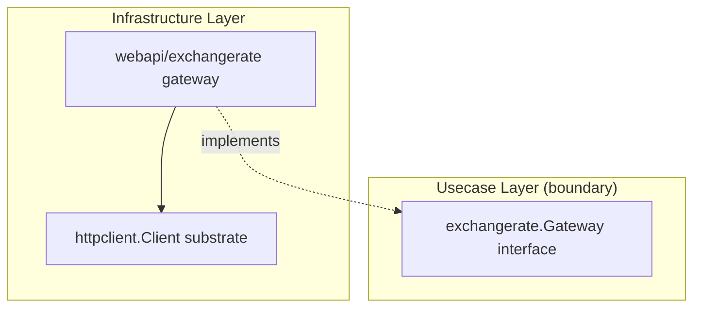

# webapi

English | [日本語](README.ja.md)

`internal/infrastructure/webapi` is the **parent subsystem for external Web API gateways** — each leaf implements a usecase `boundary.Gateway` interface on top of the `httpclient` resilient substrate.

## Architectural Position



Each leaf under `webapi/` implements a semantic gateway interface defined in `internal/usecase/boundary/<service>` and delegates transport to the `httpclient` substrate. Usecase / Domain depend only on the boundary, never on HTTP details. Leaf implementations do not carry their own README (repo convention); this subsystem README is the single entry point.

## Design Policy

- One leaf package per external service, each implementing the usecase-defined `boundary.Gateway` and returning boundary output DTOs (not raw HTTP / JSON shapes)
- Each leaf wraps the `httpclient` substrate and registers a `DownstreamProfile` (a logical `Downstream` key drives the profile / breaker / metrics / budget)
- External-service profiles disable trace propagation (`PropagateTrace = false`) and reject private/loopback access (`AllowPrivateNetwork = false`) to prevent internal correlation-ID leakage and SSRF to internal hosts
- Errors are returned as `apperror` sentinels already mapped by the substrate; JSON decode / domain-shape validation failures are wrapped as `apperror.ErrUnavailable`
- The endpoint base URL is injected via DI (the sample uses a fixed default); each leaf opens a span via `observability.LayerTracer` (`tf.Infra()`)

## DI Registration

Registered by the `webapi` module in `internal/di/module/webapi.go`. Each leaf provides its constructor / endpoint and contributes its `DownstreamProfile` to the `httpclient_profiles` group.

```go
fx.Module("webapi",
    fx.Provide(
        exchangerateext.NewEndpoint,
        exchangerateext.New,
    ),
    provideHTTPClientProfiles(
        exchangerateext.NewDownstreamProfile,
    ),
)
```
