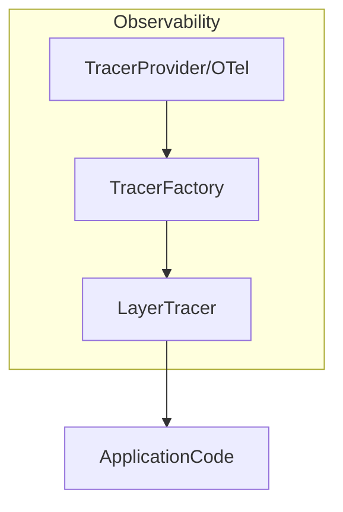

# internal/observability

English | [日本語](README.ja.md)

`internal/observability` is a package that provides **tracing and observability logging integration** for this project.

This package provides a **tracing mechanism based on OpenTelemetry**, and  
**layer-based observability logs** integrated with the `internal/logging` package.

Primary purposes:

- Initialization and management of OpenTelemetry (tracing + metrics)
- Span generation per layer
- Logging of trace / span information
- Unified observability across Domain / Usecase / Controller
- Lightweight tracer for testing

### Configuration boundary (env-driven, vendor-neutral)

This package wires only the **vendor-neutral OpenTelemetry plumbing**. The export
**destination is never modeled in the typed config**; it is read from the standard
`OTEL_*` environment variables by the SDK:

- `OTEL_TRACES_EXPORTER` / `OTEL_METRICS_EXPORTER` (`otlp` / `console` / `none`)
- `OTEL_EXPORTER_OTLP_ENDPOINT` / `OTEL_EXPORTER_OTLP_HEADERS` / `OTEL_EXPORTER_OTLP_PROTOCOL`
- `OTEL_TRACES_SAMPLER` / `OTEL_TRACES_SAMPLER_ARG`

Export is activated by **selecting an exporter** via `OTEL_TRACES_EXPORTER` /
`OTEL_METRICS_EXPORTER` (`otlp` / `console`). When neither is set, a no-op fallback is
used — nothing is sent, no connection is attempted, and no background goroutine runs — so
local development needs no configuration and no DI swapping.

> **Important:** setting `OTEL_EXPORTER_OTLP_ENDPOINT` **alone does not enable export**.
> The SDK only reads the endpoint once an OTLP exporter is selected, so staging / prod must
> set **`OTEL_TRACES_EXPORTER=otlp` / `OTEL_METRICS_EXPORTER=otlp`** in addition to the
> endpoint pointing at a Collector / Agent sidecar. `OTEL_TRACES_EXPORTER=console` prints
> spans to stdout locally.

Vendor specifics (Grafana / Datadog / New Relic) live in that Collector, not here.

Service identity (`service.name` / `deployment.environment` / `service.version` /
`service.revision` / `service.build_date`) comes from the existing app config and the
build-time `internal/system` build info (ldflags), so no OTel-specific keys leak into
the typed config.

## Architecture

The observability package is designed with the following structure.



Roles of each component:

|Component|Role|
|---|---|
|`NewResource`|Build the OTel resource (service identity) from app config + build info|
|`NewTracerProvider`|OpenTelemetry tracer provider + context propagator|
|`NewMeterProvider`|OpenTelemetry meter provider + Go runtime metrics|
|`TracerFactory`|Generate tracers per layer|
|`LayerTracer`|Span generation + observability logging|
|`helper.go`|Span / trace helper, ShouldLogWithSpan, BuildSpanName|
|`caller.go`|Retrieve caller function name|
|`test_kit.go`|Tracer for testing|

## Provided Features

### 1. NewTracerProvider

Initializes the OpenTelemetry tracer provider.

```go
func NewTracerProvider(res *resource.Resource) (*sdktrace.TracerProvider, error)
```

Characteristics

- Creates OpenTelemetry TracerProvider with the given resource
- Registers it with `otel.SetTracerProvider`
- Registers the W3C `TraceContext` + `Baggage` propagator via `otel.SetTextMapPropagator`
  (required for cross-service trace continuity)
- Builds the `SpanExporter` from standard `OTEL_*` env; when no exporter is selected it falls back to no-op and skips the batch processor (no goroutine)
- Honors `OTEL_TRACES_SAMPLER` for sampling (parent-based always-on by default)
- Lifecycle-agnostic: returns the concrete `*sdktrace.TracerProvider` (which exposes `Shutdown`)
  so the DI layer (`hook.RegisterObservabilityShutdownHooks`) owns the shutdown registration.
  This keeps the `observability` package free of any `di/lifecycle` dependency.

Used during application DI initialization.

### 1.1 NewResource / NewMeterProvider

```go
func NewResource(appCfg *config.ApplicationConfig, bi system.BuildInfo) (*resource.Resource, error)
func NewMeterProvider(res *resource.Resource) (*sdkmetric.MeterProvider, error)
```

- `NewResource` builds the shared OTel resource carrying `service.name` /
  `deployment.environment` / `service.version` / `service.revision` / `service.build_date`
  from app config + build info.
- `NewMeterProvider` mirrors `NewTracerProvider`: it registers the meter provider via
  `otel.SetMeterProvider` and builds its `MetricReader` from the standard `OTEL_*` env. Go
  **runtime metrics** instrumentation starts only when a real exporter is selected (the no-op
  fallback skips it). It is likewise lifecycle-agnostic — it returns the concrete
  `*sdkmetric.MeterProvider` and the DI hook registers its `Shutdown`. Because the shutdown
  hook depends on the concrete provider, the DI module no longer needs a separate
  force-start invoke; constructing the hook forces both providers to be built.

### 2. TracerFactory

A factory that generates `LayerTracer` for each layer.

```go
type TracerFactory interface {
    Controller() LayerTracer
    Usecase() LayerTracer
    Infra() LayerTracer
}
```

With this design:

- Controller
- Usecase
- Infrastructure

can have **separated span namespaces**.

Example

```go
tf := observability.NewTracerFactory(tp, logger, logFieldBuilder)

controllerTracer := tf.Controller()
usecaseTracer := tf.Usecase()
infraTracer := tf.Infra()
```

### 3. LayerTracer

`LayerTracer` is a component that manages **span at the layer level**.

Main features

- Span generation
- Span start / end logging
- traceID / spanID logging output
- Automatic span name generation

#### Start

```go
ctx, end := tracer.Start(ctx)
defer end()
```

Span names are automatically generated by the rule `layer.package.function`.

Example

- `usecase.user.CreateUser`
- `controller.user.GetUsers`
- `infrastructure.user.FindByID`

#### StartWithSuffix

Starts a span with an additional suffix appended to the span name.

```go
ctx, end := tracer.StartWithSuffix(ctx, "detail")
defer end()
```

Generated span name: `usecase.user.CreateUser.detail`

Use this when you need to distinguish multiple spans within the same function.

### 4. Span Helper (RunWithSpan)

You can easily measure spans for arbitrary processing using `RunWithSpan`.

This function is a utility that executes arbitrary processing along with span + observability logging, without depending on any specific layer.

```go
ctx, result, err := observability.RunWithSpan(
    ctx,
    tracer,
    observability.Usecase,
    "user",
    "FullName",
    func(ctx context.Context) (string, error) {
        return user.FullName(), nil
    },
)
```

By using this function, the following are handled automatically:

- span start
- span end
- observability logging output

### 5. ShouldLogWithSpan

Determines whether the observability mode is enabled and a valid Span exists in the current Context.

```go
if observability.ShouldLogWithSpan(ctx, obsCfg) {
    // log output assuming span is present
}
```

Combines `config.ObservabilityConfig`'s `Enabled()` with the validity of the Span in the Context.

### 6. BuildSpanName

A helper that constructs a span name from layer name, package name, and function name.

```go
name := observability.BuildSpanName("usecase", "user", "CreateUser")
// => "usecase.user.CreateUser"
```

### 7. Span Event Constants

Constants representing span lifecycle events.

```go
const (
    SpanEventStart = "start"
    SpanEventEnd   = "end"
)
```

Used for the `event_type` field in log output.

## Span Logging

At span start / end, **structured logging** is output.

Start

- `event_type=start`
- `span_name=usecase.user.CreateUser`
- `trace_id=...`
- `span_id=...`

End

- `event_type=end`
- `latency=12ms`
- `trace_id=...`
- `span_id=...`

Log output uses `LogFieldBuilder` from `internal/logging`.

## TraceContext

TraceContext holds span identification information.

```go
type TraceContext struct {
    traceID
    spanID
    parentSpanID
}
```

Retrieval

```go
tc := observability.ExtractTraceContext(ctx)
```

Usage example

```go
tc.TraceID()
tc.SpanID()
tc.ParentSpanID()
```

## Span Helper

### StartSpanWithParent

Generates a child span inheriting the parent span.

```go
tc, ctx, end := observability.StartSpanWithParent(
    ctx,
    tracer,
    "usecase.user.CreateUser",
)
defer end()
```

Return values

|Value|Description|
|---|---|
|TraceContext|trace/span information|
|context|child context|
|func()|span end|

## Caller Helper

`caller.go` retrieves the **caller function name**.

```go
getCallerFullName()
```

This information is used for:

- span name generation
- observability logging

## Test Support

In tests, a **Noop tracer** is used.

### TracerFactory

```go
tf := observability.NewNoopTracerFactory(t)
```

### LayerTracer

```go
lt := observability.NewMockUsecaseLayerTracer(t)
```

Available test tracers

|Function|Description|
|---|---|
|`NewMockControllerLayerTracer`|For Controller|
|`NewMockUsecaseLayerTracer`|For Usecase|
|`NewMockInfraLayerTracer`|For Infrastructure|
|`NewNoopLayerTracer`|Generic|
|`NewStubSpanContext`|Generate Context with a valid Span|

### StubSpanContext

Use this when a Context containing a valid `trace.Span` is needed in tests.

```go
ctx, cleanup := observability.NewStubSpanContext(t)
defer cleanup()
```

Uses an actual `sdktrace.TracerProvider` to generate a valid span, making it suitable for testing `ShouldLogWithSpan` and similar functions.

## Design Policy

This package is based on the following design policies.

### 1 Layer-based Tracing

Span names always follow `layer.package.function`.

Reason

- Improved trace readability
- Easier service map analysis

### 2 Integration with logging

Span events are output through the logging package.

- `trace_id`
- `span_id`
- `parent_span_id`
- `layer`
- `pkg`
- `function`

### 3 Application code does not depend on OTel

Application code uses only `LayerTracer`.

OpenTelemetry SDK is **encapsulated within the observability package**.

### 4 Fail-safe

Even if observability fails:

- application processing
- business logic

are not affected.

## Security Considerations

Do not include the following in trace information.

- passwords
- tokens
- personal information
- private keys

If necessary, apply **masking processing**.
