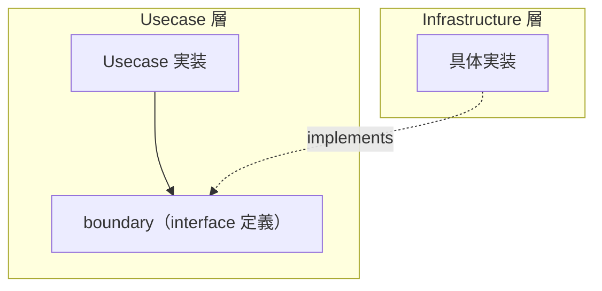

# boundary

[English](README.md) | 日本語

`internal/usecase/boundary` は、**Usecase 層が外部（Infrastructure 層）に要求するインターフェース群**を定義するディレクトリです。

## オニオンアーキテクチャにおける位置づけ



boundary は **依存性逆転の原則（DIP）** を実現するための境界です。

- Usecase は boundary の interface にのみ依存する
- Infrastructure が具体実装を提供する
- Usecase は Infrastructure の実装詳細を知らない

### Domain の Repository interface との違い

|観点|Domain Repository|Usecase Boundary|
|---|---|---|
|定義場所|Domain 層|Usecase 層|
|目的|Aggregate の永続化抽象|Usecase が必要とする外部機能の抽象|
|対象|永続化（CRUD）|認証 / 暗号化 / 時刻 / トランザクション / ジョブ等|

Domain Repository は「Aggregate をどう保存するか」を抽象化するのに対し、Usecase Boundary は「Usecase がビジネスフローを実行するために必要な外部機能」を抽象化します。

## パッケージ一覧

|パッケージ|interface|説明|実装場所|
|---|---|---|---|
|`auth`|`Authenticator`|トークンから認証情報（`Authn`）を取得|`internal/infrastructure/auth/`|
|`authz`|`Authorizer`|認証主体がリソースに対し操作を実行してよいか判定|`internal/infrastructure/authz/`|
|`clock`|`Clock`|現在時刻の取得|`internal/infrastructure/system/`|
|`exchangerate`|`Gateway`|外部為替レート取得サービスへの意味的 gateway（`<service>.Gateway` パターンのサンプル）|`internal/infrastructure/webapi/exchangerate/`|
|`idempotency`|`Store`|冪等性キーの永続化境界（claim / replay / 競合判定）|`internal/infrastructure/rdb/system_cqrs/idempotency/`|
|`job`|`Job`, `Runner`, `State`|ジョブの定義・実行・状態管理|`internal/controller/job/`|
|`objectstorage`|`Storage`|実体非依存のオブジェクトストレージ境界（キー指定でオブジェクトを `Put` し、保存先 `Path` を返す）|`internal/infrastructure/objectstorage/s3/`|
|`outbox`|`Store`|トランザクショナル outbox テーブルの永続化境界|`internal/infrastructure/rdb/system_cqrs/outbox/`|
|`publisher`|`Publisher`|publish 先非依存の outbound メッセージ publish 境界|`internal/infrastructure/publisher/`|
|`tx`|`Manager`|トランザクション境界の管理|`internal/infrastructure/rdb/driver/`|
|`worker`|`Consumer`, `Handler`, `FailureHandler`, `Worker`, `State`|broker 非依存の worker seam（pull-ack）|`internal/infrastructure/queue/sqs/`|

## 各パッケージの詳細

### auth

認証に関するインターフェースと値オブジェクトを提供します。

|型 / 関数|説明|
|---|---|
|`Authenticator`|`Credential` から `Authn` を生成するインターフェース|
|`Authn`|認証結果（subject / userID / issuer / scopes / claims）|
|`New(subject, issuer, scopes, claims)`|`Authn` を UserID 未解決の状態で生成（subject 空は `ErrUnauthenticatedSubjectMissing`）|
|`WithUserID(userID)`|内部 UserID を解決した `Authn` の複製を返す（ゼロ値 UUID は `ErrUserIDZero`）|
|`Credential`|認証スキームとトークンを保持する値オブジェクト|
|`NewCredential(scheme, token)`|`Credential` を生成（空トークンは `ErrTokenMissing`）|

エラー：

|エラー|説明|
|---|---|
|`ErrUnauthenticatedSubjectMissing`|subject が空|
|`ErrUserIDUnresolved`|内部 UserID が未解決|
|`ErrUserIDZero`|`WithUserID()` にゼロ値 UUID が渡された|
|`ErrTokenMissing`|トークンが空|

### authz

認可に関するインターフェースと値オブジェクトを提供します（`auth` と対になる存在）。強制点（PEP）は Usecase 層であり、`Authorize(...)` を呼び、拒否時に `apperror.ErrPermissionDenied`（403）へ対応づけます。

|型 / 関数|説明|
|---|---|
|`Authorizer`|`authn` が `resource` に対し `action` を実行してよいか判定するインターフェース（`Authorize(ctx, *auth.Authn, Action, *Resource) error`）|
|`Action`|認可対象の操作（例: `ActionUserDelete` = `"user:delete"`）|
|`Resource`|対象リソース。`Kind()` と任意の `OwnerID()` を持ち、所有権ベース（オブジェクトレベル）の判定を表現可能|
|`NewResource(kind, ownerID)`|`Resource` を生成|

エラー：

|エラー|説明|
|---|---|
|`ErrForbidden`|認可拒否（`apperror.ErrPermissionDenied` をラップ、HTTP 403）|

`auth.Authn`（subject / scopes / claims）と対象 `Resource` を渡すことで、RBAC（claims からロール）と所有権（subject == OwnerID）の双方を表現できます。デフォルト実装は全許可であり、本番以外の環境に限定されます。

`NewResource` に `ownerID = nil` を渡すことは、**所有者を持たない**リソースの宣言です。所有者が不明という意味ではなく、所有権による主張が適用されないことを呼び出し側が表明しています。それを `Authorizer` がどう扱うかは各実装のポリシーですが、そうしたリソースに対して所有権の一致が成立することはないため、所有権に基づく規則はアクセスを狭める方向にしか働きません。所有者の指定を省くことは、安全側に倒れる選択です。

### clock

```go
type Clock interface {
    Now() time.Time
}
```

Domain / Usecase が `time.Now()` に直接依存しないための抽象。テスト時にモック差し替え可能。

### exchangerate

サンプルの Gateway 境界。外部為替レート取得サービスへの意味的 port（`<service>.Gateway` パターン）。Usecase が `net/http` やベンダー SDK ではなく意味的 port に依存するようにし、境界でトランスポート失敗を `apperror` sentinel へ変換します。

|型 / 関数|説明|
|---|---|
|`Gateway`|`GetRate(ctx, base, quote)` で換算レートを取得|
|`Rate`|出力 DTO（`Base` / `Quote` / `Value`）|

### idempotency

冪等性キーの永続化境界。すべてのメソッドは `scope` 必須です（id 単独 lookup を持たない＝越境防止）。

|型 / 関数|説明|
|---|---|
|`Store`|冪等性キーの永続化境界インターフェース|
|`Claim(ctx, p)`|claimed 行を作成。新規なら `claimed=true`、既存キーがあれば `false` を返す（ロック待ちタイムアウト時は `ErrLockTimeout`）|
|`Get(ctx, scope, key)`|`(scope, key)` の保存済み状態を返す（無ければ nil）|
|`Complete(ctx, p)`|`claimed` → `completed` へ遷移し結果を保存|
|`DeleteExpired(ctx, cutoff, limit)`|`cutoff` より古い行を `limit` 件まで削除（GC）。削除件数を返す|

入出力の値オブジェクト：`ClaimParams` / `CompleteParams`（入力）、`Record`（保存済み状態）。sentinel: `ErrLockTimeout`（usecase 側で 409 へマップ）。

### job

|interface|説明|
|---|---|
|`Job`|`Name()` + `Execute(ctx, args)` を持つジョブ定義|
|`Runner`|`Run(ctx, jobName, args)` + `Names()` でジョブを実行・一覧|
|`State`|`Set(name, args, done)` + `Snapshot()` でジョブ実行状態を管理|

### objectstorage

実体非依存のオブジェクトストレージ境界。Usecase はこのポートにのみ依存し、S3 互換 adapter（infrastructure）が実装する。bucket / region / etag などの vendor 語彙は境界を越えて漏れない。

|型 / 関数|説明|
|---|---|
|`Storage`|`Put(ctx, PutObject) (Path, error)` でオブジェクトをキー配下へ保存する。失敗時は `apperror` sentinel（例 `ErrUnavailable`）を返す|
|`PutObject`|入力 DTO（`Key` / `Body` / `ContentType` / `CacheControl`）。`Key` は呼び出し側が採番し（例 `products/{uuid}.png`）、`CacheControl` も呼び出し側が決める。キャッシュ可否はキーの採番方針から導かれるため（空なら未設定）|
|`Path`|保存されたオブジェクトのパス（キー）。表示 URL は上位が別途組み立てる|

### outbox

トランザクショナル outbox テーブルの永続化境界。emit usecase と relay engine（controller 層）の双方が依存します。

|型 / 関数|説明|
|---|---|
|`Store`|outbox テーブルの永続化境界インターフェース|
|`Insert(ctx, p)`|業務 tx 内で outbox 行を 1 行 INSERT し、採番された `message_id` を返す|
|`ClaimPending(ctx, limit)`|pending 行を最大 `limit` 件 claim（`FOR UPDATE SKIP LOCKED`）|
|`MarkPublished(ctx, id)`|publish 成功行を `published` へ遷移（pending でなければ no-op）|
|`MarkFailed(ctx, id, lastErr)`|`attempts` を加算し `last_error` を記録、加算後の試行回数を返す|
|`MarkDead(ctx, id)`|行を `dead` へ遷移（pending でなければ no-op）|
|`ReplayDead(ctx, messageID)`|`dead` 行を `pending` へ戻す（`messageID` が nil なら全 dead 行）。戻した件数を返す|
|`DeletePublished(ctx, cutoff, limit)`|`cutoff` より古い published 行を `limit` 件まで削除（GC）。削除件数を返す|
|`OldestPendingCreatedAt(ctx)`|最古 pending 行の `created_at` を返す（outbox-lag SLI 用、無ければ `ok=false`）|

入出力の値オブジェクト：`EmitParams`（INSERT 入力）、`PendingMessage`（claim した未 publish 行）。

### publisher

ドメインイベントの outbound publish 境界と、publish 先非依存のメッセージ封筒。relay engine（controller 層）と publish adapter（infrastructure 層）の双方が依存します。

|型 / 関数|説明|
|---|---|
|`Publisher`|メッセージを publish 先へ送る境界|
|`Publish(ctx, m)`|`m` を publish 先へ送る。失敗時はエラーを返し relay の次 poll で再送（at-least-once）|
|`Message`|outbox 行から構築する publish 先非依存のメッセージ封筒（`net/http` 等の型を露出しない）|

### tx

|型 / 関数|説明|
|---|---|
|`Manager`|`Do(ctx, fn)` でトランザクション境界を管理|
|`DoWithResult[T](ctx, m, fn)`|トランザクション内で値を返すジェネリクスヘルパー|

### worker

|型 / 関数|説明|
|---|---|
|`Consumer`|broker 非依存のメッセージ受信 — `Receive` / `Ack` / `Nack` / `NackWithBackoff` / `Extend`（broker adapter が実装）|
|`Handler`|メッセージ単位の業務処理（冪等であること）|
|`FailureHandler`|恒久失敗の dead-letter シンク|
|`Worker`|Name / Consumer / Handler / FailureHandler を束ねる|
|`State`|engine と共有する選択済み worker の状態|
|`QueueStatsProvider`|メトリクス用の queue depth / DLQ 統計ソース（任意）|

## 設計方針

- boundary にはビジネスロジックを含めない（interface と値オブジェクトのみ）
- Infrastructure の import は禁止（依存方向の違反）
- すべての interface に `mockgen` による mock 自動生成を設定
