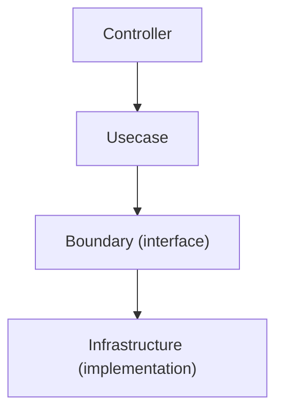

# 境界パッケージ群（Boundary Packages）

概要: `internal/usecase/boundary` は、**Usecase層から見た外部との境界（Boundary）を定義するパッケージ群**です。  
この層は、認証・トランザクション・時刻・暗号・ジョブなどの**外部依存を抽象化し、インターフェースとして契約を定義する責務**を持ちます。

Onion Architecture においては、**内側（Usecase）から外側（Infrastructure）への依存を遮断するための防壁**として機能します。

## この層の本質

boundary は単なる interface 集ではありません。  

目的は下記3点です：

- 外部依存を「名前付きの概念」に変換する層
- システムの拡張ポイントを明示する層
- 依存方向を強制するための構造的ガード

## 役割

- 外部依存（DB / 認証 / 時刻 / 暗号 / バッチ等）の抽象化
- Usecase が外部実装に依存しない構造の強制
- DI による実装差し替えポイントの提供
- テスト時のモック差し替えポイントの提供
- エラーの意味付け（アプリケーション粒度）

## 依存関係



- Usecase → boundary にのみ依存
- infrastructure → boundary を実装
- boundary はどこにも依存しない（例外: apperror / util）

## サブパッケージの責務

### auth

責務:

- 認証情報の入力（Credential）
- 認証結果の表現（Authn）
- 認証処理の抽象（Authenticator）

特徴:

- subject の正規化（trim）
- UUID変換の内包（HasID / ID）
- scope / claims の保持（認可・UI制御用途）

設計意図:

- 「認証済み」という状態を型で表現する
- トークン解析ロジックを外部へ押し出す

### tx

責務:

- トランザクション境界の制御

特徴:

- `Manager.Do` によるスコープ制御
- `DoWithResult` による値返却

設計意図:

- Usecase に「トランザクションの存在」を意識させる
- DB依存を完全に隠蔽する

### clock

責務:

- 現在時刻の取得

設計意図:

- 時刻依存ロジックのテスト性確保
- TTL / 有効期限の再現性

### security

責務:

- パスワード等のハッシュ・比較

設計意図:

- 暗号アルゴリズムの差し替え可能性
- bcrypt / argon2 等の隠蔽

### job

責務:

- ジョブ実行の抽象化

特徴:

- Job / Runner / State の分離
- CLI / batch 実行基盤

設計意図:

- 実行単位を抽象化し、実装依存を排除
- テスト可能なバッチ基盤

## 設計ルール

### MUST

- interface のみ定義する（実装禁止）
- 外部ライブラリに依存しない
- context を受け取る（I/Oがある場合）
- エラーは `apperror` をラップする
- DTOは不変的に扱う（副作用を持たない）

### SHOULD

- interface は単一責務
- 命名は「役割ベース」（Manager, Authenticator など）
- モック生成前提（mockgen）
- DTOは必要最小限

### MUST NOT

- Echo / sqlc / AWS SDK / HTTP などに依存
- インフラの型を公開
- 実装ロジックを書く
- domain を汚染する（逆依存）

## アンチパターン

### ❌ boundaryに実装を書く

```go
func (a *authenticator) Authenticate(...) { ... }
```

→ NG  
boundary は契約のみ

### ❌ infraの型を漏らす

```go
type Authenticator interface {
    Authenticate(...) (*jwt.Token, error)
}
```

→ NG  
外部依存が漏れている

### ❌ domainロジックを持たせる

→ NG  
それは domain の責務

### ❌ なんでも boundary に置く

→ NG  
「外部依存との境界」のみ

## 設計判断基準

### これ boundary に置くべき？

YES の条件:

- 外部依存している（DB / API / 時刻 / 認証）
- 実装差し替えの可能性がある
- テスト時にモック化したい
- Usecase が直接呼ぶ

NO の条件:

- 純粋なビジネスロジック → domain
- 単なるユーティリティ → pkg
- Usecase内部のロジック → usecase

## エラー設計

- boundary は「意味のあるエラー」を定義する
- apperror をラップして返す

例:

- 未認証
- 引数不正
- ID不正

## DIとの関係（uber/fx）

- boundary は Provideしない（抽象のみ）
- infrastructure が実装を Provide
- usecase が interface を受け取る

```go
type UserUsecase struct {
    auth auth.Authenticator
    tx   tx.Manager
}
```

## テスト戦略

- Usecaseテストでは mock を使用
- 外部依存を完全に排除

```go
mockAuth.EXPECT().
Authenticate(gomock.Any(), gomock.Any()).
Return(&auth.Authn{...}, nil)
```

## なぜこの構造か

この構造により：

- 実装変更（DB / 認証方式）が影響しない
- テストが高速・安定になる
- 依存関係が壊れない（lintで強制可能）
- AIがコードを書いても構造が崩れない

## この層が壊れると何が起きるか

- Usecaseがインフラに直接依存する
- テスト不能になる
- 差し替え不能になる
- スパゲッティ化する

## 推奨開発フロー

1. boundary に interface を定義
2. usecase を実装（interface前提）
3. infrastructure で実装
4. fx でバインド
5. mockでテスト
