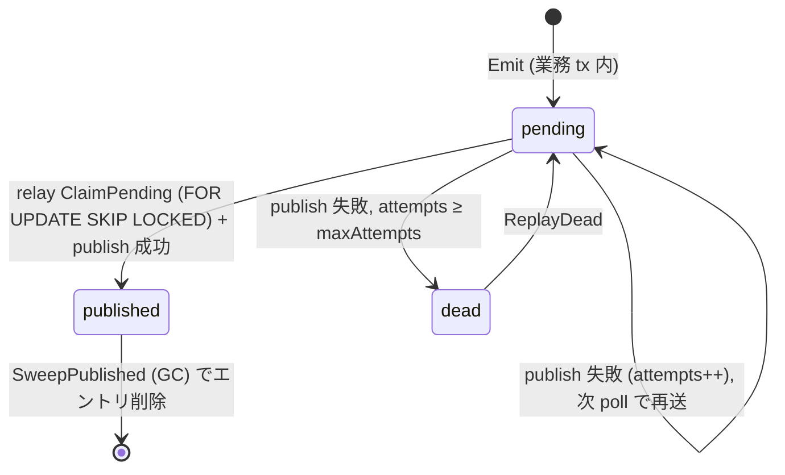

# outbox

[English](README.md) | 日本語

トランザクショナル outbox のユースケース群です。**emit**（ドメイン変更と同一
トランザクションで outbox へ 1 件記録する）、**relay**（pending のエントリを claim
して publish する）、**GC**（古い published のエントリを刈り取る）、**replay**（dead のエントリを
pending へ戻す）を提供します。永続化はすべて `Store` 境界
（`internal/usecase/boundary/outbox`）を経由し、具体的な RDB 実装は
`internal/infrastructure/rdb/system_cqrs/outbox/` にあります。

## なぜ outbox か

外部ブローカーへのイベント publish は DB トランザクションの一部ではありません。
ドメイン変更は commit したのに publish が失敗（あるいはその逆）すると、両者が
乖離し、**lost event**（イベント欠落）や phantom event（幻イベント）が発生し
ます。outbox はこのギャップを埋めます。イベントはドメイン変更と *同一*
トランザクション内で記録され、別プロセスの relay が後から publish
します（at-least-once）。そのため consumer は冪等でなければなりません。
`MessageID` が `Idempotency-Key` へ伝搬される安定した dedup キーです。

## エントリのライフサイクル

`published` のエントリは **GC**（`SweepPublished`）で刈り取られ、`dead` のエントリは
**replay**（`ReplayDead`）で復帰します。両者は独立した経路です。GC は `dead` に
触れず、replay は `published` に触れません。

## ユースケース

### emit — `EmitUsecase`

`NewEmit(store, tracerFactory) EmitUsecase`

- `Emit(ctx, EmitInput) (uuid.UUID, error)` は outbox へちょうど 1 件記録
  し、採番された `message_id` を返します。**ドメイン変更と同じ `tx.Manager.Do`
  の中で** 呼ぶ必要があります。そうすることで業務トランザクションが巻き戻れば
  outbox のエントリも巻き戻り、lost / phantom event を排除します。
- 現在の trace context をエントリの headers へ `traceparent` として capture し
  （`observability.InjectTraceContextToCarrier` 経由）、後続の
  relay → consumer が同一 trace に繋がります。
- `EmitInput` のフィールド: `AggregateType`・`AggregateID`（観測用）、
  `EventType`（種別 + version）、`Payload`（呼び出し側が marshal 済みのイベント
  本文 JSON）、`Headers`（外部エンドポイントへ伝搬）。`Headers` に
  `Authorization` / `Cookie` 等の機微ヘッダを入れてはいけません。そのまま外部
  エンドポイントへ送出されます。
- **`Payload` の構築場所 — usecase 本体には書かない。** marshal は呼び出し側の
  責務ですが、版付きのイベント契約（struct・JSON フィールド名・`EventType` 定数）は
  **専用のイベント単位**（独立したパッケージ / 関数）に定義し、usecase からはそれを
  呼ぶだけにします。ワイヤ表現を usecase メソッドへインライン展開すると fat usecase
  が再発し、orchestration がシリアライズ形式へ結合します。分離すれば usecase は薄い
  orchestrator のままで、イベント契約も単一のテスト可能な置き場所を持てます。

### relay — `RelayUsecase`

`NewRelay(txm, store, publisher, metrics, clock, logger, tracerFactory) RelayUsecase`

- `RelayBatch(ctx, batchSize) (RelayResult, error)` は最大 `batchSize` 件の
  pending のエントリを claim して publish します。すべて **1 トランザクション** 内で
  行うため、複数の relay インスタンスが同一行を二重 publish しません。
  `batchSize <= 0` は `DefaultBatchSize`（100）にフォールバックします。
  `RelayResult` は `Claimed` と `Published` を報告します。
  - **publish 失敗はトランザクションを巻き戻しません**。エントリは failed
    （`attempts++`）としてマークされ、次 poll の再送に委ねられます。`attempts`
    が `DefaultMaxAttempts`（10）に達するとエントリは `dead` にマークされ、
    `Metrics.IncDead` が計上され、warning がログ出力されます。
  - **DB アクセス失敗**（claim / mark）のみ、トランザクションを巻き戻すエラー
    として返します。
- `RecordLag(ctx) error` は最古 pending エントリの経過時間を outbox lag SLI として
  `Metrics.SetLagSeconds` に記録します。pending のエントリが無ければ `0` を記録します。
- `Metrics` は outbox 固有の o11y シンクです: `SetLagSeconds(ctx, seconds)` と
  `IncDead(ctx)`。

### GC — `GCUsecase`

`NewGC(store, clock) GCUsecase`

- `SweepPublished(ctx, batchSize) (int64, error)` は `DefaultRetention`（7 日）
  より古い `published` のエントリを `batchSize` 件ずつ削除し、合計削除件数を返します。
  `batchSize <= 0` は `DefaultGCBatchSize`（10,000）にフォールバックします。
  バッチが満たなくなり対象のエントリが無くなるまでループします。

### replay — `ReplayUsecase`

`NewReplay(store, tracerFactory) ReplayUsecase`

- `ReplayDead(ctx, messageID *uuid.UUID) (int64, error)` は `dead` のエントリを
  `pending` へ戻し、戻した件数を返します。`messageID == nil` は dead の **すべて** を
  replay し、非 nil の場合は当該 `message_id` のみを対象とします。

## 消費側

このパッケージが担うのは **producing 側**だけです。relay が publish した後にメッセージがどうなるかは
worker サブシステムの関心であり、両端を配線するのは integrator です。何も消費していない outbox は
不完全な状態ではなく、正当な構成の 1 つです。

両端はコードではなく transport で出会います。`relay` が `publisher.Message` を adapter へ渡し、adapter が
payload を本文へ、イベント種別と `message_id` を名前付きのメタデータへ載せ、`worker.Handler` が
`worker.Message` からそれらを読み戻します。どちらの端も相手を import しません。

<!-- sample-api:begin -->
サンプルは、この経路を実際に動かせるよう両端を配線しています。

| 段 | 場所 |
| --- | --- |
| 退会トランザクション内で `user.withdrawn.v1` を emit | `internal/usecase/user` |
| relay → publish | `outbox-relay` + `internal/infrastructure/queue/sqs`（`OUTBOX_PUBLISHER=sqs`） |
| consume → 退会証跡の保存 | [`internal/controller/worker/withdrawalarchive`](../../controller/worker/withdrawalarchive/README.ja.md) |

<!-- sample-api:end -->

## レイアウト

| 関心事 | パス |
| --- | --- |
| boundary（`Store`） | `internal/usecase/boundary/outbox/` |
| usecase | `internal/usecase/outbox/`（本パッケージ） |
| infrastructure | `internal/infrastructure/rdb/system_cqrs/outbox/` |
| sqlc DML | `database/dml/system_cqrs/outbox/` |
