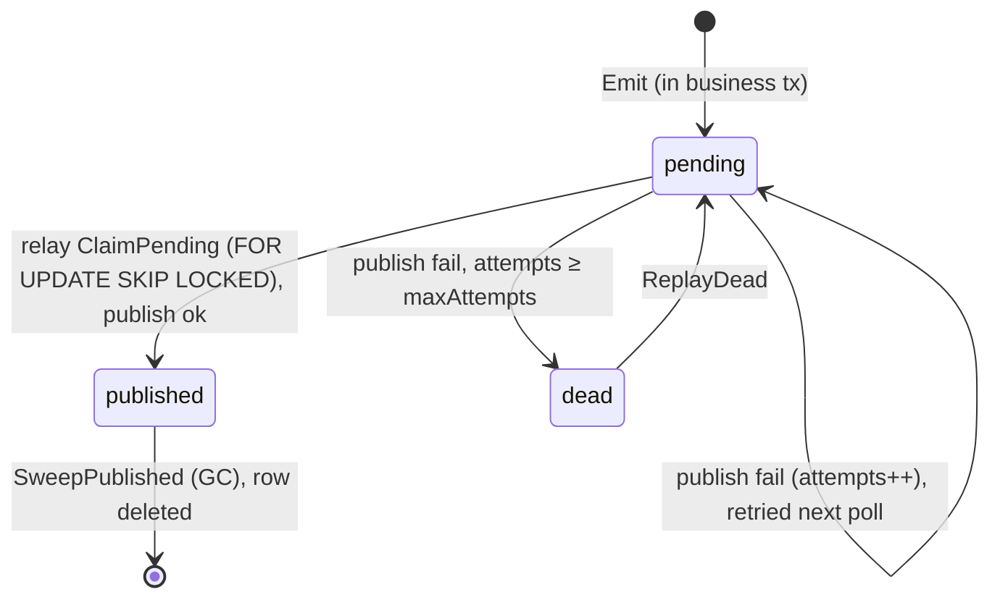

# outbox

English | [日本語](README.ja.md)

Usecases for the transactional outbox: **emit** (write an outbox row in the same
transaction as the domain change), **relay** (claim pending rows and publish
them), **GC** (prune old published rows), and **replay** (return dead rows to
pending). All persistence goes through the `Store` boundary
(`internal/usecase/boundary/outbox`); the concrete RDB implementation lives in
`internal/infrastructure/rdb/system_cqrs/outbox/`.

## Why an outbox?

Publishing an event to an external broker is not part of the database
transaction. If the domain change commits but the publish fails (or vice versa),
the two diverge — a **lost event** or a **phantom event**. The outbox closes
that gap: the event is written to a DB row inside the *same* transaction as the
domain change, and a separate relay process publishes it afterwards
(at-least-once). Consumers must therefore be idempotent — the `MessageID` is the
stable dedup key propagated into the `Idempotency-Key`.

## Row lifecycle

`published` rows are pruned by **GC** (`SweepPublished`); `dead` rows are
recovered by **replay** (`ReplayDead`). These are distinct paths — GC never
touches `dead`, and replay never touches `published`.

## Usecases

### emit — `EmitUsecase`

`NewEmit(store, tracerFactory) EmitUsecase`

- `Emit(ctx, EmitInput) (uuid.UUID, error)` inserts exactly one outbox row and
  returns the allocated `message_id`. It must be called **inside the same
  `tx.Manager.Do` as the domain change** so a rolled-back business transaction
  also rolls back the outbox row (no lost / phantom event).
- The current trace context is captured into the row's headers as `traceparent`
  (via `observability.InjectTraceContextToCarrier`), so the eventual
  relay → consumer stays on the same trace.
- `EmitInput` fields: `AggregateType`, `AggregateID` (observation only),
  `EventType` (type + version), `Payload` (caller-marshaled event body JSON),
  and `Headers` (propagated to the external endpoint). Do **not** put sensitive
  headers (`Authorization` / `Cookie`) in `Headers` — they are sent verbatim
  to the external endpoint.
- **Where to build `Payload` — keep it out of the usecase body.** The caller owns
  the marshaling, but the versioned event contract (its struct, JSON field names,
  and `EventType` constant) must live in a **dedicated event unit** (its own package
  / function) that the usecase merely calls. Inlining the wire representation into
  the usecase method re-introduces a fat usecase and couples the orchestration to a
  serialization format; isolating it keeps the usecase a thin orchestrator and gives
  the event contract a single, testable home.

### relay — `RelayUsecase`

`NewRelay(txm, store, publisher, metrics, clock, logger, tracerFactory) RelayUsecase`

- `RelayBatch(ctx, batchSize) (RelayResult, error)` claims up to `batchSize`
  pending rows and publishes them, all in **one transaction** so multiple relay
  instances never double-publish the same row. `batchSize <= 0` falls back to
  `DefaultBatchSize` (100). `RelayResult` reports `Claimed` and `Published`.
  - A **publish failure does not roll back the transaction**: the row is marked
    failed (`attempts++`) and left for the next poll to retry; once `attempts`
    reaches `DefaultMaxAttempts` (10) the row is marked `dead`, `Metrics.IncDead`
    is counted, and a warning is logged.
  - Only a **DB access failure** (claim / mark) returns an error that rolls the
    transaction back.
- `RecordLag(ctx) error` records the age of the oldest pending row as the outbox
  lag SLI via `Metrics.SetLagSeconds`; with no pending rows it records `0`.
- `Metrics` is the outbox-specific o11y sink: `SetLagSeconds(ctx, seconds)` and
  `IncDead(ctx)`.

### GC — `GCUsecase`

`NewGC(store, clock) GCUsecase`

- `SweepPublished(ctx, batchSize) (int64, error)` deletes `published` rows older
  than `DefaultRetention` (7 days) in batches of `batchSize` and returns the
  total deleted. `batchSize <= 0` falls back to `DefaultGCBatchSize` (10,000).
  It loops until a short batch signals no more rows remain.

### replay — `ReplayUsecase`

`NewReplay(store, tracerFactory) ReplayUsecase`

- `ReplayDead(ctx, messageID *uuid.UUID) (int64, error)` moves `dead` rows back
  to `pending` and returns the count restored. `messageID == nil` replays **all**
  dead rows; a non-nil value targets that single `message_id`.

## Layout

| Concern | Path |
| --- | --- |
| boundary (`Store`) | `internal/usecase/boundary/outbox/` |
| usecase | `internal/usecase/outbox/` (this package) |
| infrastructure | `internal/infrastructure/rdb/system_cqrs/outbox/` |
| sqlc DML | `database/dml/system_cqrs/outbox/` |
